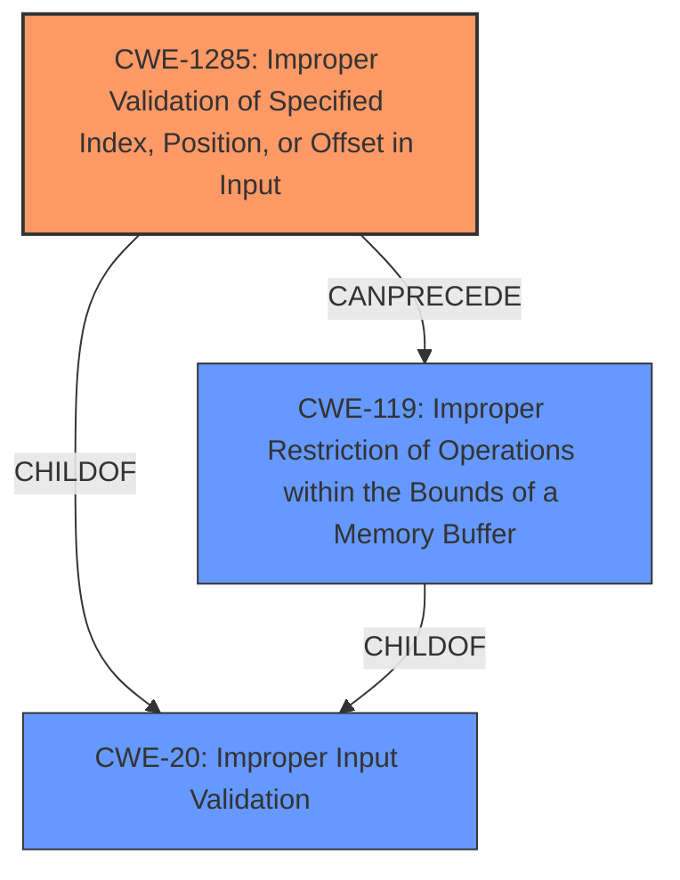

# Analysis Report for CVE-2021-26351

# Vulnerability Analysis Report: CVE-2021-26351

## Description


## Analysis (with Relationship Data)

# Summary
| CWE ID  | CWE Name                                                                  | Confidence | CWE Abstraction Level | CWE Vulnerability Mapping Label | CWE-Vulnerability Mapping Notes |
| :-------- | :------------------------------------------------------------------------ | :--------- | :-------------------- | :------------------------------ | :-------------------------------- |
| CWE-1285  | Improper Validation of Specified Index, Position, or Offset in Input     | 0.9        | Base                  | Primary                         | Allowed                          |
| CWE-119   | Improper Restriction of Operations within the Bounds of a Memory Buffer | 0.7        | Class                 | Secondary                       | Discouraged                       |

## Evidence and Confidence

*   **Confidence Score:** 0.8
*   **Evidence Strength:** HIGH

## Relationship Analysis
The primary CWE is CWE-1285, which is a Base level CWE and a child of CWE-20. The vulnerability description indicates **insufficient validation**, aligning with CWE-1285. CWE-119 is a Class-level CWE and a parent of several more specific CWEs related to buffer overflows. The relationship between CWE-1285 and CWE-119 is that **improper validation** (CWE-1285) can lead to operations outside the bounds of a memory buffer (CWE-119).



## Vulnerability Chain
The vulnerability chain starts with **insufficient DRAM address validation** (CWE-1285), leading to a DMA read/write from/to an invalid DRAM address, which results in a denial of service.

## Summary of Analysis
The initial analysis focused on identifying the root cause of the vulnerability, which is **insufficient DRAM address validation**. The Retriever Results highlighted CWE-1285, "Improper Validation of Specified Index, Position, or Offset in Input," as a strong candidate. The vulnerability description explicitly states **insufficient validation**, making CWE-1285 a direct match. The evidence is strong, with the vulnerability description key phrases and CVE reference links content summary both highlighting **insufficient validation** as the root cause.

The relationship analysis shows that CWE-1285 is a child of CWE-20 (Improper Input Validation) and can precede CWE-119 (Improper Restriction of Operations within the Bounds of a Memory Buffer). The selection of CWE-1285 is at the optimal level of specificity because it directly addresses the **insufficient validation** aspect of the vulnerability. While CWE-119 could also be considered due to the potential for out-of-bounds access, CWE-1285 more accurately represents the root cause.

The vulnerability description explicitly states **insufficient DRAM address validation**, supporting the selection of CWE-1285. The retriever results provides supporting evidence with a similarity score of 0.278, further bolstering the confidence in this mapping.

Relevant CWE Information:

# Enhanced Context (25 CWEs)

## CWE-823: Use of Out-of-range Pointer Offset
**Abstraction Level**: Base
**Similarity Score**: 0.79
**Source**: dense

**Description**:
The product performs pointer arithmetic on a valid pointer, but it uses an offset that can point outside of the intended range of valid memory locations for the resulting pointer.

**Mapping Guidance**:
- Usage: Allowed
- Rationale: This CWE entry is at the Base level of abstraction, which is a preferred level of abstraction for mapping to the root causes of vulnerabilities.

CWE-823 was considered because DMA involves pointers and offsets. However, the root cause isn't in the pointer arithmetic itself, but in the **lack of validation** of the DRAM address.

## CWE-667: Improper Locking
**Abstraction Level**: Class
**Similarity Score**: 0.79
**Source**: dense

**Description**:
The product does not properly acquire or release a lock on a resource, leading to unexpected resource state changes and behaviors.

**Mapping Guidance**:
- Usage: Allowed-with-Review
- Rationale: This CWE entry is a Class and might have Base-level children that would be more appropriate

CWE-667 was considered but is not applicable because the vulnerability isn't related to locking mechanisms.

## CWE-131: Incorrect Calculation of Buffer Size
**Abstraction Level**: Base
**Similarity Score**: 0.78
**Source**: dense

**Description**:
The product does not correctly calculate the size to be used when allocating a buffer, which could lead to a buffer overflow.

**Mapping Guidance**:
- Usage: Allowed
- Rationale: This CWE entry is at the Base level of abstraction, which is a preferred level of abstraction for mapping to the root causes of vulnerabilities.

CWE-131 was considered because DMA could involve buffer size calculations. However, the root cause is related to validation of the address and not necessarily the buffer size itself.

## CWE-822: Untrusted Pointer Dereference
**Abstraction Level**: Base
**Similarity Score**: 0.78
**Source**: dense

**Description**:
The product obtains a value from an untrusted source, converts this value to a pointer, and dereferences the resulting pointer.

**Mapping Guidance**:
- Usage: Allowed
- Rationale: This CWE entry is at the Base level of abstraction, which is a preferred level of abstraction for mapping to the root causes of vulnerabilities.

CWE-822 was considered because the DRAM address could be viewed as a pointer. However, the primary weakness is the **lack of validation** of that address, not necessarily that it comes from an untrusted source, even if that's implied.

## CWE-1285: Improper Validation of Specified Index, Position, or Offset in Input
**Abstraction Level**: Base
**Similarity Score**: 0.77
**Source**: dense

**Description**:
The product receives input that is expected to specify an index, position, or offset into an indexable resource such as a buffer or file, but it does not validate or incorrectly validates that the specified index/position/offset has the required properties.

**Mapping Guidance**:
- Usage: Allowed
- Rationale: This CWE entry is at the Base level of abstraction, which is a preferred level of abstraction for mapping to the root causes of vulnerabilities.

CWE-1285 is the selected primary CWE, as it accurately describes the root cause of the vulnerability: **insufficient DRAM address validation**.

## CWE-191: Integer Underflow (Wrap or Wraparound)
**Abstraction Level**: Base
**Similarity Score**: 0.77
**Source**: dense

**Description**:
The product subtracts one value from another, such that the result is less than the minimum allowable integer value, which produces a value that is not equal to the correct result.

**Mapping Guidance**:
- Usage: Allowed
- Rationale: This CWE entry is at the Base level of abstraction, which is a preferred level of abstraction for mapping to the root causes of vulnerabilities.

CWE-191 was considered, but is not directly related to the validation of the DRAM address, but on integer calculation.

## CWE-119: Improper Restriction of Operations within the Bounds of a Memory Buffer
**Abstraction Level**: Class
**Similarity Score**: 0.77
**Source**: dense

**Description**:
The product performs operations on a memory buffer, but it reads from or writes to a memory location outside the buffer's intended boundary. This may result in read or write operations on unexpected memory locations that could be linked to other variables, data structures, or internal program data.

**Mapping Guidance**:
- Usage: Discouraged
- Rationale: CWE-119 is commonly misused in low-information vulnerability reports when lower-level CWEs could be used instead, or when more details about the vulnerability are available.

CWE-119 is a secondary CWE, as the **insufficient validation** (CWE-1285) can lead to out-of-bounds access. However, the root cause is more accurately represented by the **lack of validation**.

## CWE-125: Out-of-bounds Read
**Abstraction Level**: Base
**Similarity Score**: 0.77
**Source**: dense

**Description**:
The product reads data past the end, or before the beginning, of the intended buffer.

**Mapping Guidance**:
- Usage: Allowed
- Rationale: This CWE entry is at the Base level of abstraction, which is a preferred level of abstraction for mapping to the root causes of vulnerabilities.

CWE


## CWE Relationship Analysis

Current CWEs represent these abstraction levels: .


### Vulnerability Chain Analysis

**Chain starting from CWE-131:**
- 131 (Incorrect Calculation of Buffer Size) - ROOT


**Chain starting from CWE-823:**
- 823 (Use of Out-of-range Pointer Offset) - ROOT


### CWE Relationship Diagram

```mermaid
graph TD
    classDef primary fill:#f96,stroke:#333,stroke-width:2px
    classDef secondary fill:#69f,stroke:#333
    classDef tertiary fill:#9e9,stroke:#333
```


*Report generated on 2025-03-31 06:35:33*
