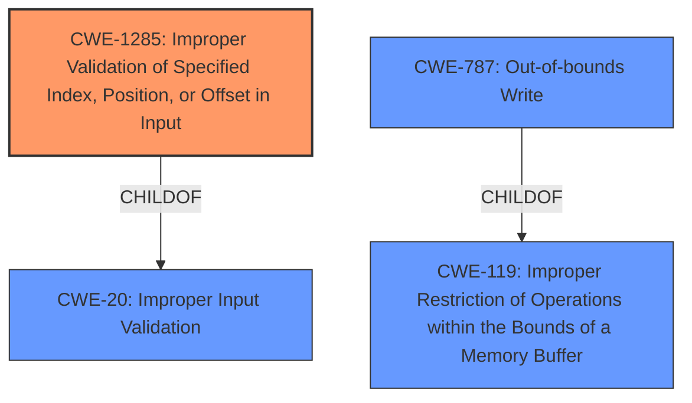

# Analysis for CVE-2021-26370

# Summary
| CWE ID | CWE Name | Confidence | CWE Abstraction Level | CWE Vulnerability Mapping Label | CWE-Vulnerability Mapping Notes |
|---|---|---|---|---|---|
| CWE-1285 | Improper Validation of Specified Index, Position, or Offset in Input | 0.9 | Base | Allowed | Primary CWE |
| CWE-787 | Out-of-bounds Write | 0.7 | Base | Allowed | Secondary Candidate |
| CWE-119 | Improper Restriction of Operations within the Bounds of a Memory Buffer | 0.6 | Class | Discouraged | Secondary Candidate |

## Evidence and Confidence

*   **Confidence Score:** 0.9
*   **Evidence Strength:** HIGH

## Relationship Analysis
The primary CWE is CWE-1285, which represents the **improper validation** of an index, position, or offset. This is a child of CWE-20, **Improper Input Validation**, which is a more general class. CWE-787 (**Out-of-bounds Write**) and CWE-125 (**Out-of-bounds Read**) are both children of CWE-119 (**Improper Restriction of Operations within the Bounds of a Memory Buffer**), indicating potential consequences of the **improper validation**. The choice of CWE-1285 as the primary CWE is based on the explicit mention of **improper validation of destination address**.

## Vulnerability Chain
The vulnerability chain starts with **improper validation of the destination address** (CWE-1285), potentially leading to an **out-of-bounds write** (CWE-787). This then results in the attacker being able to overwrite arbitrary bootloader memory, leading to a loss of integrity and availability.

## Summary of Analysis
The initial analysis identified several potential CWEs, including CWE-1285, CWE-787, and CWE-119. The selection was primarily based on the **Vulnerability Description Key Phrases**, which directly mentions **"Improper validation of destination address."** The **CVE Reference Links Content Summary** further supports this by stating "**Insufficient validation of destination address leads to potential memory corruption.**"

CWE-1285 (**Improper Validation of Specified Index, Position, or Offset in Input**) was chosen as the primary CWE because it accurately reflects the root cause vulnerability: the **improper validation** of the destination address. The high retriever score and the direct mention of validation in the vulnerability description further support this choice.

CWE-787 (**Out-of-bounds Write**) and CWE-119 (**Improper Restriction of Operations within the Bounds of a Memory Buffer**) were considered as secondary CWEs, representing potential consequences of the **improper validation**. Although CWE-119 is discouraged due to its high level of abstraction, the evidence supports at least acknowledging that the **improper validation** can lead to **out-of-bounds write** conditions.

The final decision is based on the evidence provided, with a focus on the **improper validation** aspect of the vulnerability. CWE-1285 is at the optimal level of specificity, as it directly addresses the **improper validation of the destination address**, while CWE-787 and CWE-119 represent potential impacts.

Relevant CWE Information:

# Enhanced Context (25 CWEs)

## CWE-191: Integer Underflow (Wrap or Wraparound)
**Abstraction Level**: Base
**Similarity Score**: 0.77
**Source**: dense

**Description**:
The product subtracts one value from another, such that the result is less than the minimum allowable integer value, which produces a value that is not equal to the correct result.

**Mapping Guidance**:
- Usage: Allowed
- Rationale: This CWE entry is at the Base level of abstraction, which is a preferred level of abstraction for mapping to the root causes of vulnerabilities.

*Rationale for not selecting:* While integer issues could be present, the description focuses on address validation, not integer arithmetic.

## CWE-805: Buffer Access with Incorrect Length Value
**Abstraction Level**: Base
**Similarity Score**: 0.77
**Source**: dense

**Description**:
The product uses a sequential operation to read or write a buffer, but it uses an incorrect length value that causes it to access memory that is outside of the bounds of the buffer.

**Mapping Guidance**:
- Usage: Allowed
- Rationale: This CWE entry is at the Base level of abstraction, which is a preferred level of abstraction for mapping to the root causes of vulnerabilities.

*Rationale for not selecting:* This CWE is about incorrect length values, but the vulnerability description doesn't provide sufficient information to confirm that.

## CWE-131: Incorrect Calculation of Buffer Size
**Abstraction Level**: Base
**Similarity Score**: 0.76
**Source**: dense

**Description**:
The product does not correctly calculate the size to be used when allocating a buffer, which could lead to a buffer overflow.

**Mapping Guidance**:
- Usage: Allowed
- Rationale: This CWE entry is at the Base level of abstraction, which is a preferred level of abstraction for mapping to the root causes of vulnerabilities.

*Rationale for not selecting:* Similar to CWE-805, this CWE is about size calculation, but the provided details don't include enough information.

## CWE-197: Numeric Truncation Error
**Abstraction Level**: Base
**Similarity Score**: 0.75
**Source**: dense

**Description**:
Truncation errors occur when a primitive is cast to a primitive of a smaller size and data is lost in the conversion.

**Mapping Guidance**:
- Usage: Allowed
- Rationale: This CWE entry is at the Base level of abstraction, which is a preferred level of abstraction for mapping to the root causes of vulnerabilities.

*Rationale for not selecting:* Numeric truncation is not explicitly mentioned.

## CWE-125: Out-of-bounds Read
**Abstraction Level**: Base
**Similarity Score**: 0.75
**Source**: dense

**Description**:
The product reads data past the end, or before the beginning, of the intended buffer.

**Mapping Guidance**:
- Usage: Allowed
- Rationale: This CWE entry is at the Base level of abstraction, which is a preferred level of abstraction for mapping to the root causes of vulnerabilities.

*Rationale for not selecting:* The vulnerability description focuses on writing to arbitrary memory locations, not reading.

## CWE-823: Use of Out-of-range Pointer Offset
**Abstraction Level**: Base
**Similarity Score**: 0.75
**Source**: dense

**Description**:
The product performs pointer arithmetic on a valid pointer, but it uses an offset that can point outside of the intended range of valid memory locations for the resulting pointer.

**Mapping Guidance**:
- Usage: Allowed
- Rationale: This CWE entry is at the Base level of abstraction, which is a preferred level of abstraction for mapping to the root causes of vulnerabilities.

*Rationale for not selecting:* Pointer arithmetic is not explicitly mentioned.

## CWE-130: Improper Handling of Length Parameter Inconsistency
**Abstraction Level**: Base
**Similarity Score**: 0.75
**Source**: dense

**Description**:
The product parses a formatted message or structure, but it does not handle or incorrectly handles a length field that is inconsistent with the actual length of the associated data.

**Mapping Guidance**:
- Usage: Allowed
- Rationale: This CWE entry is at the Base level of abstraction, which is a preferred level of abstraction for mapping to the root causes of vulnerabilities.

*Rationale for not selecting:* Length parameter inconsistency is not explicitly mentioned.

## CWE-126: Buffer Over-read
**Abstraction Level**: Variant
**Similarity Score**: 0.74
**Source**: dense

**Description**:
The product reads from a buffer using buffer access mechanisms such as indexes or pointers that reference memory locations after the targeted buffer.

**Mapping Guidance**:
- Usage: Allowed
- Rationale: This CWE entry is at the Variant level of abstraction, which is a preferred level of abstraction for mapping to the root causes of vulnerabilities.

*Rationale for not selecting:* Similar to CWE-125, this is about reading and the description focuses on writing.

## CWE-1289: Improper Validation of Unsafe Equivalence in Input
**Abstraction Level**: Base
**Similarity Score**: 0.74
**Source**: dense

**Description**:
The product receives