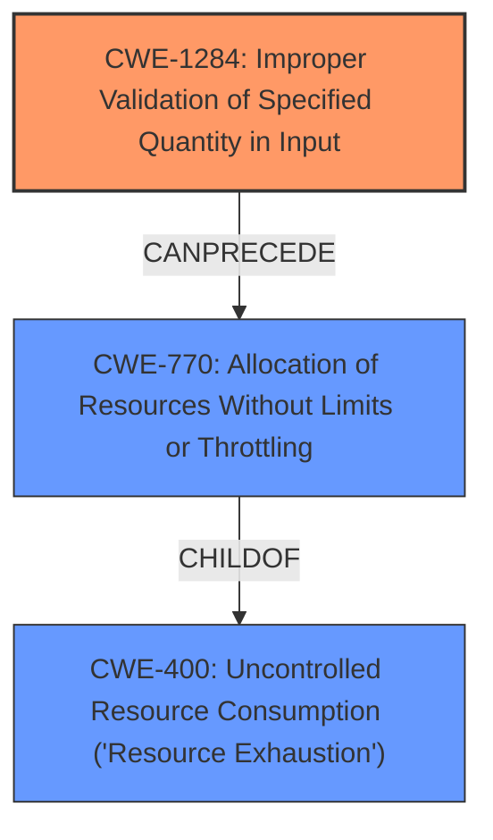

# Enhanced Analysis for CVE-2021-26373

# Summary
| CWE ID | CWE Name | Confidence | CWE Abstraction Level | CWE Vulnerability Mapping Label | CWE-Vulnerability Mapping Notes |
|---|---|---|---|---|---|
| CWE-1284 | Improper Validation of Specified Quantity in Input | 0.8 | Base | Primary | Allowed |
| CWE-770 | Allocation of Resources Without Limits or Throttling | 0.5 | Base | Secondary | Allowed |
| CWE-400 | Uncontrolled Resource Consumption ('Resource Exhaustion') | 0.3 | Class | Secondary | Allowed |

## Evidence and Confidence

*   **Confidence Score:** 0.8
*   **Evidence Strength:** HIGH

## Relationship Analysis
The primary CWE is CWE-1284, representing the **improper validation** of an expected quantity. A potential consequence of this **improper validation** is resource allocation without limits (CWE-770), which can lead to resource exhaustion (CWE-400). CWE-1284 can precede CWE-770, which is a child of CWE-400. The abstraction levels also influenced the selection. CWE-1284 and CWE-770 are base level, which is the preferred level, whereas CWE-400 is a class.



## Vulnerability Chain
The chain of events is as follows:
1.  **Root Cause:** **Insufficient bound checks** (translated to **improper validation** of input).
2.  **Weakness:** Inadequate control over resource allocation, potentially leading to excessive resource consumption.
3.  **Impact:** Denial of resources and/or possibly denial of service.

## Summary of Analysis
The initial assessment identified **insufficient bound checks** as the root cause, leading to potential denial of resources. The analysis focused on mapping this root cause to the most appropriate CWE.

The vulnerability description explicitly mentions "**insufficient bound checks** in the System Management Unit (SMU) may result in a system voltage malfunction that could result in denial of resources and/or possibly denial of service."

Based on the retriever results, CWE-1284 (Improper Validation of Specified Quantity in Input) was selected as the primary CWE. The SMU likely handles voltage settings, which are quantities. **Insufficient bound checks** can be interpreted as **improper validation** of these quantities. The other top CWEs, such as CWE-119 and CWE-20, are considered too general. CWE-1284 aligns well with the vulnerability's description and the concept of validating quantities related to system voltage.

CWE-770 (Allocation of Resources Without Limits or Throttling) was considered a secondary CWE because the improper validation of quantities could lead to excessive resource allocation. This is a reasonable potential consequence of the **insufficient bound checks**.

CWE-400 (Uncontrolled Resource Consumption) was considered as a possible impact as the **insufficient bound checks** could lead to denial of service.

The final selection prioritizes the root cause (**improper validation**) while also acknowledging potential consequences (resource allocation issues and denial of service). The chosen CWEs are at the optimal level of specificity, with CWE-1284 providing the most accurate representation of the **insufficient bound checks** in the SMU.

Relevant CWE Information:

# Enhanced Context (25 CWEs)

## CWE-1289: Improper Validation of Unsafe Equivalence in Input
**Abstraction Level**: Base
**Similarity Score**: 0.77
**Source**: dense

**Description**:
The product receives an input value that is used as a resource identifier or other type of reference, but it does not validate or incorrectly validates that the input is equivalent to a potentially-unsafe value.

**Mapping Guidance**:
- Usage: Allowed
- Rationale: This CWE entry is at the Base level of abstraction, which is a preferred level of abstraction for mapping to the root causes of vulnerabilities.

*Rejected:* This CWE doesn't fit as the input isn't necessarily a resource identifier.

## CWE-807: Reliance on Untrusted Inputs in a Security Decision
**Abstraction Level**: Base
**Similarity Score**: 0.75
**Source**: dense

**Description**:
The product uses a protection mechanism that relies on the existence or values of an input, but the input can be modified by an untrusted actor in a way that bypasses the protection mechanism.

**Mapping Guidance**:
- Usage: Allowed
- Rationale: This CWE entry is at the Base level of abstraction, which is a preferred level of abstraction for mapping to the root causes of vulnerabilities.

*Rejected:* The description does not suggest the presence of a protection mechanism.

## CWE-1220: Insufficient Granularity of Access Control
**Abstraction Level**: Base
**Similarity Score**: 0.75
**Source**: dense

**Description**:
The product implements access controls via a policy or other feature with the intention to disable or restrict accesses (reads and/or writes) to assets in a system from untrusted agents. However, implemented access controls lack required granularity, which renders the control policy too broad because it allows accesses from unauthorized agents to the security-sensitive assets.

**Mapping Guidance**:
- Usage: Allowed
- Rationale: This CWE entry is at the Base level of abstraction, which is a preferred level of abstraction for mapping to the root causes of vulnerabilities.

*Rejected:* The description does not suggest any access control.

## CWE-274: Improper Handling of Insufficient Privileges
**Abstraction Level**: Base
**Similarity Score**: 0.74
**Source**: dense

**Description**:
The product does not handle or incorrectly handles when it has insufficient privileges to perform an operation, leading to resultant weaknesses.

**Mapping Guidance**:
- Usage: Discouraged
- Rationale: This CWE entry could be deprecated in a future version of CWE.

*Rejected:* The description does not suggest any privilege issue.

## CWE-653: Improper Isolation or Compartmentalization
**Abstraction Level**: Class
**Similarity Score**: 0.74
**Source**: dense

**Description**:
The product does not properly compartmentalize or isolate functionality, processes, or resources that require different privilege levels, rights, or permissions.

**Mapping Guidance**:
- Usage: Allowed
- Rationale: This CWE entry is at the Base level of abstraction, which is a preferred level of abstraction for mapping to the root causes of vulnerabilities.

*Rejected:* The description does not suggest any isolation issue.

## CWE-799: Improper Control of Interaction Frequency
**Abstraction Level**: Class
**Similarity Score**: 0.74
**Source**: dense

**Description**:
The product does not properly limit the number or frequency of interactions that it has with an actor, such as the number of incoming requests.

**Mapping Guidance**:
- Usage: Allowed-with-Review
- Rationale: This CWE entry is a Class and might have Base-level children that would be more appropriate

*Rejected:* The description does not suggest frequency of interactions.

## CWE-280: Improper Handling of Insufficient Permissions or Privileges
**Abstraction Level**: Base
**Similarity Score**: 0.74
**Source**: dense

**Description**:
The product does not handle or incorrectly handles when it has insufficient privileges to access resources or functionality as specified by their permissions. This may cause it to follow unexpected code paths that may leave the product in an invalid state.

**Mapping Guidance**:
- Usage: Allowed
- Rationale: This CWE entry is at the Base level of abstraction, which is a preferred level of abstraction for mapping to the root causes of vulnerabilities.

*Rejected:* The description does not suggest any permissions issue.

## CWE-691: Insufficient Control Flow Management
**Abstraction Level**: Pillar
**Similarity Score**: 0.74
**Source**: dense

**Description**:
The code does not sufficiently manage its control flow during execution, creating conditions in which the control flow can be modified in unexpected ways.

**Mapping Guidance**:
- Usage: Discouraged
- Rationale: This CWE entry is extremely high-level, a Pillar. However, classification research is limited for weaknesses of this type, so there can be gaps or organizational difficulties within CWE that force use of this weakness, even at such a high level of abstraction.

*Rejected:* This is too high level.

## CWE-345: Insufficient Verification of Data Authenticity
**Abstraction Level**: Class
**Similarity Score**: 0.74
**Source**: dense

**Description**:
The product does not sufficiently verify the origin or authenticity of data, in a way that causes


## CWE Relationship Analysis

Current CWEs represent these abstraction levels: .


### Vulnerability Chain Analysis

**Chain starting from CWE-400:**
- 400 (Uncontrolled Resource Consumption) - ROOT


**Chain starting from CWE-280:**
- 280 (Improper Handling of Insufficient Permissions or Privileges ) - ROOT


### CWE Relationship Diagram

```mermaid
graph TD
    classDef primary fill:#f96,stroke:#333,stroke-width:2px
    classDef secondary fill:#69f,stroke:#333
    classDef tertiary fill:#9e9,stroke:#333
```