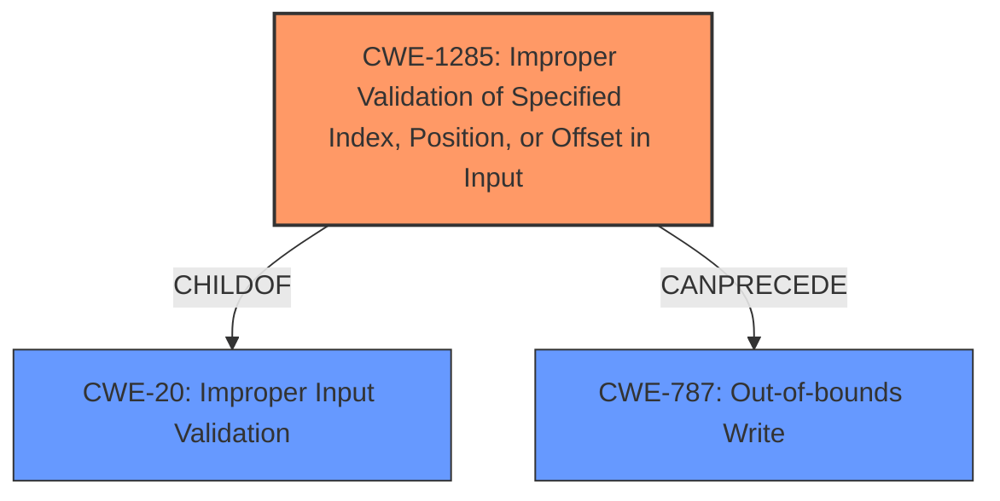

# Analysis for CVE-2021-26398

# Summary
| CWE ID    | CWE Name                                                                  | Confidence | CWE Abstraction Level | CWE Vulnerability Mapping Label | CWE-Vulnerability Mapping Notes |
| :--------- | :------------------------------------------------------------------------ | :--------- | :---------------------- | :------------------------------ | :------------------------------ |
| CWE-1285 | Improper Validation of Specified Index, Position, or Offset in Input | 0.90       | Base                    | Primary CWE                   | Allowed                       |
| CWE-787 | Out-of-bounds Write | 0.75       | Base                    | Secondary Candidate                   | Allowed                       |
| CWE-20     | Improper Input Validation                                                   | 0.60       | Class                   | Secondary Candidate                   | Discouraged                    |

## Evidence and Confidence

*   **Confidence Score:** 0.80
*   **Evidence Strength:** HIGH

## Relationship Analysis
The primary CWE is CWE-1285, which is a base level weakness, and a child of CWE-20. The vulnerability stems from **insufficient input validation** in the `SYS_KEY_DERIVE` system call, which could lead to an attacker corrupting ASP OS memory and potentially executing arbitrary code.
CWE-1285 is more specific than its parent CWE-20 because it pinpoints the lack of validation on a specified index, position, or offset. CWE-787 (Out-of-bounds Write) could be a consequence of this improper validation if the index, position, or offset is used to write data outside the intended buffer.

## Vulnerability Chain
The vulnerability chain starts with the **insufficient input validation** (CWE-1285) in the `SYS_KEY_DERIVE` system call. This **lack of validation** allows a compromised user application or ABL to provide malicious input. The consequence of this malicious input is the corruption of ASP OS memory, which can further lead to arbitrary code execution. This can be represented as:

CWE-1285 (Improper Validation of Specified Index, Position, or Offset in Input) -> Memory Corruption -> Arbitrary Code Execution.
CWE-787 (Out-of-bounds Write) could be a consequence of the improper validation and is potentially a step in memory corruption.

## Summary of Analysis
The initial assessment pointed towards CWE-20 (Improper Input Validation), but after further analysis and considering the retriever results, CWE-1285 (Improper Validation of Specified Index, Position, or Offset in Input) was chosen as the primary CWE due to its higher specificity and better alignment with the vulnerability description. The description clearly states that there is **insufficient input validation** in the `SYS_KEY_DERIVE` system call, but it doesn't just stop at any **lack of validation**, it is specifically related to index, position, or offset, which the system call uses to derive keys.

The evidence for this decision is primarily based on the "Vulnerability Description Key Phrases" which identify "**Insufficient input validation**" as the root cause, and the "CVE Reference Links Content Summary" which states "**Root cause of vulnerability:** Insufficient input validation in the `SYS_KEY_DERIVE` system call."

CWE-20 is a Class-level CWE and is discouraged for use when a more specific CWE is available. CWE-1285 is a Base-level CWE and a child of CWE-20, making it a more suitable choice.

CWE-787 (Out-of-bounds Write) is a plausible secondary CWE because the **insufficient input validation** could lead to writing data outside the intended buffer. However, the description doesn't explicitly state that an out-of-bounds write occurs, so it's a secondary consideration.

Relevant CWE Information:

# Enhanced Context (25 CWEs)
The following CWEs were identified as potentially relevant to this vulnerability:

## CWE-191: Integer Underflow (Wrap or Wraparound)
**Abstraction Level**: Base
**Similarity Score**: 0.79
**Source**: dense

**Description**:
The product subtracts one value from another, such that the result is less than the minimum allowable integer value, which produces a value that is not equal to the correct result.

**Mapping Guidance**:
- Usage: Allowed
- Rationale: This CWE entry is at the Base level of abstraction, which is a preferred level of abstraction for mapping to the root causes of vulnerabilities.

## CWE-197: Numeric Truncation Error
**Abstraction Level**: Base
**Similarity Score**: 0.76
**Source**: dense

**Description**:
Truncation errors occur when a primitive is cast to a primitive of a smaller size and data is lost in the conversion.

**Mapping Guidance**:
- Usage: Allowed
- Rationale: This CWE entry is at the Base level of abstraction, which is a preferred level of abstraction for mapping to the root causes of vulnerabilities.

## CWE-190: Integer Overflow or Wraparound
**Abstraction Level**: Base
**Similarity Score**: 0.76
**Source**: dense

**Description**:
The product performs a calculation that can
         produce an integer overflow or wraparound when the logic
         assumes that the resulting value will always be larger than
         the original value. This occurs when an integer value is
         incremented to a value that is too large to store in the
         associated representation. When this occurs, the value may
         become a very small or negative number.

**Mapping Guidance**:
- Usage: Allowed
- Rationale: This CWE entry is at the Base level of abstraction, which is a preferred level of abstraction for mapping to the root causes of vulnerabilities.

## CWE-131: Incorrect Calculation of Buffer Size
**Abstraction Level**: Base
**Similarity Score**: 0.76
**Source**: dense

**Description**:
The product does not correctly calculate the size to be used when allocating a buffer, which could lead to a buffer overflow.

**Mapping Guidance**:
- Usage: Allowed
- Rationale: This CWE entry is at the Base level of abstraction, which is a preferred level of abstraction for mapping to the root causes of vulnerabilities.

## CWE-681: Incorrect Conversion between Numeric Types
**Abstraction Level**: Base
**Similarity Score**: 0.76
**Source**: dense

**Description**:
When converting from one data type to another, such as long to integer, data can be omitted or translated in a way that produces unexpected values. If the resulting values are used in a sensitive context, then dangerous behaviors may occur.

**Mapping Guidance**:
- Usage: Allowed
- Rationale: This CWE entry is at the Base level of abstraction, which is a preferred level of abstraction for mapping to the root causes of vulnerabilities.

## CWE-1289: Improper Validation of Unsafe Equivalence in Input
**Abstraction Level**: Base
**Similarity Score**: 0.75
**Source**: dense

**Description**:
The product receives an input value that is used as a resource identifier or other type of reference, but it does not validate or incorrectly validates that the input is equivalent to a potentially-unsafe value.

**Mapping Guidance**:
- Usage: Allowed
- Rationale: This CWE entry is at the Base level of abstraction, which is a preferred level of abstraction for mapping to the root causes of vulnerabilities.

## CWE-125: Out-of-bounds Read
**Abstraction Level**: Base
**Similarity Score**: 0.75
**Source**: dense

**Description**:
The product reads data past the end, or before the beginning, of the intended buffer.

**Mapping Guidance**:
- Usage: Allowed
- Rationale: This CWE entry is at the Base level of abstraction, which is a preferred level of abstraction for mapping to the root causes of vulnerabilities.

## CWE-680: Integer Overflow to Buffer Overflow
**Abstraction Level**: Compound
**Similarity Score**: 0.74
**Source**: dense

**Description**:
The product performs a calculation to determine how much memory to allocate, but an integer overflow can occur that causes less memory to be allocated than expected, leading to a buffer overflow.

**Mapping Guidance**:
- Usage: Discouraged
- Rationale: This CWE entry is a named chain, which combines multiple weaknesses.

## CWE-129: Improper Validation of Array Index
**Abstraction Level**: Variant
**Similarity Score**: 0.74
**Source**: dense

**Description**:
The product uses untrusted input when calculating or using an array index, but the product does not validate or incorrectly validates the index to ensure the index references