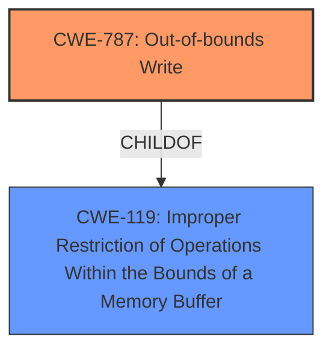

# Raw Analyzer Response for CVE-2021-26411

# Summary

| CWE ID | CWE Name | Confidence | CWE Abstraction Level | CWE Vulnerability Mapping Label | CWE-Vulnerability Mapping Notes |
|---|---|---|---|---|---|
| CWE-787 | Out-of-bounds Write | 1 | Base | Allowed | Primary CWE |

## Evidence and Confidence

*   **Confidence Score:** 1
*   **Evidence Strength:** HIGH

## Relationship Analysis

The primary relationship that influenced my decision was the direct mapping of **Memory Corruption** to **CWE-787 (Out-of-bounds Write)**. The Retriever Results also strongly suggested CWE-787 as the most relevant CWE. The parent-child relationship of CWE-787 to CWE-119 (Improper Restriction of Operations Within the Bounds of a Memory Buffer) was also considered, but CWE-787 is more specific and therefore a better fit.

## Vulnerability Chain

The vulnerability chain appears to be a single-step issue:

1.  **Root Cause:** **Memory Corruption** due to an out-of-bounds write (CWE-787).
2.  **Impact:** Unspecified impact due to memory corruption.

## Summary of Analysis

The primary analysis is based on the direct evidence of "**Memory Corruption**" in the vulnerability description, which aligns with the definition of CWE-787 (Out-of-bounds Write).

The "Vulnerability Description Key Phrases" section explicitly mentions "**weakness: Memory Corruption**", which is a key indicator for CWE-787. The "Alternative Terms" section for CWE-787 also explicitly mentions "Memory Corruption" as a term often used to describe the consequences of writing to memory outside the bounds of a buffer.

The retriever results further support this selection, with CWE-787 having a score of 1.000.

The "CWE for similar CVE Descriptions" section also lists CWE-787 as the Primary CWE Match and the Top CWE.

Based on this evidence, CWE-787 is the most appropriate and specific CWE for this vulnerability.

Relevant CWE Information:

# Enhanced Context (25 CWEs)

## CWE-131: Incorrect Calculation of Buffer Size
**Abstraction Level**: Base
**Similarity Score**: 0.79
**Source**: dense
**Description**: The product does not correctly calculate the size to be used when allocating a buffer, which could lead to a buffer overflow.
**Rationale for Not Selecting**: While incorrect buffer size calculation can lead to out-of-bounds writes, the provided vulnerability description does not explicitly mention any calculation errors. The description focuses on the **memory corruption** itself, making CWE-787 a more direct and suitable match.

## CWE-681: Incorrect Conversion between Numeric Types
**Abstraction Level**: Base
**Similarity Score**: 0.78
**Source**: dense
**Description**: When converting from one data type to another, such as long to integer, data can be omitted or translated in a way that produces unexpected values. If the resulting values are used in a sensitive context, then dangerous behaviors may occur.
**Rationale for Not Selecting**: There is no mention of type conversion issues in the vulnerability description.

## CWE-191: Integer Underflow (Wrap or Wraparound)
**Abstraction Level**: Base
**Similarity Score**: 0.77
**Source**: dense
**Description**: The product subtracts one value from another, such that the result is less than the minimum allowable integer value, which produces a value that is not equal to the correct result.
**Rationale for Not Selecting**: Integer underflow is not mentioned or implied in the vulnerability description.

## CWE-125: Out-of-bounds Read
**Abstraction Level**: Base
**Similarity Score**: 0.77
**Source**: dense
**Description**: The product reads data past the end, or before the beginning, of the intended buffer.
**Rationale for Not Selecting**: The vulnerability description mentions "**Memory Corruption**" not an out-of-bounds read, therefore CWE-787 is more appropriate.

## CWE-704: Incorrect Type Conversion or Cast
**Abstraction Level**: Class
**Similarity Score**: 0.77
**Source**: dense
**Description**: The product does not correctly convert an object, resource, or structure from one type to a different type.
**Rationale for Not Selecting**: There is no evidence of type conversion errors in the vulnerability description.

## CWE-823: Use of Out-of-range Pointer Offset
**Abstraction Level**: Base
**Similarity Score**: 0.77
**Source**: dense
**Description**: The product performs pointer arithmetic on a valid pointer, but it uses an offset that can point outside of the intended range of valid memory locations for the resulting pointer.
**Rationale for Not Selecting**: While an out-of-range pointer offset can lead to memory corruption, the description focuses on the effect (**Memory Corruption**) rather than the cause (pointer arithmetic).

## CWE-805: Buffer Access with Incorrect Length Value
**Abstraction Level**: Base
**Similarity Score**: 0.76
**Source**: dense
**Description**: The product uses a sequential operation to read or write a buffer, but it uses an incorrect length value that causes it to access memory that is outside of the bounds of the buffer.
**Rationale for Not Selecting**: The vulnerability description does not mention an incorrect length value.

## CWE-129: Improper Validation of Array Index
**Abstraction Level**: Variant
**Similarity Score**: 0.76
**Source**: dense
**Description**: The product uses untrusted input when calculating or using an array index, but the product does not validate or incorrectly validates the index to ensure the index references a valid position within the array.
**Rationale for Not Selecting**: There is no mention of array index validation issues.

## CWE-197: Numeric Truncation Error
**Abstraction Level**: Base
**Similarity Score**: 0.76
**Source**: dense
**Description**: Truncation errors occur when a primitive is cast to a primitive of a smaller size and data is lost in the conversion.
**Rationale for Not Selecting**: There is no mention of numeric truncation errors.

## CWE-126: Buffer Over-read
**Abstraction Level**: Variant
**Similarity Score**: 0.76
**Source**: dense
**Description**: The product reads from a buffer using buffer access mechanisms such as indexes or pointers that reference memory locations after the targeted buffer.
**Rationale for Not Selecting**: The vulnerability description mentions "**Memory Corruption**" and not specifically an over-read.

## CWE-190: Integer Overflow or Wraparound
**Abstraction Level**: Base
**Similarity Score**: 5460.04
**Source**: sparse
**Description**: The product performs a calculation that can produce an integer overflow or wraparound when the logic assumes that the resulting value will always be larger than the original value. This occurs when an integer value is incremented to a value that is too large to store in the associated representation. When this occurs, the value may become a very small or negative number.
**Rationale for Not Selecting**: There is no indication of integer overflow or wraparound issues.

## CWE-415: Double Free
**Abstraction Level**: Variant
**Similarity Score**: 5347.23
**Source**: sparse
**Description**: The product calls free() twice on the same memory address, potentially leading to modification of unexpected memory locations.
**Rationale for Not Selecting**: There is no mention of double free issues.

## CWE-193: Off-by-one Error
**Abstraction Level**: Base
**Similarity Score**: 5215.86
**Source**: sparse
**Description**: A product calculates or uses an incorrect maximum or minimum value that is 1 more, or 1 less, than the correct value.
**Rationale for Not Selecting**: There is no indication of an off-by-one error.

## CWE-123: Write-what-where Condition
**Abstraction Level**: base
**Similarity Score**: 5.03
**Source**: graph
**Description**: CWE-123: Write-what-where Condition
**Rationale for Not Selecting**: While an out-of-bounds write (CWE-787) *can* lead to a write-what-where condition, CWE-787 is a more direct and specific description of the vulnerability as described.

## CWE-416: Use After Free
**Abstraction Level**: variant
**Similarity Score**: 4.53
**Source**: graph
**Description**: CWE-416: Use After Free
**Rationale for Not Selecting**: There is no mention of "use after free" in the vulnerability description.

## CWE-825: Expired Pointer Dereference
**Abstraction Level**: base
**Similarity Score**: 4.33
**