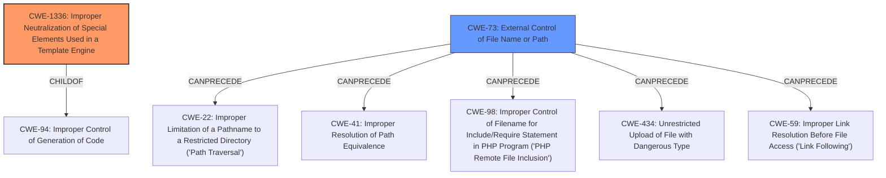

# Analysis Report for CVE-2021-26622

# Vulnerability Analysis Report: CVE-2021-26622

## Description


## Analysis (with Relationship Data)

# Summary
| CWE ID | CWE Name | Confidence | CWE Abstraction Level | CWE Vulnerability Mapping Label | CWE-Vulnerability Mapping Notes |
|---|---|---|---|---|---|
| CWE-1336 | Improper Neutralization of Special Elements Used in a Template Engine | 1.0 | Base | Allowed | Primary CWE. The description mentions SSTI vulnerability, and this CWE directly addresses that. |
| CWE-73 | External Control of File Name or Path | 0.7 | Base | Allowed | Secondary CWE. The description mentions insufficient file name parameter validation, which aligns with this CWE. |

## Evidence and Confidence

*   **Confidence Score:** 0.85
*   **Evidence Strength:** MEDIUM

## Relationship Analysis
The primary relationship influencing the decision is the ChildOf relationship between CWE-1336 and CWE-94 (Improper Control of Generation of Code). This indicates that the **SSTI vulnerability** (CWE-1336) is a specific type of code injection. Additionally, the CanPrecede relationship between CWE-73 and several file-related weaknesses highlights how **external control of filenames** can lead to other vulnerabilities.



## Vulnerability Chain
The vulnerability chain starts with two root causes:
1.  **SSTI vulnerability** (CWE-1336) allows attackers to inject template expressions.
2.  **Insufficient file name parameter validation** (CWE-73) allows attackers to control file paths.

These root causes lead to **remote code execution**, the impact of the vulnerability.

## Summary of Analysis
The primary vulnerability is a remote code execution vulnerability due to **SSTI vulnerability and insufficient file name parameter validation** in Genian NAC.

The vulnerability description explicitly mentions "SSTI vulnerability and insufficient file name parameter validation". This is strong evidence for mapping to CWE-1336 and CWE-73, respectively.

The graph relationships and retriever results support the selection of CWE-1336 as the primary weakness, as it is a direct cause of code injection. The retriever results also suggest CWE-73 due to "insufficient file name parameter validation."

The selected CWEs are at the optimal level of specificity (Base) because they accurately represent the root causes of the vulnerability. CWE-1336 precisely captures the **SSTI vulnerability**, and CWE-73 precisely captures the **insufficient file name parameter validation**.

Relevant CWE Information:

# Enhanced Context (25 CWEs)
The following CWEs were identified as potentially relevant to this vulnerability:

## CWE-80: Improper Neutralization of Script-Related HTML Tags in a Web Page (Basic XSS)
**Abstraction Level**: Variant
**Similarity Score**: 0.79

## CWE-184: Incomplete List of Disallowed Inputs
**Abstraction Level**: Base
**Similarity Score**: 0.77

## CWE-74: Improper Neutralization of Special Elements in Output Used by a Downstream Component ('Injection')
**Abstraction Level**: Class
**Similarity Score**: 0.76

## CWE-1289: Improper Validation of Unsafe Equivalence in Input
**Abstraction Level**: Base
**Similarity Score**: 0.76

## CWE-138: Improper Neutralization of Special Elements
**Abstraction Level**: Class
**Similarity Score**: 0.75

## CWE-917: Improper Neutralization of Special Elements used in an Expression Language Statement ('Expression Language Injection')
**Abstraction Level**: Base
**Similarity Score**: 0.74

## CWE-807: Reliance on Untrusted Inputs in a Security Decision
**Abstraction Level**: Base
**Similarity Score**: 0.74

## CWE-116: Improper Encoding or Escaping of Output
**Abstraction Level**: Class
**Similarity Score**: 0.74

## CWE-183: Permissive List of Allowed Inputs
**Abstraction Level**: Base
**Similarity Score**: 0.74

## CWE-41: Improper Resolution of Path Equivalence
**Abstraction Level**: Base
**Similarity Score**: 0.74

## CWE-116: Improper Encoding or Escaping of Output
**Abstraction Level**: Class
**Similarity Score**: 10569.20

## CWE-79: Improper Neutralization of Input During Web Page Generation ('Cross-site Scripting')
**Abstraction Level**: Base
**Similarity Score**: 10262.13

## CWE-184: Incomplete List of Disallowed Inputs
**Abstraction Level**: Base
**Similarity Score**: 10079.68

## CWE-22: Improper Limitation of a Pathname to a Restricted Directory ('Path Traversal')
**Abstraction Level**: Base
**Similarity Score**: 9999.96

## CWE-138: Improper Neutralization of Special Elements
**Abstraction Level**: Class
**Similarity Score**: 9983.03

## CWE-79: Improper Neutralization of Input During Web Page Generation ('Cross-site Scripting')
**Abstraction Level**: base
**Similarity Score**: 5.03

## CWE-78: Improper Neutralization of Special Elements used in an OS Command ('OS Command Injection')
**Abstraction Level**: base
**Similarity Score**: 5.03

## CWE-94: Improper Control of Generation of Code ('Code Injection')
**Abstraction Level**: base
**Similarity Score**: 4.33

## CWE-59: Improper Link Resolution Before File Access ('Link Following')
**Abstraction Level**: base
**Similarity Score**: 4.33

## CWE-434: Unrestricted Upload of File with Dangerous Type
**Abstraction Level**: base
**Similarity Score**: 4.33

## CWE-22: Improper Limitation of a Pathname to a Restricted Directory ('Path Traversal')
**Abstraction Level**: base
**Similarity Score**: 4.33

## CWE-494: Download of Code Without Integrity Check
**Abstraction Level**: base
**Similarity Score**: 4.33

## CWE-770: Allocation of Resources Without Limits or Throttling
**Abstraction Level**: base
**Similarity Score**: 4.33

## CWE-190: Integer Overflow or Wraparound
**Abstraction Level**: base
**Similarity Score**: 4.33

## CWE-98: Improper Control of Filename for Include/Require Statement in PHP Program ('PHP Remote File Inclusion')
**Abstraction Level**: variant
**Similarity Score**: 3.89

## CWE Details

### CWE-1336: Improper Neutralization of Special Elements Used in a Template Engine
The product uses a template engine to insert or process externally-influenced input, but it does not neutralize or incorrectly neutralizes special elements or syntax that can be interpreted as template expressions or other code directives when processed by the engine.

This aligns directly with the "**SSTI vulnerability**" mentioned in the description. The attacker can inject arbitrary expressions into the template, leading to code execution.

### CWE-73: External Control of File Name or Path
The product allows user input to control or influence paths or file names that are used in filesystem operations.

This aligns with "**insufficient file name parameter validation**" mentioned in the description. The attacker can control file paths, which can lead to various vulnerabilities.

### Rejected CWEs
*   CWE-20: Improper Input Validation: This is a very general class. Since the specific weaknesses are known (SSTI and filename control), it's better to use more specific CWEs.
*   CWE-79: Improper Neutralization of Input During Web Page Generation ('Cross-site Scripting'): While XSS could be a potential impact, the primary issue is the SSTI, which allows for broader code execution, not just script injection.
*   CWE-78: Improper Neutralization of Special Elements used in an OS Command ('OS Command Injection'): Although remote code execution is


## CWE Relationship Analysis

Current CWEs represent these abstraction levels: .


### Vulnerability Chain Analysis

**Chain starting from CWE-41:**
- 41 (Improper Resolution of Path Equivalence) - ROOT


**Chain starting from CWE-807:**
- 807 (Reliance on Untrusted Inputs in a Security Decision) - ROOT


### CWE Relationship Diagram

```mermaid
graph TD
    classDef primary fill:#f96,stroke:#333,stroke-width:2px
    classDef secondary fill:#69f,stroke:#333
    classDef tertiary fill:#9e9,stroke:#333
```


*Report generated on 2025-03-30 15:04:34*
