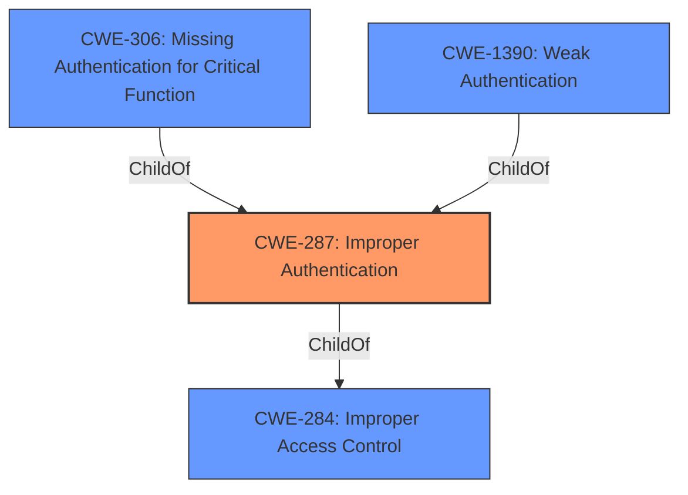

# Analysis for CVE-2021-26638

# Summary
| CWE ID | CWE Name | Confidence | CWE Abstraction Level | CWE Vulnerability Mapping Label | CWE-Vulnerability Mapping Notes |
|---|---|---|---|---|---|
| CWE-287 | Improper Authentication | 0.9 | Class | Primary | Discouraged, but chosen due to lack of specific information. Consider children or descendants, beginning with CWE-1390: Weak Authentication or CWE-306: Missing Authentication for Critical Function. |

## Evidence and Confidence

*   **Confidence Score:** 0.9
*   **Evidence Strength:** MEDIUM

## Relationship Analysis
The primary relationship considered was the ChildOf relationship between CWE-287 and its potential children, especially CWE-306 (Missing Authentication for Critical Function) and CWE-1390 (Weak Authentication). While CWE-287 is a Class-level CWE and discouraged, the provided description lacks specific details to pinpoint a more precise Base or Variant CWE. Therefore, CWE-287 serves as the initial high-level classification.

## Vulnerability Chain
The vulnerability chain starts with **Improper Authentication**, leading to authentication bypass and information exposure, ultimately allowing remote attackers to take control of the home environment.

## Summary of Analysis
The initial analysis identified **Improper Authentication** as the **rootcause** of the vulnerability. Based on the description, the S&D smarthome application has an **Improper Authentication** vulnerability that can lead to authentication bypass and information exposure.

The selection of CWE-287 is largely driven by the **Vulnerability Description Key Phrases**, which explicitly mentions "**Improper Authentication**". The "Retriever Results" also lists CWE-287 as the top combined result, but the Mapping Guidance discourages the usage of Class level CWEs, like CWE-287, when a more specific CWE is available. However, there is insufficient information to select a more specific CWE.

Relevant CWE Information:
- Vulnerability Description: **Improper Authentication** vulnerability in S&D smarthome(smartcare) application can cause authentication bypass and information exposure.

Based on the information, CWE-287 is at the optimal level of specificity given the limited evidence.

Other CWEs Considered but Not Used:
- CWE-259 (Use of Hard-coded Password), CWE-306 (Missing Authentication for Critical Function), CWE-290 (Authentication Bypass by Spoofing), CWE-798 (Use of Hard-coded Credentials), CWE-291 (Reliance on IP Address for Authentication), CWE-1392 (Use of Default Credentials): These CWEs were considered but not selected because the vulnerability description doesn't provide enough detail to confirm the specific mechanism of **Improper Authentication**. These would be more appropriate if the vulnerability involved hard-coded passwords, missing authentication, spoofing, or reliance on IP addresses.