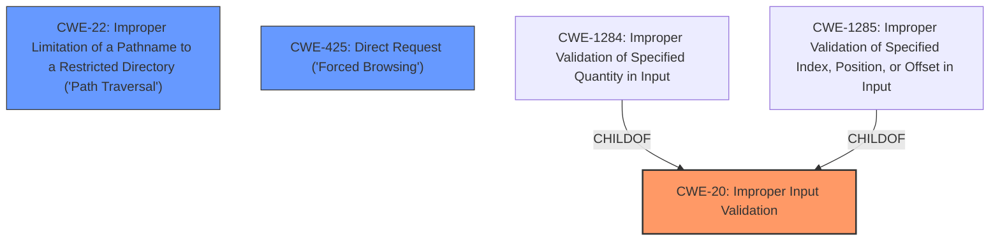

# Enhanced Analysis for CVE-2021-26639

# Summary
| CWE ID | CWE Name | Confidence | CWE Abstraction Level | CWE Vulnerability Mapping Label | CWE-Vulnerability Mapping Notes |
|---|---|---|---|---|---|
| CWE-20 | Improper Input Validation | 0.7 | Class | Primary | Discouraged: Consider lower-level children.|
| CWE-22 | Improper Limitation of a Pathname to a Restricted Directory ('Path Traversal') | 0.6 | Base | Secondary | Allowed: Could be a potential impact if the lack of validation allows access outside the intended directory.|
| CWE-425 | Direct Request ('Forced Browsing') | 0.5 | Base | Secondary | Allowed: Could be a potential impact if the lack of validation allows direct access to restricted resources.|

## Evidence and Confidence

*   **Confidence Score:** 0.7
*   **Evidence Strength:** MEDIUM

## Relationship Analysis
The primary CWE is CWE-20 [Improper Input Validation], which is a class-level CWE. The secondary CWEs, CWE-22 [Improper Limitation of a Pathname to a Restricted Directory ('Path Traversal')] and CWE-425 [Direct Request ('Forced Browsing')], are base-level CWEs and represent potential impacts of the **lack of input validation**. CWE-20 is a parent of CWE-1284 [Improper Validation of Specified Quantity in Input] and CWE-1285 [Improper Validation of Specified Index, Position, or Offset in Input], which could be more specific if more information were available.


## Vulnerability Chain
The vulnerability chain starts with the **lack of input validation** (CWE-20). This can lead to path traversal (CWE-22) if the input is a file path that isn't properly sanitized, allowing access to unintended files. It can also lead to direct request (CWE-425) if the system doesn't validate whether the user is authorized to access a specific URL.

## Summary of Analysis
The initial analysis identified CWE-20 [Improper Input Validation] as the primary weakness due to the **lack of validation of input values**. The vulnerability description explicitly states this **root cause**. The analysis considered CWE-22 [Improper Limitation of a Pathname to a Restricted Directory ('Path Traversal')] and CWE-425 [Direct Request ('Forced Browsing')] as secondary issues, representing potential consequences of the **lack of input validation**.

The evidence supporting this assessment comes directly from the "Vulnerability Description Key Phrases," which highlights the "**lack of validation of input values**" as the **rootcause**.

CWE-20 is a class-level CWE, and the MITRE mapping guidance discourages its use when more specific CWEs are available. However, without more detailed information about *what* input is not being validated or how, it's difficult to select a more specific base-level CWE. If the **lack of input validation** leads to path traversal, CWE-22 [Improper Limitation of a Pathname to a Restricted Directory ('Path Traversal')] could also be relevant. If the **lack of input validation** leads to access of restricted URLs, CWE-425 [Direct Request ('Forced Browsing')] could be relevant.

The selection of CWE-20 is at a slightly higher level of abstraction than preferred. More specific variants such as CWE-1284 [Improper Validation of Specified Quantity in Input], CWE-1285 [Improper Validation of Specified Index, Position, or Offset in Input] would be better if the specific type of **input validation** error was known, but based solely on the evidence provided, CWE-20 is the most appropriate choice.

Relevant CWE Information:


## CWE Relationship Analysis

Current CWEs represent these abstraction levels: .


### Vulnerability Chain Analysis

**Chain starting from CWE-425:**
- 425 (Direct Request ('Forced Browsing')) - ROOT


**Chain starting from CWE-20:**
- 20 (Improper Input Validation) - ROOT


### CWE Relationship Diagram

```mermaid
graph TD
    classDef primary fill:#f96,stroke:#333,stroke-width:2px
    classDef secondary fill:#69f,stroke:#333
    classDef tertiary fill:#9e9,stroke:#333
```