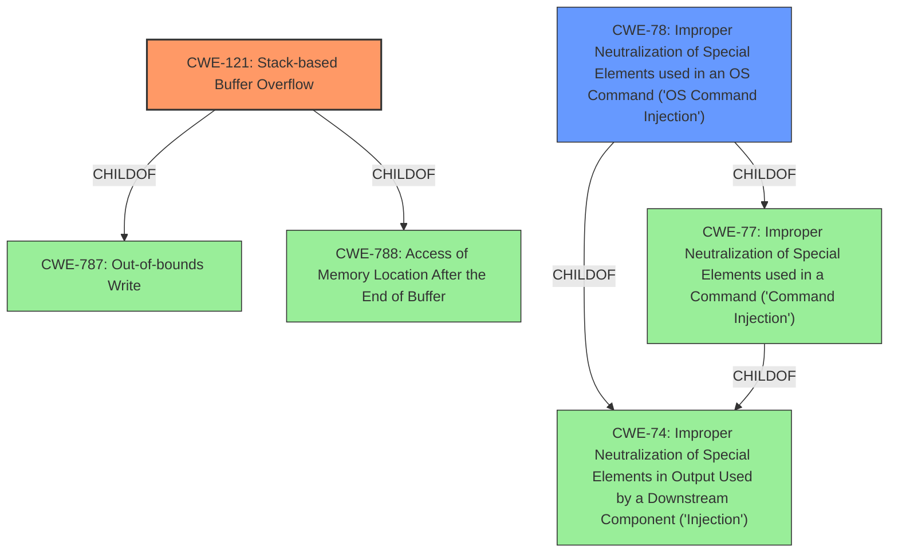

# Enhanced Analysis for CVE-2021-26727

# Summary
| CWE ID | CWE Name | Confidence | CWE Abstraction Level | CWE Vulnerability Mapping Label | CWE-Vulnerability Mapping Notes |
|---|---|---|---|---|---|
| CWE-121 | Stack-based Buffer Overflow | 0.9 | Variant | Allowed | Primary CWE |
| CWE-78 | Improper Neutralization of Special Elements used in an OS Command ('OS Command Injection') | 0.9 | Base | Allowed | Secondary CWE |

## Evidence and Confidence

*   **Confidence Score:** 0.9
*   **Evidence Strength:** HIGH

## Relationship Analysis
The primary CWE is CWE-121, a Variant of CWE-787 and CWE-788, representing a stack-based buffer overflow. CWE-78 is a Base CWE and a ChildOf CWE-77 and CWE-74, representing the command injection vulnerability. These two weaknesses are distinct and contribute independently to the overall vulnerability.



## Vulnerability Chain
The vulnerability chain starts with:
1.  **CWE-121**: **Stack-based buffer overflow** in the `SubNet_handler_func` due to **lack of input size validation**.
2.  **CWE-78**: **OS command injection** through the `safe_system` function, which fails to properly sanitize inputs, allowing arbitrary commands to be executed.

The impact is arbitrary code execution with root privileges, leading to full system compromise.

## Summary of Analysis
The initial assessment, based on the vulnerability description and CVE reference, identified **multiple command injections and stack-based buffer overflows**. The retriever results pointed to several relevant CWEs, including CWE-119, CWE-190, CWE-77, CWE-121, CWE-120 and CWE-78.

Based on the description "Multiple command injections and stack-based buffer overflows vulnerabilities in the SubNet_handler_func function of spx_restservice allow an attacker to execute arbitrary code with the same privileges as the server user (root)", the primary issue is the **stack-based buffer overflow** (CWE-121) and the **command injection** (CWE-78).

The description highlights that the `SubNet_handler_func` is vulnerable to both a stack-based buffer overflow and command injection. The CVE Reference Links Content Summary further confirms this, stating that the function uses an externally controlled HTTP parameter without proper length validation, leading to the overflow, and the use of `safe_system` which allows for the injection of arbitrary OS commands via the overflow.

CWE-121 (Stack-based Buffer Overflow) is selected as the primary CWE because the vulnerability description explicitly mentions "stack-based buffer overflows". The CVE Reference Links Content Summary supports this by stating that the function copies an externally controlled string into a fixed-size buffer on the stack without checking the input length.

CWE-78 (Improper Neutralization of Special Elements used in an OS Command ('OS Command Injection')) is selected as a secondary CWE because the vulnerability description mentions "command injections". The CVE Reference Links Content Summary supports this by stating that the `safe_system` function, despite its name, allows for the injection of arbitrary OS commands due to the lack of proper sanitization.

CWE-119 (Improper Restriction of Operations within the Bounds of a Memory Buffer) was considered but is a Class-level CWE and is too general. The specific vulnerability is a stack-based buffer overflow, which is better represented by CWE-121.

CWE-77 (Improper Neutralization of Special Elements used in a Command ('Command Injection')) was considered, but CWE-78 is more specific, as it relates to OS commands.

CWE-120 (Buffer Copy without Checking Size of Input ('Classic Buffer Overflow')) was considered but is less specific than CWE-121, which explicitly states that the buffer overflow is stack-based.

The selected CWEs are at the optimal level of specificity, accurately representing the weaknesses described in the vulnerability. They are supported by the evidence provided and align with the MITRE mapping guidance.


## CWE Relationship Analysis

Current CWEs represent these abstraction levels: .


### Vulnerability Chain Analysis

**Chain starting from CWE-190:**
- 190 (Integer Overflow or Wraparound) - ROOT


**Chain starting from CWE-121:**
- 121 (Stack-based Buffer Overflow) - ROOT


### CWE Relationship Diagram

```mermaid
graph TD
    classDef primary fill:#f96,stroke:#333,stroke-width:2px
    classDef secondary fill:#69f,stroke:#333
    classDef tertiary fill:#9e9,stroke:#333
```