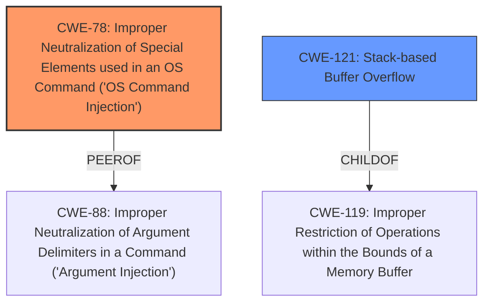

# Analysis for CVE-2021-26731

# Summary
| CWE ID    | CWE Name                                                                          | Confidence | CWE Abstraction Level | CWE Vulnerability Mapping Label | CWE-Vulnerability Mapping Notes |
| :---------- | :---------------------------------------------------------------------------------- | :--------- | :---------------------- | :------------------------------ | :------------------------------ |
| CWE-78      | Improper Neutralization of Special Elements used in an OS Command ('OS Command Injection') | 0.9        | Base                    | Primary                       | Allowed                       |
| CWE-121     | Stack-based Buffer Overflow                                                           | 0.9        | Variant                 | Secondary                     | Allowed                       |

## Evidence and Confidence

*   **Confidence Score:** 0.9
*   **Evidence Strength:** HIGH

## Relationship Analysis
The primary weakness is **CWE-78** Improper Neutralization of Special Elements used in an OS Command ('OS Command Injection'), because the vulnerability description mentions "**command injection**". The secondary weakness is **CWE-121** Stack-based Buffer Overflow, because the vulnerability description mentions "**stack-based buffer overflows**".

## Vulnerability Chain
The vulnerability chain starts with **CWE-78** and **CWE-121** due to the **improper neutralization** of input and **stack-based buffer overflows**, leading to the ability to **execute arbitrary code with the same privileges as the server user (root)**, highlighting a path from initial weakness to critical impact.

## Summary of Analysis
Initially, the vulnerability description points to two distinct weaknesses: command injection and stack-based buffer overflows.

The evidence supporting **CWE-78** is strong, as the description explicitly states "**command injection**". This indicates that the application constructs OS commands using externally influenced input without proper neutralization of special elements.

The evidence for **CWE-121** is also strong, with the explicit mention of "**stack-based buffer overflows**". This suggests that the application is susceptible to overwriting memory on the stack due to **improper** bounds checking.

The relationship analysis confirms that **CWE-78** and **CWE-121** can exist independently but can also be related in certain scenarios. Both can lead to arbitrary code execution.

I am confident in assigning **CWE-78** and **CWE-121** based on the explicit mentions in the vulnerability description and the supporting evidence.
**CWE-120 Buffer Copy without Checking Size of Input** was considered because it is a classic buffer overflow scenario, but **CWE-121 Stack-based Buffer Overflow** is a better fit because the vulnerability explicitly stated that the buffer overflow is stack-based.
**CWE-119 Improper Restriction of Operations within the Bounds of a Memory Buffer** was considered, but is too general, and **CWE-121 Stack-based Buffer Overflow** is a better fit because the vulnerability explicitly stated that the buffer overflow is stack-based.
# Enhanced Context (25 CWEs)
The following CWEs were identified as potentially relevant to this vulnerability:

## CWE-74: Improper Neutralization of Special Elements in Output Used by a Downstream Component ('Injection')
**Abstraction Level**: Class
**Similarity Score**: 0.75
**Source**: dense

**Description**:
The product constructs all or part of a command, data structure, or record using externally-influenced input from an upstream component, but it does not neutralize or incorrectly neutralizes special elements that could modify how it is parsed or interpreted when it is sent to a downstream component.

**Mapping Guidance**:
- Usage: Discouraged
- Rationale: CWE-74 is high-level and often misused when lower-level weaknesses are more appropriate.

## CWE-138: Improper Neutralization of Special Elements
**Abstraction Level**: Class
**Similarity Score**: 0.75
**Source**: dense

**Description**:
The product receives input from an upstream component, but it does not neutralize or incorrectly neutralizes special elements that could be interpreted as control elements or syntactic markers when they are sent to a downstream component.

**Mapping Guidance**:
- Usage: Discouraged
- Rationale: This CWE entry is a level-1 Class (i.e., a child of a Pillar). It might have lower-level children that would be more appropriate

## CWE-134: Use of Externally-Controlled Format String
**Abstraction Level**: Base
**Similarity Score**: 0.75
**Source**: dense

**Description**:
The product uses a function that accepts a format string as an argument, but the format string originates from an external source.

**Mapping Guidance**:
- Usage: Allowed
- Rationale: This CWE entry is at the Base level of abstraction, which is a preferred level of abstraction for mapping to the root causes of vulnerabilities.

## CWE-303: Incorrect Implementation of Authentication Algorithm
**Abstraction Level**: Base
**Similarity Score**: 0.74
**Source**: dense

**Description**:
The requirements for the product dictate the use of an established authentication algorithm, but the implementation of the algorithm is incorrect.

**Mapping Guidance**:
- Usage: Allowed
- Rationale: This CWE entry is at the Base level of abstraction, which is a preferred level of abstraction for mapping to the root causes of vulnerabilities.

## CWE-696: Incorrect Behavior Order
**Abstraction Level**: Class
**Similarity Score**: 0.74
**Source**: dense

**Description**:
The product performs multiple related behaviors, but the behaviors are performed in the wrong order in ways which may produce resultant weaknesses.

**Mapping Guidance**:
- Usage: Allowed-with-Review
- Rationale: This CWE entry is a Class and might have Base-level children that would be more appropriate

## CWE-345: Insufficient Verification of Data Authenticity
**Abstraction Level**: Class
**Similarity Score**: 0.74
**Source**: dense

**Description**:
The product does not sufficiently verify the origin or authenticity of data, in a way that causes it to accept invalid data.

**Mapping Guidance**:
- Usage: Discouraged
- Rationale: This CWE entry is a level-1 Class (i.e., a child of a Pillar). It might have lower-level children that would be more appropriate

## CWE-1391: Use of Weak Credentials
**Abstraction Level**: Class
**Similarity Score**: 0.74
**Source**: dense

**Description**:
The product uses weak credentials (such as a default key or hard-coded password) that can be calculated, derived, reused, or guessed by an attacker.

**Mapping Guidance**:
- Usage: Allowed-with-Review
- Rationale: This CWE entry is a Class and might have Base-level children that would be more appropriate

## CWE-668: Exposure of Resource to Wrong Sphere
**Abstraction Level**: Class
**Similarity Score**: 0.74
**Source**: dense

**Description**:
The product exposes a resource to the wrong control sphere, providing unintended actors with inappropriate access to the resource.

**Mapping Guidance**:
- Usage: Discouraged
- Rationale: CWE-668 is high-level and is often misused as a catch-all when lower-level CWE IDs might be applicable. It is sometimes used for low-information vulnerability reports [REF-1287]. It is a level-1 Class (i.e., a child of a Pillar). It is not useful for trend analysis.

## CWE-798: Use of Hard-coded Credentials
**Abstraction Level**: Base
**Similarity Score**: 0.74
**Source**: dense

**Description**:
The product contains hard-coded credentials, such as a password or cryptographic key.

**Mapping Guidance**:
- Usage: Allowed
- Rationale: This CWE entry is at the Base level of abstraction, which is a preferred level of abstraction for mapping to the root causes of vulnerabilities.

## CWE-755: Improper Handling of Exceptional Conditions
**Abstraction Level**: Class
**Similarity Score**: 0.74
**Source**: dense

**Description**:
The product does not handle or incorrectly handles an exceptional condition.

**Mapping Guidance**:
- Usage: Discouraged
- Rationale: This CWE entry is a level-1 Class (i.e., a child of a Pillar). It might have lower-level children that would be more appropriate

## CWE-190: Integer Overflow or Wraparound
**Abstraction Level**: Base
**Similarity Score**: 3622.04
**Source

# Enhanced Query for CVE-2021-26731

# Vulnerability Description

    Command injection and multiple **stack-based buffer overflows** vulnerabilities in the modifyUserb_func function of spx_restservice allow an attacker to execute arbitrary code with the same privileges as the server user (root). This issue affects Lanner Inc IAC-AST2500A standard firmware version 1.10.0.

    # Keyphrase-Specific CWE Analysis
    This vulnerability contains multiple keyphrases that may map to different CWEs. 
    Please analyze each keyphrase separately and determine the most appropriate CWE(s) for each.

    ## ROOTCAUSE: 'off-by-null dereference'

Relevant CWEs for this ROOTCAUSE:

### 1. CWE-121: Stack-based Buffer Overflow (Score: 311.20)

A stack-based buffer overflow condition is a condition where the buffer being overwritten is allocated on the stack (i.e., is a local variable or, rarely, a parameter to a function)....

### 2. CWE-193: Off-by-one Error (Score: 303.73)

A product calculates or uses an incorrect maximum or minimum value that is 1 more, or 1 less, than the correct value....

### 3. CWE-120: Buffer Copy without Checking Size of Input ('Classic Buffer Overflow') (Score: 294.80)

The product copies an input buffer to an output buffer without verifying that the size of the input buffer is less than the size of the output buffer, leading to a buffer overflow....

### 4. CWE-476: NULL Pointer Dereference (Score: 280.68)

The product dereferences a pointer that it expects to be valid but is NULL....

### 5. CWE-119: Improper Restriction of Operations within the Bounds of a Memory Buffer (Score: 268.32)

The product performs operations on a memory buffer, but it reads from or writes to a memory location outside the buffer's intended boundary. This may result in read or write operations on unexpected memory locations that could be linked to other variables, data structures, or internal program data....

## WEAKNESS: 'command injection'

Relevant CWEs for this WEAKNESS:

### 1. CWE-121: Stack-based Buffer Overflow (Score: 311.20)

A stack-based buffer overflow condition is a condition where the buffer being overwritten is allocated on the stack (i.e., is a local variable or, rarely, a parameter to a function)....

### 2. CWE-78: Improper Neutralization of Special Elements used in an OS Command ('OS Command Injection') (Score: 272.75)

The product constructs all or part of an OS command using externally-influenced input from an upstream component, but it does not neutralize or incorrectly neutralizes special elements that could modify the intended OS command when it is sent to a downstream component....

### 3. CWE-138: Improper Neutralization of Special Elements (Score: 250.45)

The product receives input from an upstream component, but it does not neutralize or incorrectly neutralizes special elements that could be interpreted as control elements or syntactic markers when they are sent to a downstream component....

### 4. CWE-20: Improper Input Validation (Score: 249.93)

The product receives input or data, but it does
        not validate or incorrectly validates that the input has the
        properties that are required to process the data safely and
        correctly....

### 5. CWE-88: Improper Neutralization of Argument Delimiters in a Command ('Argument Injection') (Score: 238.20)

The product constructs a string for a command to be executed by a separate component
in another control sphere, but it does not properly delimit the
intended arguments, options, or switches within that command string....

## WEAKNESS: 'stack-based buffer overflows'

Relevant CWEs for this WEAKNESS:

### 1. CWE-121: Stack-based Buffer Overflow (Score: 311.20)

A stack-based buffer overflow condition is a condition where the buffer being overwritten is allocated on the stack (i.e., is a local variable or, rarely, a parameter to a function)....

### 2. CWE-193: Off-by-one Error (Score: 303.73)

A product calculates or uses an incorrect maximum or minimum value that is 1 more, or 1 less, than the correct value....

### 3. CWE-120: Buffer Copy without Checking Size of Input ('Classic Buffer Overflow') (Score: 294.80)

The product copies an input buffer to an output buffer without verifying that the size of the input buffer is less than the size of the output buffer, leading to a buffer overflow....

### 4. CWE-1284: Improper Validation of Specified Quantity in Input (Score: 266.42)

The product receives input that is expected to specify a quantity (such as size or length), but it does not validate or incorrectly validates that the quantity has the required properties....

### 5. CWE-190: Integer Overflow or Wraparound (Score: 266.41)

The product performs a calculation that can
         produce an integer overflow or wraparound when the logic
         assumes that the resulting value will always be larger than
         the original value. This occurs when an integer value is
         incremented to a value that is too large to st...

## IMPACT: 'execute arbitrary code with the same privileges as the server user (root)'

Relevant CWEs for this IMPACT:

### 1. CWE-121: Stack-based Buffer Overflow (Score: 311.20)

A stack-based buffer overflow condition is a condition where the buffer being overwritten is allocated on the stack (i.e., is a local variable or, rarely, a parameter to a function)....

### 2. CWE-78: Improper Neutralization of Special Elements used in an OS Command ('OS Command Injection') (Score: 272.75)

The product constructs all or part of an OS command using externally-influenced input from an upstream component, but it does not neutralize or incorrectly neutralizes special elements that could modify the intended OS command when it is sent to a downstream component....

### 3. CWE-20: Improper Input Validation (Score: 249.93)

The product receives input or data, but it does
        not validate or incorrectly validates that the input has the
        properties that are required to process the data safely and
        correctly....

### 4. CWE-250: Execution with Unnecessary Privileges (Score: 125.58)

The product performs an operation at a privilege level that is higher than the minimum level required, which creates new weaknesses or amplifies the consequences of other weaknesses....

### 5. CWE-427: Uncontrolled Search Path Element (Score: 123.19)

The product uses a fixed or controlled search path to find resources, but one or more locations in that path can be under the control of unintended actors....

## ATTACKER: 'attacker'

Relevant CWEs for this ATTACKER:

### 1. CWE-121: Stack-based Buffer Overflow (Score: 311.20)

A stack-based buffer overflow condition is a condition where the buffer being overwritten is allocated on the stack (i.e., is a local variable or, rarely, a parameter to a function)....

### 2. CWE-78: Improper Neutralization of Special Elements used in an OS Command ('OS Command Injection') (Score: 272.75)

The product constructs all or part of an OS command using externally-influenced input from an upstream component, but it does not neutralize or incorrectly neutralizes special elements that could modify the intended OS command when it is sent to a downstream component....

### 3. CWE-119: Improper Restriction of Operations within the Bounds of a Memory Buffer (Score: 268.32)

The product performs operations on a memory buffer, but it reads from or writes to a memory location outside the buffer's intended boundary. This may result in read or write operations on unexpected memory locations that could be linked to other variables, data structures, or internal program data....

### 4. CWE-20: Improper Input Validation (Score: 249.93)

The product receives input or data, but it does
        not validate or incorrectly validates that the input has the
        properties that are required to process the data safely and
        correctly....

### 5. CWE-284: Improper Access Control (Score: 81.80)

The product does not restrict or incorrectly restricts access to a resource from an unauthorized actor....

## PRODUCT: 'Lanner Inc IAC-AST2500A'

Relevant CWEs for this PRODUCT:

### 1. CWE-121: Stack-based Buffer Overflow (Score: 311.20)

A stack-based buffer overflow condition is a condition where the buffer being overwritten is allocated on the stack (i.e., is a local variable or, rarely, a parameter to a function)....

### 2. CWE-78: Improper Neutralization of Special Elements used in an OS Command ('OS Command Injection') (Score: 272.75)

The product constructs all or part of an OS command using externally-influenced input from an upstream component, but it does not neutralize or incorrectly neutralizes special elements that could modify the intended OS command when it is sent to a downstream component....

### 3. CWE-138: Improper Neutralization of Special Elements (Score: 250.45)

The product receives input from an upstream component, but it does not neutralize or incorrectly neutralizes special elements that could be interpreted as control elements or syntactic markers when they are sent to a downstream component....

### 4. CWE-284: Improper Access Control (Score: 81.80)

The product does not restrict or incorrectly restricts access to a resource from an unauthorized actor....

### 5. CWE-134: Use of Externally-Controlled Format String (Score: 81.46)

The product uses a function that accepts a format string as an argument, but the format string originates from an external source....

## VERSION: 'standard firmware version 1.10.0'

Relevant CWEs for this VERSION:

### 1. CWE-121: Stack-based Buffer Overflow (Score: 311.20)

A stack-based buffer overflow condition is a condition where the buffer being overwritten is allocated on the stack (i.e., is a local variable or, rarely, a parameter to a function)....

### 2. CWE-78: Improper Neutralization of Special Elements used in an OS Command ('OS Command Injection') (Score: 272.75)

The product constructs all or part of an OS command using externally-influenced input from an upstream component, but it does not neutralize or incorrectly neutralizes special elements that could modify the intended OS command when it is sent to a downstream component....

### 3. CWE-119: Improper Restriction of Operations within the Bounds of a Memory Buffer (Score: 268.32)

The product performs operations on a memory buffer, but it reads from or writes to a memory location outside the buffer's intended boundary. This may result in read or write operations on unexpected memory locations that could be linked to other variables, data structures, or internal program data....

### 4. CWE-20: Improper Input Validation (Score: 249.93)

The product receives input or data, but it does
        not validate or incorrectly validates that the input has the
        properties that are required to process the data safely and
        correctly....

### 5. CWE-284: Improper Access Control (Score: 81.80)

The product does not restrict or incorrectly restricts access to a resource from an unauthorized actor....

## COMPONENT: 'modifyUserb_func function'

Relevant CWEs for this COMPONENT:

### 1. CWE-121: Stack-based Buffer Overflow (Score: 311.20)

A stack-based buffer overflow condition is a condition where the buffer being overwritten is allocated on the stack (i.e., is a local variable or, rarely, a parameter to a function)....

### 2. CWE-78: Improper Neutralization of Special Elements used in an OS Command ('OS Command Injection') (Score: 272.75)

The product constructs all or part of an OS command using externally-influenced input from an upstream component, but it does not neutralize or incorrectly neutralizes special elements that could modify the intended OS command when it is sent to a downstream component....

### 3. CWE-119: Improper Restriction of Operations within the Bounds of a Memory Buffer (Score: 268.32)

The product performs operations on a memory buffer, but it reads from or writes to a memory location outside the buffer's intended boundary. This may result in read or write operations on unexpected memory locations that could be linked to other variables, data structures, or internal program data....

### 4. CWE-138: Improper Neutralization of Special Elements (Score: 250.45)

The product receives input from an upstream component, but it does not neutralize or incorrectly neutralizes special elements that could be interpreted as control elements or syntactic markers when they are sent to a downstream component....

### 5. CWE-20: Improper Input Validation (Score: 249.93)

The product receives input or data, but it does
        not validate or incorrectly validates that the input has the
        properties that are required to process the data safely and
        correctly....

    # Analysis Instructions
    1. For each keyphrase, identify the most appropriate CWE(s) that represent the weakness.
    2. Consider how the different keyphrases might relate to each other in the vulnerability chain.
    3. Provide a final determination of primary CWE(s) and any secondary CWEs.
    4. Format your response using the standard analysis template.

    Please analyze how these different weaknesses interact and provide a comprehensive CWE classification.
    