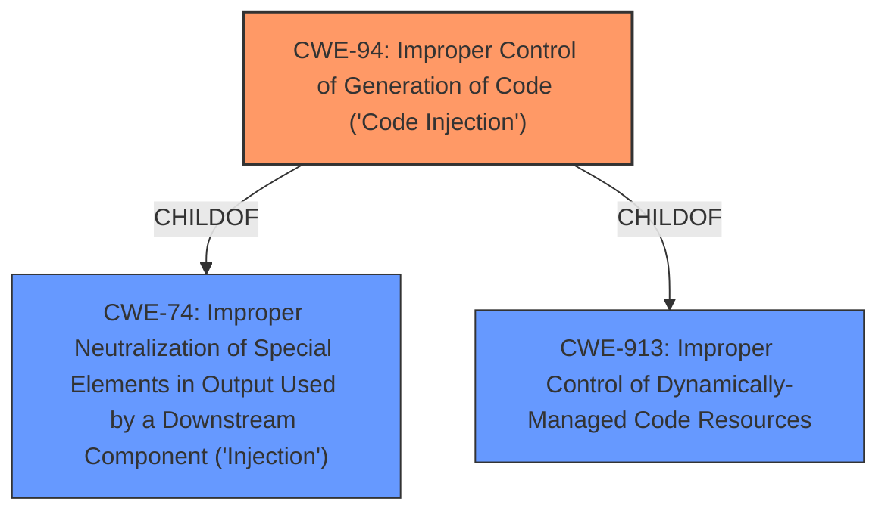

# Analysis for CVE-2021-26855

# Summary
| CWE ID | CWE Name | Confidence | CWE Abstraction Level | CWE Vulnerability Mapping Label | CWE-Vulnerability Mapping Notes |
|---|---|---|---|---|---|
| CWE-94 | Improper Control of Generation of Code ('Code Injection') | 0.7 | Base | Allowed-with-Review | Primary CWE |

## Evidence and Confidence

*   **Confidence Score:** 0.7
*   **Evidence Strength:** LOW

## Relationship Analysis
The primary CWE is CWE-94, which is a base-level CWE. This CWE can be a child of CWE-74 (Improper Neutralization of Special Elements in Output Used by a Downstream Component ('Injection')) or CWE-913 (Improper Control of Dynamically-Managed Code Resources). There are no clear chain relationships to use.

## Vulnerability Chain
The vulnerability description only states that a Remote Code Execution vulnerability exists in Microsoft Exchange Server. More information is needed to understand the chain of events that leads to the vulnerability.

## Summary of Analysis
The vulnerability description is very brief and only states that there is a "Microsoft Exchange Server Remote Code Execution Vulnerability".

The **Vulnerability Description Key Phrases** show the **impact** as Remote Code Execution and the **product** as Microsoft Exchange Server.

The **CWE for similar CVE Descriptions** only shows CWE-NVD-noinfo as the Primary CWE Match, which means that the description is too generic to map to a specific CWE.

The **Retriever Results** lists CWE-94 (Improper Control of Generation of Code ('Code Injection')) as having the highest score. This CWE is related to code injection, which can lead to remote code execution. CWE-94 is listed as "Allowed-with-Review" because it is frequently misused. The description states "This weakness only applies when the product's functionality intentionally constructs all or part of a code segment".

Based on the limited information available, CWE-94 appears to be the most appropriate CWE for this vulnerability.

Relevant CWE Information:
# Enhanced Context (25 CWEs)
The following CWEs were identified as potentially relevant to this vulnerability:

## CWE-94: Improper Control of Generation of Code ('Code Injection')
**Abstraction Level**: base
**Similarity Score**: 4.33
**Source**: graph

**Description**:
CWE-94: Improper Control of Generation of Code ('Code Injection')

**Mapping Guidance**:
- Usage: Allowed-with-Review
- Rationale: This entry is frequently misused for vulnerabilities with a technical impact of "code execution," which does not by itself indicate a root cause weakness, since dozens of weaknesses can enable code execution.

**Relationships**:
- CANFOLLOW -> CWE-98
- PARENTOF -> CWE-96
- PARENTOF -> CWE-95
- PARENTOF -> CWE-1336
- CHILDOF -> CWE-913