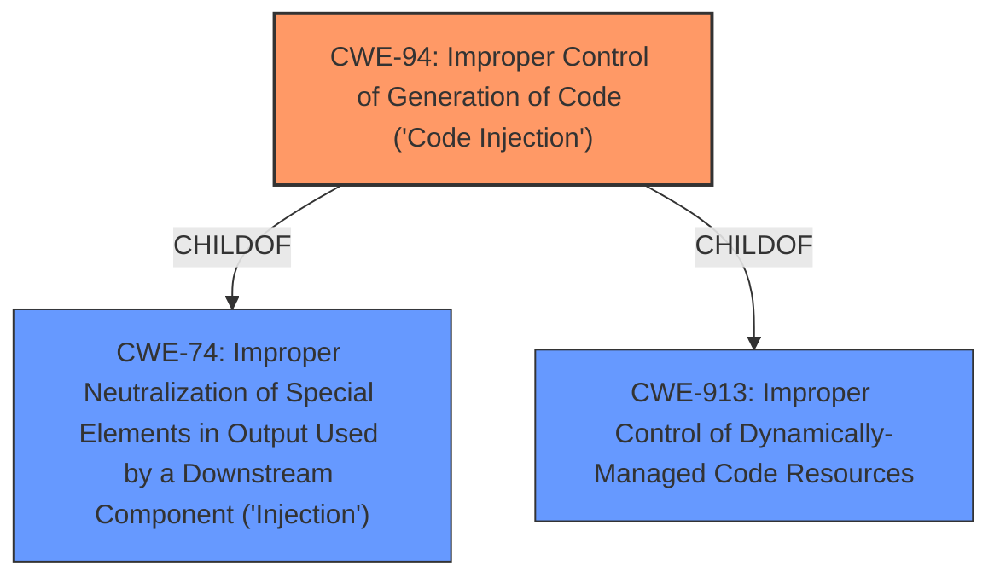

# Analysis for CVE-2021-27065

# Summary
| CWE ID | CWE Name | Confidence | CWE Abstraction Level | CWE Vulnerability Mapping Label | CWE-Vulnerability Mapping Notes |
|---|---|---|---|---|---|
| CWE-94 | Improper Control of Generation of Code ('Code Injection') | 0.7 | Base | Allowed-with-Review | Primary CWE |
| CWE-NVD-noinfo | NVD has no information | 0.2 |   |   | Secondary Candidate |

## Evidence and Confidence

*   **Confidence Score:** 0.7
*   **Evidence Strength:** LOW

## Relationship Analysis
The primary relationship influencing the selection is that CWE-94 is a base CWE which can result in code execution. The challenge with CWE-94 is that it is frequently misused, but it can be applicable if the software constructs a code segment from external input. The other CWEs were considered but did not match well.

## Vulnerability Chain
The chain of root cause and weaknesses are as follows:
1.  Improper control of code generation (CWE-94) leads to remote code execution.
2.  The description provides very little information to build out the chain of weaknesses.

## Summary of Analysis
Based on the provided information, the vulnerability is a Microsoft Exchange Server Remote Code Execution Vulnerability. The key phrase is **impact:** Remote Code Execution. The "CWE for similar CVE Descriptions" section lists `CWE-NVD-noinfo` as the primary match. However, that is not particularly helpful in understanding the root cause.

The retriever results suggest several CWEs, including:
*   CWE-918: Server-Side Request Forgery (SSRF)
*   CWE-84: Improper Neutralization of Encoded URI Schemes in a Web Page
*   CWE-502: Deserialization of Untrusted Data
*   CWE-338: Use of Cryptographically Weak Pseudo-Random Number Generator (PRNG)
*   CWE-88: Improper Neutralization of Argument Delimiters in a Command ('Argument Injection')
*   CWE-94: Improper Control of Generation of Code ('Code Injection')
*   CWE-79: Improper Neutralization of Input During Web Page Generation ('Cross-site Scripting')
*   CWE-322: Key Exchange without Entity Authentication
*   CWE-23: Relative Path Traversal
*   CWE-184: Incomplete List of Disallowed Inputs

Given the **impact** is Remote Code Execution, a closer look at CWE-94 is warranted. CWE-94 is "Improper Control of Generation of Code ('Code Injection')". The description for CWE-94 mentions: "The product constructs all or part of a code segment using externally-influenced input from an upstream component, but it does not neutralize or incorrectly neutralizes special elements that could modify the syntax or behavior of the intended code segment."

The mapping guidance for CWE-94 is "Allowed-with-Review" with the rationale: "This entry is frequently misused for vulnerabilities with a technical impact of "code execution," which does not by itself indicate a root cause weakness, since dozens of weaknesses can enable code execution."

Since the vulnerability description only mentions "Remote Code Execution" and "Microsoft Exchange Server", it is difficult to determine the root cause. However, given that the vulnerability results in code execution, and without other information, CWE-94 is the best candidate with the information provided.

CWE-NVD-noinfo is only provided because there is no additional information.

Relevant CWE Information:
*   CWE-94: Improper Control of Generation of Code ('Code Injection')
    *   The product constructs all or part of a code segment using externally-influenced input from an upstream component, but it does not neutralize or incorrectly neutralizes special elements that could modify the syntax or behavior of the intended code segment.
    *   This could allow an attacker to craft code in such a way that it alters the intended control flow, leading to arbitrary code execution.
    *   The relationship context shows that it is a child of CWE-74 (Improper Neutralization of Special Elements in Output Used by a Downstream Component ('Injection')) and CWE-913 (Improper Control of Dynamically-Managed Code Resources).
    *   The mapping guidance is "Allowed-with-Review" because it is frequently misused for vulnerabilities with a technical impact of "code execution".

*   CWE-NVD-noinfo
    *   This is a placeholder when the NVD doesn't provide enough information to map to a specific CWE.
    *   It is not a true CWE and does not provide any details about the weakness.

I am choosing CWE-94 as the primary CWE because it aligns with the remote code execution impact, even though the evidence is weak.