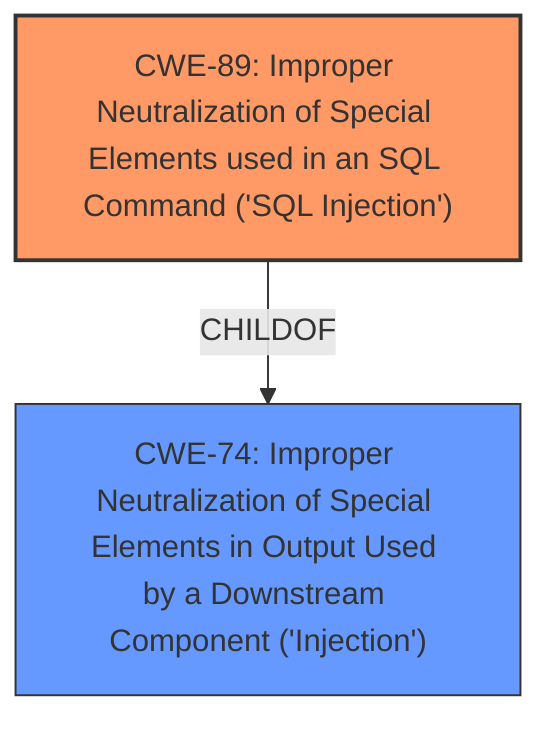

# Enhanced Analysis for CVE-2021-27101

# Summary
| CWE ID | CWE Name | Confidence | CWE Abstraction Level | CWE Vulnerability Mapping Label | CWE-Vulnerability Mapping Notes |
|---|---|---|---|---|---|
| CWE-89 | Improper Neutralization of Special Elements used in an SQL Command ('SQL Injection') | 1.0 | Base | Allowed | Primary CWE |

## Evidence and Confidence

*   **Confidence Score:** 1.0
*   **Evidence Strength:** HIGH

## Relationship Analysis
The primary relationship is that **CWE-89** [CWE-89: Improper Neutralization of Special Elements used in an SQL Command ('SQL Injection')] is a child of **CWE-74** [CWE-74: Improper Neutralization of Special Elements in Output Used by a Downstream Component ('Injection')]. **CWE-89** [CWE-89: Improper Neutralization of Special Elements used in an SQL Command ('SQL Injection')] is more specific and directly relates to SQL Injection, while **CWE-74** [CWE-74: Improper Neutralization of Special Elements in Output Used by a Downstream Component ('Injection')] is a more general class of injection vulnerabilities. Given the explicit mention of SQL injection, **CWE-89** [CWE-89: Improper Neutralization of Special Elements used in an SQL Command ('SQL Injection')] is the better choice.



## Vulnerability Chain
The vulnerability chain involves the following:
  1.  A crafted Host header is sent in a request.
  2.  The Accellion FTA software **fails to neutralize** special elements in the header.
  3.  This leads to **SQL injection**.

## Summary of Analysis
The vulnerability description clearly states that the Accellion FTA software is affected by **SQL injection** via a crafted Host header. The "CVE Reference Links Content Summary" confirms this, stating "The vulnerability stems from a **SQL injection** flaw," and "The core issue is a **SQL injection** vulnerability... This allows an attacker to manipulate SQL queries executed by the application."

The retriever results also list **CWE-89** [CWE-89: Improper Neutralization of Special Elements used in an SQL Command ('SQL Injection')] as a relevant CWE.

The selection of **CWE-89** [CWE-89: Improper Neutralization of Special Elements used in an SQL Command ('SQL Injection')] is based on the direct evidence of **SQL injection**, making it the most accurate and specific CWE.

Relevant CWE Information:

# Enhanced Context (25 CWEs)
The following CWEs were identified as potentially relevant to this vulnerability:

## CWE-74: Improper Neutralization of Special Elements in Output Used by a Downstream Component ('Injection')
**Abstraction Level**: Class
**Similarity Score**: 0.74
**Source**: dense

**Description**:
The product constructs all or part of a command, data structure, or record using externally-influenced input from an upstream component, but it does not neutralize or incorrectly neutralizes special elements that could modify how it is parsed or interpreted when it is sent to a downstream component.

**Mapping Guidance**:
- Usage: Discouraged
- Rationale: CWE-74 is high-level and often misused when lower-level weaknesses are more appropriate.

## CWE-89: Improper Neutralization of Special Elements used in an SQL Command ('SQL Injection')
**Abstraction:** Base
**Status:** Stable

### Description
The product constructs all or part of an SQL command using externally-influenced input from an upstream component, but it does not neutralize or incorrectly neutralizes special elements that could modify the intended SQL command when it is sent to a downstream component. Without sufficient removal or quoting of SQL syntax in user-controllable inputs, the generated SQL query can cause those inputs to be interpreted as SQL instead of ordinary user data.

### Extended Description
Not provided

### Alternative Terms
SQL injection: a common attack-oriented phrase
SQLi: a common abbreviation for "SQL injection"

### Relationships
ChildOf -> CWE-943
ChildOf -> CWE-74

### Mapping Guidance
**Usage:** Allowed
**Rationale:** This CWE entry is at the Base level of abstraction, which is a preferred level of abstraction for mapping to the root causes of vulnerabilities.
**Comments:** Carefully read both the name and description to ensure that this mapping is an appropriate fit. Do not try to 'force' a mapping to a lower-level Base/Variant simply to comply with this preferred level of abstraction.
**Reasons:**
- Acceptable-Use

### Additional Notes
**[Relationship]** SQL injection can be resultant from special character mismanagement, MAID, or denylist/allowlist problems. It can be primary to authentication errors.

### Observed Examples
- **CVE-2023-32530:** SQL injection in security product dashboard using crafted certificate fields
- **CVE-2021-42258:** SQL injection in time and billing software, as exploited in the wild per CISA KEV.
- **CVE-2021-27101:** SQL injection in file-transfer system via a crafted Host header, as exploited in the wild per CISA KEV.

**CWE-89** [CWE-89: Improper Neutralization of Special Elements used in an SQL Command ('SQL Injection')] is selected because the vulnerability description explicitly mentions **SQL injection**. The description of **CWE-89** [CWE-89: Improper Neutralization of Special Elements used in an SQL Command ('SQL Injection')] precisely matches the vulnerability: "The product constructs all or part of an SQL command using externally-influenced input... but it does not neutralize or incorrectly neutralizes special elements that could modify the intended SQL command."


## CWE Relationship Analysis

Current CWEs represent these abstraction levels: .


### Vulnerability Chain Analysis

**Chain starting from CWE-89:**
- 89 (Improper Neutralization of Special Elements used in an SQL Command ('SQL Injection')) - ROOT


**Chain starting from CWE-74:**
- 74 (Improper Neutralization of Special Elements in Output Used by a Downstream Component ('Injection')) - ROOT


### CWE Relationship Diagram

```mermaid
graph TD
    classDef primary fill:#f96,stroke:#333,stroke-width:2px
    classDef secondary fill:#69f,stroke:#333
    classDef tertiary fill:#9e9,stroke:#333
```