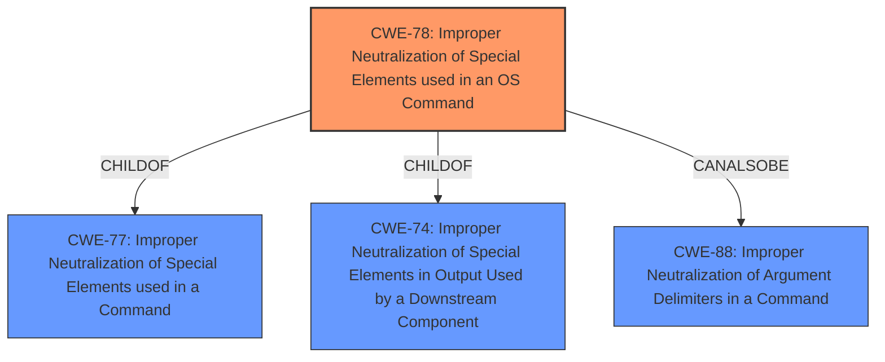

# Analysis Report for CVE-2021-27102

# Vulnerability Analysis Report: CVE-2021-27102

## Description


## Analysis (with Relationship Data)

# Summary
| CWE ID | CWE Name | Confidence | CWE Abstraction Level | CWE Vulnerability Mapping Label | CWE-Vulnerability Mapping Notes |
|---|---|---|---|---|---|
| CWE-78 | Improper Neutralization of Special Elements used in an OS Command ('OS Command Injection') | 1.0 | Base | Allowed | Primary CWE |

## Evidence and Confidence

*   **Confidence Score:** 1.0
*   **Evidence Strength:** HIGH

## Relationship Analysis
The primary relationship that impacted my decision was the ChildOf relationship of CWE-78 to CWE-77 (Improper Neutralization of Special Elements). Also, CWE-78 can be related to CWE-88 (Improper Neutralization of Argument Delimiters in a Command). CWE-78 is a Base level CWE which is the preferred level.



## Vulnerability Chain
The vulnerability chain starts with the Accellion FTA product, which **fails to properly neutralize special elements** in OS commands. This **improper neutralization** leads to **OS command execution**. The chain is:
Accellion FTA -> **Improper Neutralization of Special Elements** -> **OS Command Execution**.

## Summary of Analysis
The vulnerability description indicates that Accellion FTA versions 9_12_411 and earlier are affected by OS command execution via a local web service call. The root cause is the **lack of proper neutralization of special elements** in OS commands, leading to **OS command injection**.

The "CVE Reference Links Content Summary" explicitly states the root cause as "OS command execution via a local web service call" and lists "OS command injection" as a weakness. This provides strong evidence for CWE-78.

The retriever results list CWE-78 as the fourth best match. The description of CWE-78, "The product constructs all or part of an OS command using externally-influenced input from an upstream component, but it does not neutralize or incorrectly neutralizes special elements that could modify the intended OS command when it is sent to a downstream component," aligns perfectly with the vulnerability description.

CWE-20 (Improper Input Validation) was considered but not selected because CWE-78 provides a more specific and accurate description of the vulnerability. CWE-20 is a Class-level CWE, while CWE-78 is a Base-level CWE, making CWE-78 more appropriate.

CWE-88 (Improper Neutralization of Argument Delimiters in a Command ('Argument Injection')) was considered, as it CANALSOBE a possible classification along with CWE-78, but was not selected as there was no evidence of argument delimiters being the weakness.

Therefore, based on the evidence, relationship analysis, and mapping guidance, CWE-78 is the most appropriate CWE for this vulnerability.


## CWE Relationship Analysis

Current CWEs represent these abstraction levels: .


### Vulnerability Chain Analysis

**Chain starting from CWE-20:**
- 20 (Improper Input Validation) - ROOT


**Chain starting from CWE-78:**
- 78 (Improper Neutralization of Special Elements used in an OS Command ('OS Command Injection')) - ROOT


### CWE Relationship Diagram

```mermaid
graph TD
    classDef primary fill:#f96,stroke:#333,stroke-width:2px
    classDef secondary fill:#69f,stroke:#333
    classDef tertiary fill:#9e9,stroke:#333
```


*Report generated on 2025-03-31 11:30:40*
