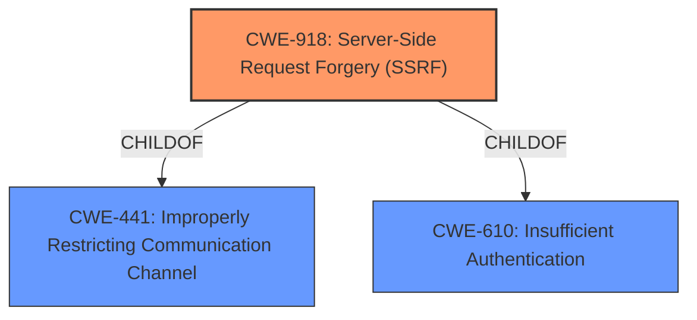

# Analysis for CVE-2021-27103

# Summary
| CWE ID | CWE Name | Confidence | CWE Abstraction Level | CWE Vulnerability Mapping Label | CWE-Vulnerability Mapping Notes |
|---|---|---|---|---|---|
| CWE-918 | Server-Side Request Forgery (SSRF) | 1.0 | Base | Allowed | Primary CWE |

## Evidence and Confidence

*   **Confidence Score:** 1.0
*   **Evidence Strength:** HIGH

## Relationship Analysis
The primary CWE is CWE-918, which is a base level CWE. It has parent relationships to CWE-441 (Improperly restricting communication channel) and CWE-610 (Insufficient authentication). The relationships show that the SSRF vulnerability stems from a failure to properly authenticate or restrict access to the resource.

## Vulnerability Chain
The vulnerability chain starts with the **weakness** of **server-side request forgery** due to the server's failure to validate the destination of a request. This allows an attacker to craft a POST request that forces the server to make requests to unintended destinations, potentially leading to sensitive data exposure or other backend system manipulation.

## Summary of Analysis
The vulnerability is a **server-side request forgery (SSRF)**.

The vulnerability description states: "Accellion FTA 9_12_411 and earlier is affected by SSRF via a crafted POST request to wmProgressstat.html." The **Vulnerability Description Key Phrases** includes " **weakness:** **server-side request forgery**". The **CVE Reference Links Content Summary** states: "The vulnerability is caused by a Server-Side Request Forgery (SSRF) flaw in Accellion FTA (File Transfer Appliance)." and "The application is vulnerable to SSRF, allowing an attacker to make requests to arbitrary internal or external resources from the server."

The Retriever Results identify CWE-918 as the top candidate.

CWE-918 (Server-Side Request Forgery) is a Base level CWE that describes the **weakness** where "The web server receives a URL or similar request from an upstream component and retrieves the contents of this URL, but it does not sufficiently ensure that the request is being sent to the expected destination." The description of CWE-918 aligns directly with the vulnerability description. The Mapping Guidance for CWE-918 states "Usage: Allowed" and "Rationale: This CWE entry is at the Base level of abstraction, which is a preferred level of abstraction for mapping to the root causes of vulnerabilities."

The other CWEs were considered but were not as good a fit:
*   CWE-611 (Improper Restriction of XML External Entity Reference): While SSRF and XXE are related, this vulnerability is not specific to XML.
*   CWE-138 (Improper Neutralization of Special Elements): This is a more general class of **weakness**, and CWE-918 is more specific.
*   CWE-89 (Improper Neutralization of Special Elements used in an SQL Command ('SQL Injection')): This is specific to SQL injection, which is not the case here.
*   CWE-601 (URL Redirection to Untrusted Site ('Open Redirect')): This involves redirection, whereas SSRF involves the server making requests.
*   CWE-113 (Improper Neutralization of CRLF Sequences in HTTP Headers ('HTTP Request/Response Splitting')): This is related to HTTP header manipulation, not general request forgery.
*   CWE-456 (Missing Initialization of a Variable): This is a memory management issue and not directly related to the described vulnerability.
*   CWE-352 (Cross-Site Request Forgery (CSRF)): CSRF involves tricking a user into making a request, while SSRF involves the server itself making the request.
*   CWE-121 (Stack-based Buffer Overflow): This is a memory corruption issue and not related to the described vulnerability.
*   CWE-502 (Deserialization of Untrusted Data): This is specific to deserialization issues, which is not the case here.

CWE-918 is the most appropriate CWE because it accurately describes the **weakness** where the server is making requests to unintended destinations due to insufficient validation.