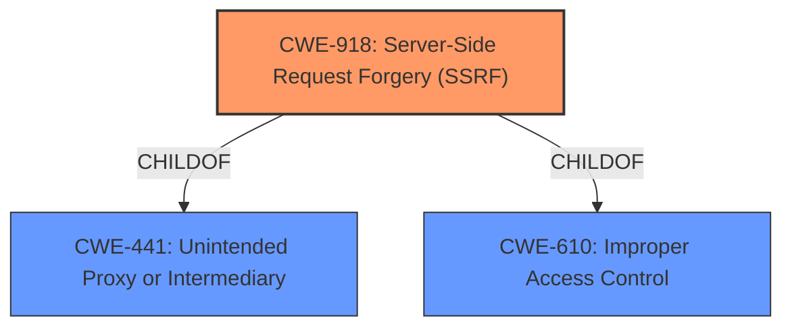

# Raw Analyzer Response for CVE-2021-27103

# Summary
| CWE ID | CWE Name | Confidence | CWE Abstraction Level | CWE Vulnerability Mapping Label | CWE-Vulnerability Mapping Notes |
|---|---|---|---|---|---|
| CWE-918 | Server-Side Request Forgery (SSRF) | 1.0 | Base | Allowed | Primary CWE |

## Evidence and Confidence

*   **Confidence Score:** 1.0
*   **Evidence Strength:** HIGH

## Relationship Analysis
The primary relationship impacting the decision is that CWE-918 is a **Base** level CWE and directly matches the vulnerability description, which explicitly mentions "Server-Side Request Forgery (SSRF)". Other related CWEs like CWE-611 (Improper Restriction of XML External Entity Reference) and CWE-113 (Improper Neutralization of CRLF Sequences in HTTP Headers) were considered but not chosen because they represent different types of vulnerabilities, although they can lead to similar outcomes such as unauthorized access or information disclosure.

## Vulnerability Chain
The vulnerability chain involves the following sequence:
1.  **Root Cause:** The Accellion FTA software **fails to sufficiently ensure that the request is being sent to the expected destination** when processing a URL or similar request from an upstream component (CWE-918).
2.  **Weakness:** A crafted POST request to `wmProgressstat.html` exploits the SSRF vulnerability.
3.  **Impact:** An attacker can make requests to arbitrary internal or external resources from the server, potentially accessing sensitive data, performing port scanning, or manipulating other back-end systems.

## Summary of Analysis
The analysis is based on clear evidence provided in the vulnerability description and the CVE reference links. The vulnerability is explicitly identified as a **server-side request forgery**, which directly corresponds to CWE-918.

The key phrase "weakness: **server-side request forgery**" from the Vulnerability Description Key Phrases section provides direct evidence.

The CVE Reference Links Content Summary confirms the root cause: "The vulnerability is caused by a **Server-Side Request Forgery** (SSRF) flaw in Accellion FTA".

The selection of CWE-918 is at the optimal level of specificity because it is a **Base** level CWE that accurately represents the **root cause** of the vulnerability, as confirmed by the provided evidence. The retriever results also list CWE-918 as the top candidate.
Other CWEs, such as CWE-611 and CWE-113, were considered but are not as directly relevant to the described vulnerability. CWE-611 relates to XML External Entity injection, while CWE-113 deals with HTTP Request/Response Splitting. Although these vulnerabilities can have similar impacts, the specific flaw described is an SSRF, making CWE-918 the most appropriate choice.

Relevant CWE Information:

# Enhanced Context (25 CWEs)
The following CWEs were identified as potentially relevant to this vulnerability:

## CWE-918: Server-Side Request Forgery (SSRF)
**Abstraction:** Base
**Status:** Incomplete

### Description
The web server receives a URL or similar request from an upstream component and retrieves the contents of this URL, but it does not sufficiently ensure that the request is being sent to the expected destination.

### Extended Description
Not provided

### Alternative Terms
XSPA: Cross Site Port Attack
SSRF: Server-Side Request Forgery

### Relationships
ChildOf -> CWE-441
ChildOf -> CWE-610

### Mapping Guidance
**Usage:** Allowed
**Rationale:** This CWE entry is at the Base level of abstraction, which is a preferred level of abstraction for mapping to the root causes of vulnerabilities.
**Comments:** Carefully read both the name and description to ensure that this mapping is an appropriate fit. Do not try to 'force' a mapping to a lower-level Base/Variant simply to comply with this preferred level of abstraction.
**Reasons:**
- Acceptable-Use