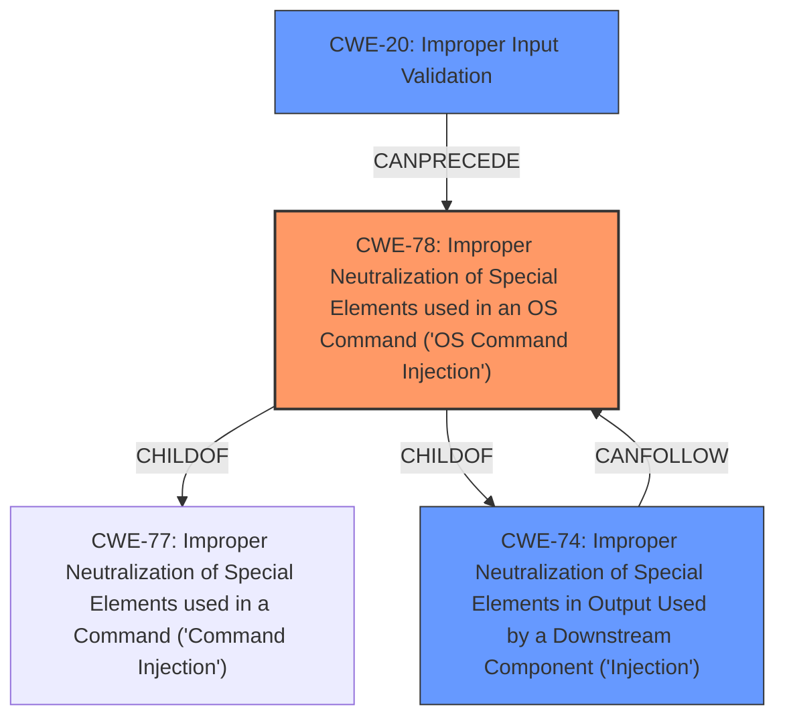

# Raw Analyzer Response for CVE-2021-27104

# Summary
| CWE ID | CWE Name | Confidence | CWE Abstraction Level | CWE Vulnerability Mapping Label | CWE-Vulnerability Mapping Notes |
|---|---|---|---|---|---|
| CWE-78 | Improper Neutralization of Special Elements used in an OS Command ('OS Command Injection') | 1.0 | Base | Primary | Allowed |
| CWE-74 | Improper Neutralization of Special Elements in Output Used by a Downstream Component ('Injection') | 0.6 | Class | Secondary | Discouraged |
| CWE-20 | Improper Input Validation | 0.5 | Class | Secondary | Discouraged |

## Evidence and Confidence

*   **Confidence Score:** 0.9
*   **Evidence Strength:** HIGH

## Relationship Analysis
The primary relationship that impacts the decision is the ChildOf relationship of CWE-78 **Improper Neutralization of Special Elements used in an OS Command ('OS Command Injection')** to CWE-77 **Improper Neutralization of Special Elements used in a Command ('Command Injection')**, and the fact that CWE-78 is a Base level CWE which is preferred. The relationship of CWE-78 to CWE-74 **Improper Neutralization of Special Elements in Output Used by a Downstream Component ('Injection')** also impacts the decision, since the ultimate impact is injection.

## Vulnerability Chain
The chain of root cause and weaknesses are:
1.  **Improper Input Validation** (or lack thereof) in the handling of POST requests.
2.  **Improper Neutralization of Special Elements used in an OS Command ('OS Command Injection')** due to the lack of sanitization.
3.  OS Command Execution leading to full system compromise and potential data breach.

## Summary of Analysis
The primary weakness is CWE-78 **Improper Neutralization of Special Elements used in an OS Command ('OS Command Injection')**. This is based on the vulnerability description stating "Accellion FTA 9_12_370 and earlier is affected by OS command execution via a crafted POST request to various admin endpoints" and the CVE Reference Links Content Summary which states "The vulnerability stems from a lack of proper input sanitization and validation when handling POST requests to admin endpoints in Accellion FTA. This allows for the execution of arbitrary operating system commands by an attacker."

The graph relationships influenced the decision to select CWE-78 as the primary weakness because it is a child of CWE-74 **Improper Neutralization of Special Elements in Output Used by a Downstream Component ('Injection')** which is a more general class of weakness, and CWE-78 is more specific to the vulnerability description.

CWE-78 is at the optimal level of specificity because it directly describes the vulnerability of OS command injection, which is the stated impact.

Relevant CWE Information:

# Enhanced Context (25 CWEs)

## CWE-1289: Improper Validation of Unsafe Equivalence in Input
**Abstraction Level**: Base
**Similarity Score**: 0.77
**Source**: dense

**Description**:
The product receives an input value that is used as a resource identifier or other type of reference, but it does not validate or incorrectly validates that the input is equivalent to a potentially-unsafe value.
**Rationale for Not Selecting**: While input validation is a concern, the core issue is the lack of neutralization before execution. This is not about validating the equivalence of inputs but rather about preventing malicious commands.

## CWE-184: Incomplete List of Disallowed Inputs
**Abstraction Level**: Base
**Similarity Score**: 0.76
**Source**: dense

**Description**:
The product implements a protection mechanism that relies on a list of inputs (or properties of inputs) that are not allowed by policy or otherwise require other action to neutralize before additional processing takes place, but the list is incomplete.
**Rationale for Not Selecting**: This CWE is about having an incomplete list of disallowed inputs. While relevant to input validation, the core issue is that there's no neutralization of OS commands.

## CWE-74: Improper Neutralization of Special Elements in Output Used by a Downstream Component ('Injection')
**Abstraction Level**: Class
**Similarity Score**: 0.76
**Source**: dense

**Description**:
The product constructs all or part of a command, data structure, or record using externally-influenced input from an upstream component, but it does not neutralize or incorrectly neutralizes special elements that could modify how it is parsed or interpreted when it is sent to a downstream component.
**Rationale for Selecting**: CWE-74 is a parent of CWE-78, and indicates that special elements are not neutralized, leading to injection. This is a related issue, but not as specific as CWE-78. It is a Class-level CWE, and it is discouraged to use class-level CWEs when a Base-level is available.

## CWE-138: Improper Neutralization of Special Elements
**Abstraction Level**: Class
**Similarity Score**: 0.75
**Source**: dense

**Description**:
The product receives input from an upstream component, but it does not neutralize or incorrectly neutralizes special elements that could be interpreted as control elements or syntactic markers when they are sent to a downstream component.
**Rationale for Not Selecting**: Similar to CWE-74, this is a more general case. The specific issue is OS command injection, not general element neutralization.

## CWE-41: Improper Resolution of Path Equivalence
**Abstraction Level**: Base
**Similarity Score**: 0.75
**Source**: dense

**Description**:
The product is vulnerable to file system contents disclosure through path equivalence. Path equivalence involves the use of special characters in file and directory names. The associated manipulations are intended to generate multiple names for the same object.
**Rationale for Not Selecting**: This is related to file system paths, not OS command execution.

## CWE-807: Reliance on Untrusted Inputs in a Security Decision
**Abstraction Level**: Base
**Similarity Score**: 0.75
**Source**: dense

**Description**:
The product uses a protection mechanism that relies on the existence or values of an input, but the input can be modified by an untrusted actor in a way that bypasses the protection mechanism.
**Rationale for Not Selecting**: While the system relies on inputs, the issue is not the reliance itself, but the lack of neutralization.

## CWE-23: Relative Path Traversal
**Abstraction Level**: Base
**Similarity Score**: 0.75
**Source**: dense

**Description**:
The product uses external input to construct a pathname that should be within a restricted directory, but it does not properly neutralize sequences such as ".." that can resolve to a location that is outside of that directory.
**Rationale for Not Selecting**: This is related to file paths, not OS command execution.

## CWE-183: Permissive List of Allowed Inputs
**Abstraction Level**: Base
**Similarity Score**: 0.75
**Source**: dense

**Description**:
The product implements a protection mechanism that relies on a list of inputs (or properties of inputs) that are explicitly allowed by policy because the inputs are assumed to be safe, but the list is too permissive - that is, it allows an input that is unsafe, leading to resultant weaknesses.
**Rationale for Not Selecting**: The issue is not the permissive list, but rather that no sanitization is happening.

## CWE-73: External Control of File Name or Path
**Abstraction Level**: Base
**Similarity Score**: 0.74
**Source**: dense

**Description**:
The product allows user input to control or influence paths or file names that are used in filesystem operations.
**Rationale for Not Selecting**: This is related to file paths, not OS command execution.

## CWE-131: Incorrect Calculation of Buffer Size
**Abstraction Level**: Base
**Similarity Score**: 0.74
**Source**: dense

**Description**:
The product does not correctly calculate the size to be used when allocating a buffer, which could lead to a buffer overflow.
**Rationale for Not Selecting**: This is related to buffer overflows, not OS command execution.

## CWE-22: Improper Limitation of a Pathname to a Restricted Directory ('Path Traversal')
**Abstraction Level**: Base
**Similarity Score**: 8792.86
**Source**: sparse

**Description**:
The product uses external input to construct a pathname that is