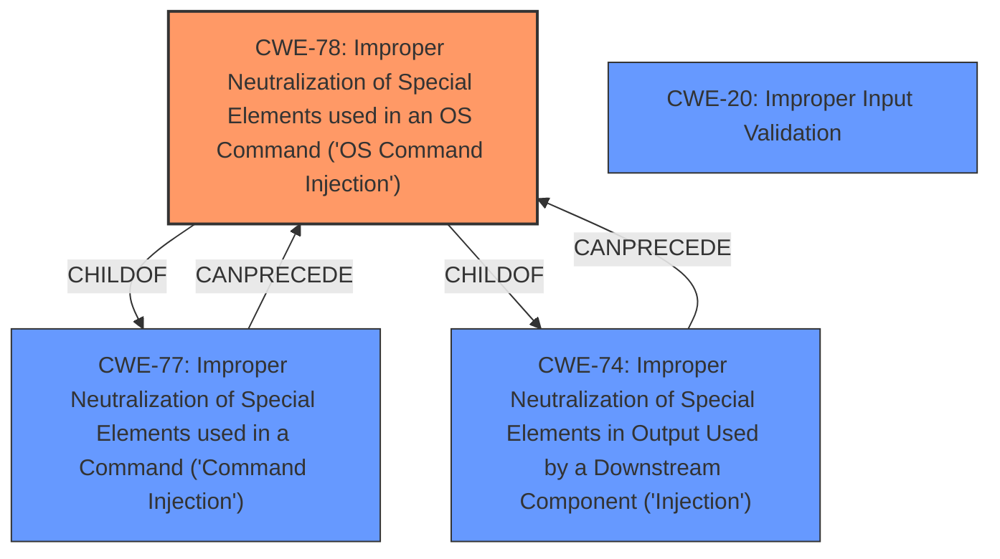

# Raw Analyzer Response for CVE-2021-27104

# Summary
| CWE ID | CWE Name | Confidence | CWE Abstraction Level | CWE Vulnerability Mapping Label | CWE-Vulnerability Mapping Notes |
|---|---|---|---|---|---|
| CWE-78 | Improper Neutralization of Special Elements used in an OS Command ('OS Command Injection') | 1.0 | Base | Primary | Allowed |
| CWE-20 | Improper Input Validation | 0.7 | Class | Secondary | Discouraged |

## Evidence and Confidence

*   **Confidence Score:** 0.9
*   **Evidence Strength:** HIGH

## Relationship Analysis
The primary relationship that influenced the decision was the hierarchical relationship where CWE-78 is a base CWE that is a child of CWE-77 (Improper Neutralization of Special Elements used in a Command) and CWE-74 (Improper Neutralization of Special Elements in Output Used by a Downstream Component ('Injection')). This indicates that CWE-78 is a specific type of injection vulnerability, which aligns with the vulnerability description. CWE-20 is a broader class, and while applicable, is less specific.

## Vulnerability Chain
The vulnerability chain starts with the **lack of proper input sanitization/validation** (CWE-20) of POST request data, leading to the ability to inject special elements into OS commands. This ultimately results in **OS command execution** (CWE-78) and potential full system compromise.

## Summary of Analysis
The initial analysis focused on identifying the root cause of the vulnerability, which the CVE description identifies as a lack of proper input sanitization and validation when handling POST requests to admin endpoints. The most direct consequence of this is the execution of arbitrary operating system commands.

The **Vulnerability Description Key Phrases** mentions "**impact:** OS command execution" which strongly suggests CWE-78.

The **CVE Reference Links Content Summary** section provides supporting evidence:
"The vulnerability stems from a **lack of proper input sanitization and validation** when handling POST requests to admin endpoints in Accellion FTA. This allows for the execution of arbitrary operating system commands by an attacker."

The Retriever Results also list CWE-78 as a highly relevant CWE.

Based on this evidence, CWE-78 (Improper Neutralization of Special Elements used in an OS Command ('OS Command Injection')) is the most appropriate primary CWE because it accurately describes the **root cause** and impact of the vulnerability. The application fails to neutralize special elements in the input, which allows an attacker to inject arbitrary OS commands.

CWE-20 (Improper Input Validation) is considered as a secondary CWE because the root cause involves insufficient validation of input data. However, CWE-78 is more specific as it directly describes the OS command injection vulnerability.

The selection of CWE-78 is at the optimal level of specificity because it is a Base CWE that directly addresses the type of vulnerability described. Using a more general CWE like CWE-20 would not accurately capture the specific nature of the weakness.

Relevant CWE Information:

# Enhanced Context (25 CWEs)
The following CWEs were identified as potentially relevant to this vulnerability:

## CWE-78: Improper Neutralization of Special Elements used in an OS Command ('OS Command Injection')
**Abstraction:** Base
**Similarity Score**: 5.03
**Source**: graph

**Description**:
CWE-78: Improper Neutralization of Special Elements used in an OS Command ('OS Command Injection')

**Mapping Guidance**:
- Usage: Allowed
- Rationale: This CWE entry is at the Base level of abstraction, which is a preferred level of abstraction for mapping to the root causes of vulnerabilities.