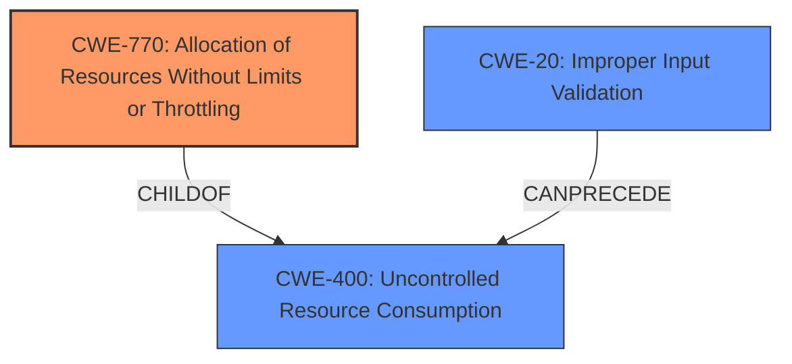

# Raw Analyzer Response for CVE-2021-27420

# Summary
| CWE ID | CWE Name | Confidence | CWE Abstraction Level | CWE Vulnerability Mapping Label | CWE-Vulnerability Mapping Notes |
|---|---|---|---|---|---|
| CWE-770 | Allocation of Resources Without Limits or Throttling | 0.8 | Base | Allowed | Primary CWE |
| CWE-400 | Uncontrolled Resource Consumption | 0.6 | Class | Discouraged | Secondary Candidate |
| CWE-20 | Improper Input Validation | 0.5 | Class | Discouraged | Secondary Candidate |

## Evidence and Confidence

*   **Confidence Score:** 0.7
*   **Evidence Strength:** HIGH

## Relationship Analysis
The primary CWE selected is CWE-770, which is a child of CWE-400. CWE-400 represents a more general case of uncontrolled resource consumption. CWE-20 is also considered due to the **improper handling of HTTP verbs**, which suggests a lack of proper input validation. However, the core issue is that the server doesn't limit resources allocated for handling these unsupported verbs, leading to a denial-of-service.

## Vulnerability Chain
The vulnerability chain starts with the **improper handling of unsupported HTTP verbs**, leading to the **allocation of resources without limits or throttling**, eventually resulting in the web server becoming unresponsive, which constitutes a denial-of-service.

## Summary of Analysis
Initially, the vulnerability description points towards **improper handling of HTTP verbs**, which suggests CWE-20. However, the core issue lies in the fact that the web server **does not properly handle receipt of unsupported HTTP verbs**, and it **does not impose limits on the resources allocated** when processing these requests. This leads to a state where the server becomes temporarily unresponsive because it is overwhelmed, which is a clear indication of CWE-770. CWE-400 is also a potential candidate because it describes uncontrolled resource consumption but is too general. Therefore, CWE-770 is more specific and better captures the **root cause** of the vulnerability.

The vulnerability description key phrases support this:
- **rootcause:** **does not properly handle receipt of unsupported HTTP verbs**
- **impact:** web server becomes temporarily unresponsive

The CVE Reference Links Content Summary also supports this conclusion:
- **Root Cause of Vulnerability:** The root cause is improper input validation within the web server component of the GE UR family of devices. Specifically, the web server does not properly handle unsupported HTTP verbs.
- **Weaknesses/Vulnerabilities Present:**
    - Improper Input Validation: The web server fails to properly handle unsupported HTTP verbs.
    - Unresponsiveness: The web server becomes temporarily unresponsive after receiving a series of unsupported HTTP requests.

The selection of CWE-770 aligns with MITRE's guidance for choosing the most specific and accurate CWE.

Relevant CWE Information:

# Enhanced Context (25 CWEs)
The following CWEs were identified as potentially relevant to this vulnerability:

## CWE-668: Exposure of Resource to Wrong Sphere
**Abstraction Level**: Class
**Similarity Score**: 0.77
**Source**: dense

**Description**:
The product exposes a resource to the wrong control sphere, providing unintended actors with inappropriate access to the resource.
**Did not select:** Not relevant to the description.

## CWE-404: Improper Resource Shutdown or Release
**Abstraction Level**: Class
**Similarity Score**: 0.77
**Source**: dense

**Description**:
The product does not release or incorrectly releases a resource before it is made available for re-use.
**Did not select:** Not relevant to the description. The server becomes unresponsive due to resource exhaustion, not a failure to release resources.

## CWE-664: Improper Control of a Resource Through its Lifetime
**Abstraction Level**: Pillar
**Similarity Score**: 0.77
**Source**: dense

**Description**:
The product does not maintain or incorrectly maintains control over a resource throughout its lifetime of creation, use, and release.
**Did not select:** Too broad, CWE-770 is a more specific child.

## CWE-807: Reliance on Untrusted Inputs in a Security Decision
**Abstraction Level**: Base
**Similarity Score**: 0.76
**Source**: dense

**Description**:
The product uses a protection mechanism that relies on the existence or values of an input, but the input can be modified by an untrusted actor in a way that bypasses the protection mechanism.
**Did not select:** Not relevant to the description.

## CWE-799: Improper Control of Interaction Frequency
**Abstraction Level**: Class
**Similarity Score**: 0.76
**Source**: dense

**Description**:
The product does not properly limit the number or frequency of interactions that it has with an actor, such as the number of incoming requests.
**Did not select:** While frequency is related, the core problem is not throttling requests but unbounded resource allocation for unsupported verbs.

## CWE-1289: Improper Validation of Unsafe Equivalence in Input
**Abstraction Level**: Base
**Similarity Score**: 0.76
**Source**: dense

**Description**:
The product receives an input value that is used as a resource identifier or other type of reference, but it does not validate or incorrectly validates that the input is equivalent to a potentially-unsafe value.
**Did not select:** Not relevant to the description.

## CWE-405: Asymmetric Resource Consumption (Amplification)
**Abstraction Level**: Class
**Similarity Score**: 0.76
**Source**: dense

**Description**:
The product does not properly control situations in which an adversary can cause the product to consume or produce excessive resources without requiring the adversary to invest equivalent work or otherwise prove authorization, i.e., the adversary's influence is "asymmetric."
**Did not select:** While there's asymmetric resource consumption, CWE-770 is more direct.

## CWE-274: Improper Handling of Insufficient Privileges
**Abstraction Level**: Base
**Similarity Score**: 0.76
**Source**: dense

**Description**:
The product does not handle or incorrectly handles when it has insufficient privileges to perform an operation, leading to resultant weaknesses.
**Did not select:** Not relevant to the description.

## CWE-280: Improper Handling of Insufficient Permissions or Privileges 
**Abstraction Level**: Base
**Similarity Score**: 0.75
**Source**: dense

**Description**:
The product does not handle or incorrectly handles when it has insufficient privileges to access resources or functionality as specified by their permissions. This may cause it to follow unexpected code paths that may leave the product in an invalid state.
**Did not select:** Not relevant to the description.

## CWE-41: Improper Resolution of Path Equivalence
**Abstraction Level**: Base
**Similarity Score**: 0.75
**Source**: dense

**Description**:
The product is vulnerable to file system contents disclosure through path equivalence. Path equivalence involves the use of special characters in file and directory names. The associated manipulations are intended to generate multiple names for the same object.
**Did not select:** Not relevant to the description.

## CWE-789: Memory Allocation with Excessive Size Value
**Abstraction Level**: Variant
**Similarity Score**: 7288.28
**Source**: sparse

**Description**:
The product allocates memory based on an untrusted, large size value, but it does not ensure that the size is within expected limits, allowing arbitrary amounts of memory to be allocated.
**Did not select:** Not specific enough. The vulnerability is about unsupported HTTP verbs, not just excessive size.

## CWE-863: Incorrect Authorization
**Abstraction Level**: Class
**Similarity Score**: 7271.64
**Source**: sparse

**Description**:
The product performs an authorization check when an actor attempts to access a resource or perform an action, but it does not correctly perform the check.
**Did not select:** Not relevant to the description.

## CWE-1284: Improper Validation of Specified Quantity in Input
**Abstraction Level**: Base
**Similarity Score**: 7266.83
**Source**: sparse

**Description**:
The product receives input that is expected to specify a quantity (such as size or length), but it does not validate or incorrectly validates that the quantity has the required properties.
**Did not select:** Not specific enough. The vulnerability is about unsupported HTTP verbs, not just quantity.

## CWE-22: Improper Limitation of a Pathname to a Restricted Directory ('Path Traversal')
**Abstraction Level**: Base
**Similarity Score**: 7250.19
**Source**: