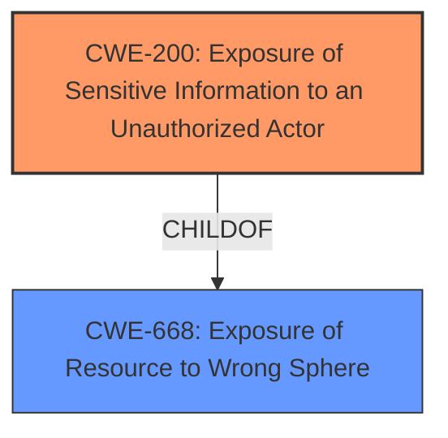

# Raw Analyzer Response for CVE-2021-27424

# Summary
| CWE ID | CWE Name | Confidence | CWE Abstraction Level | CWE Vulnerability Mapping Label | CWE-Vulnerability Mapping Notes |
|---|---|---|---|---|---|
| CWE-200 | Exposure of Sensitive Information to an Unauthorized Actor | 0.9 | Class | Primary | Allowed-with-Review |

## Evidence and Confidence

*   **Confidence Score:** 0.9
*   **Evidence Strength:** HIGH

## Relationship Analysis
The primary CWE identified is CWE-200, which is a Class-level CWE. The analysis considered the discouraged usage of CWE-200 due to it being frequently misused. However, given the nature of the vulnerability being the **exposure of the 'Last-key pressed' register**, CWE-200 is deemed appropriate.

## Vulnerability Chain
The chain of weaknesses is relatively straightforward:
1.  The **root cause** is the **exposure of the MODBUS memory map** including the "Last-key pressed" register.
2.  The **weakness** is the **unauthorized access to sensitive information** via the MODBUS register.
3.  The **impact** is that an attacker can **gain unauthorized information**.

## Summary of Analysis
The initial analysis identified CWE-200 as a strong candidate due to the **exposure of sensitive information**. The "CVE Reference Links Content Summary" clearly states that the **root cause** is the exposure of sensitive information through a MODBUS register, leading to potential unauthorized access.

The retriever results also list CWE-200 as the top candidate. The MITRE mapping guidance discourages the usage of CWE-200 because it is commonly misused, and confidentiality loss is a technical impact. However, in this case, the vulnerability is directly related to the exposure of sensitive information, making CWE-200 the most appropriate choice.

The decision is based on the evidence from the "CVE Reference Links Content Summary" and the vulnerability description, which both highlight the **exposure of sensitive information** as the primary issue. The selection of CWE-200 is at the optimal level of specificity because it directly describes the nature of the vulnerability.

Relevant CWE Information:
- **CWE-200**: The product exposes sensitive information to an actor that is not explicitly authorized to have access to that information. The vulnerability description states that "GE UR devices expose sensitive information through a MODBUS register ('Last-key pressed')." This aligns directly with the description of CWE-200.