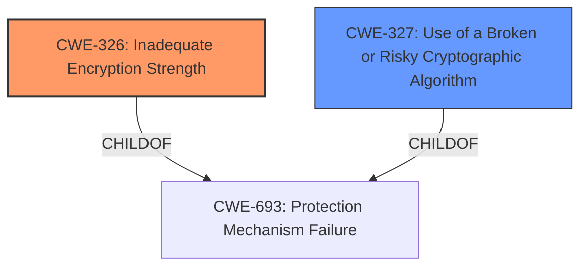

# Analysis for CVE-2021-27450

# Summary
| CWE ID | CWE Name | Confidence | CWE Abstraction Level | CWE Vulnerability Mapping Label | CWE-Vulnerability Mapping Notes |
|---|---|---|---|---|---|
| CWE-326 | Inadequate Encryption Strength | 0.9 | Class | Primary | Allowed-with-Review |
| CWE-327 | Use of a Broken or Risky Cryptographic Algorithm | 0.7 | Class | Secondary | Allowed-with-Review |

## Evidence and Confidence

*   **Confidence Score:** 0.8
*   **Evidence Strength:** HIGH

## Relationship Analysis
The primary relationship influencing the decision is the hierarchical relationship where CWE-326, **Inadequate Encryption Strength**, and CWE-327, **Use of a Broken or Risky Cryptographic Algorithm**, are both children of CWE-693, **Protection Mechanism Failure**. While CWE-326 is a more direct fit, the possibility of a broken algorithm being in use prompts the inclusion of CWE-327 as a secondary consideration.

## Vulnerability Chain
The vulnerability chain starts with a **misconfiguration** in the SSH server configuration file, leading to **inadequate encryption strength**. This weakening of the SSH protocol can then be leveraged as part of a larger attack.

## Summary of Analysis
The initial analysis identified **inadequate encryption strength** as the primary issue, aligning with the CVE description. The criticism considered the potential for a **broken or risky cryptographic algorithm** being used, which prompted its inclusion as a secondary CWE.

The selection of CWE-326 is primarily based on the "Vulnerability Description Key Phrases" and "CVE Reference Links Content Summary" which highlight the **weakening of SSH protocol strength** due to the SSH server configuration file not implementing certain best practices.

>   **Vulnerability Description Key Phrases**
>   - **impact:** weakening of SSH protocol strength
>
>   **CVE Reference Links Content Summary**
>   - **Root Cause:** The SSH server configuration file on the GE MU320E device does not implement certain best practices, which **weakens the SSH protocol**.
>   - **Weaknesses:** Inadequate encryption strength in the SSH server configuration.

The selection of CWE-326 is also supported by the retriever results which identify it as the top combined result.

CWE-327 is considered as a secondary CWE because the description mentions that the SSH server configuration file does not implement certain best practices, which *could* imply the use of a broken or risky cryptographic algorithm. However, the evidence is not strong enough to make it a primary CWE.

Both selected CWEs are at the optimal level of specificity, being Class-level CWEs which provide sufficient detail without being overly specific.

Relevant CWE Information:

# Enhanced Context (25 CWEs)

## CWE-326: Inadequate Encryption Strength
**Technical Explanation:** The vulnerability description clearly states that the SSH server configuration does not implement certain best practices, which leads to a weakening of the SSH protocol strength. This directly aligns with CWE-326, which describes scenarios where sensitive data is stored or transmitted using an encryption scheme that is not strong enough for the level of protection required.
**Security Implications:** Using inadequate encryption strength makes the SSH protocol vulnerable to brute-force attacks, potentially allowing attackers to gain unauthorized access to the system.
**Relationships:** CWE-326 is a child of CWE-693, **Protection Mechanism Failure**. This relationship highlights that the inadequate encryption strength is a specific type of protection mechanism failure.
**Mapping Guidance Influence:** The MITRE mapping guidance suggests that this CWE is "Allowed-with-Review" because it is a Class-level CWE, and a more specific Base-level CWE might be available. However, in this case, CWE-326 directly reflects the vulnerability, making it the most appropriate choice.
**Primary/Secondary:** Primary.
**Confidence:** 0.9

## CWE-327: Use of a Broken or Risky Cryptographic Algorithm
**Technical Explanation:** Although the primary issue is **inadequate encryption strength**, there's a possibility that the misconfiguration involves using a broken or risky cryptographic algorithm. The description doesn't explicitly state this, but it's a plausible scenario given the lack of best practices.
**Security Implications:** Using a broken or risky cryptographic algorithm can lead to complete compromise of the encrypted data, as these algorithms have known vulnerabilities.
**Relationships:** CWE-327 is a child of CWE-693, **Protection Mechanism Failure**. This relationship highlights that the use of a broken or risky cryptographic algorithm is a specific type of protection mechanism failure.
**Mapping Guidance Influence:** The MITRE mapping guidance suggests that this CWE is "Allowed-with-Review" because it is a Class-level CWE, and a more specific Base-level CWE might be available. However, the lack of explicit evidence prevents us from selecting a more specific CWE.
**Primary/Secondary:** Secondary.
**Confidence:** 0.7

CWEs considered but not used:

*   **CWE-1394: Use of Default Cryptographic Key:** While possible, there's no explicit mention of default keys being used.
*   **CWE-770: Allocation of Resources Without Limits or Throttling:** Not relevant to the described vulnerability.
*   **CWE-88: Improper Neutralization of Argument Delimiters in a Command ('Argument Injection'):** Not relevant to the described vulnerability.
*   **CWE-250: Execution with Unnecessary Privileges:** Not relevant to the described vulnerability.
*   **CWE-208: Observable Timing Discrepancy:** Not relevant to the described vulnerability.
*   **CWE-1284: Improper Validation of Specified Quantity in Input:** Not relevant to the described vulnerability.
*   **CWE-1390: Weak Authentication:** The issue is not weak authentication, but rather the encryption strength.
*   **CWE-306: Missing Authentication for Critical Function:** The issue is not missing authentication, but rather the encryption strength.