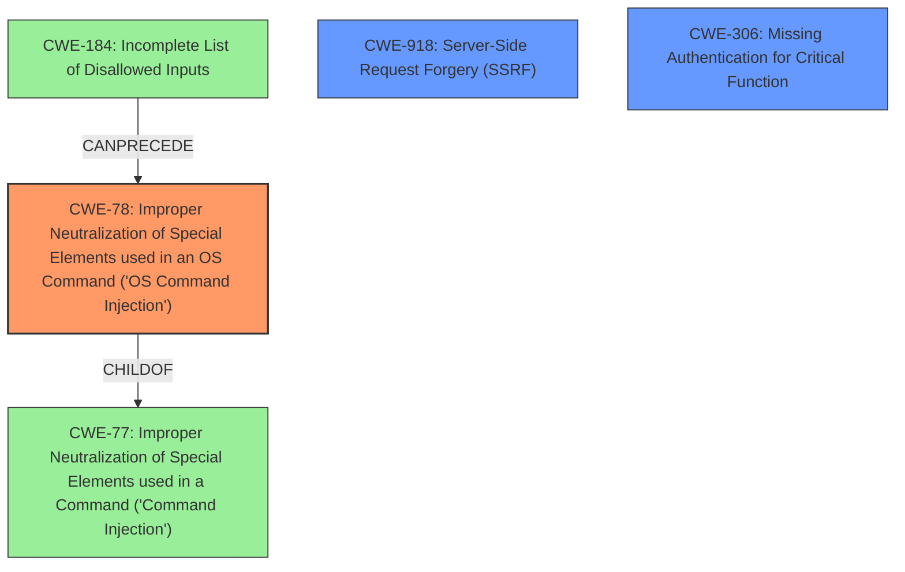

# Analysis Report for CVE-2021-27561

# Vulnerability Analysis Report: CVE-2021-27561

## Description


## Analysis (with Relationship Data)

# Summary

| CWE ID | CWE Name | Confidence | CWE Abstraction Level | CWE Vulnerability Mapping Label | CWE-Vulnerability Mapping Notes |
|---|---|---|---|---|---|
| CWE-78 | Improper Neutralization of Special Elements used in an OS Command ('OS Command Injection') | 1.0 | Base | Allowed | Primary CWE |
| CWE-918 | Server-Side Request Forgery (SSRF) | 0.7 | Base | Allowed | Secondary CWE |
| CWE-306 | Missing Authentication for Critical Function | 0.6 | Base | Allowed | Secondary CWE |

## Evidence and Confidence

*   **Confidence Score:** 0.8
*   **Evidence Strength:** HIGH

## Relationship Analysis
The primary weakness is **CWE-78 [Improper Neutralization of Special Elements used in an OS Command ('OS Command Injection')]**, a Base level CWE. It is related to **CWE-77 [Improper Neutralization of Special Elements used in a Command ('Command Injection')]** (its parent) and can be preceded by **CWE-184 [Incomplete List of Disallowed Inputs]**. The SSRF, **CWE-918 [Server-Side Request Forgery (SSRF)]**, exists in the NodeJS application and allows targeting the vulnerable smserver daemon. Additionally, the vulnerability exists due to **CWE-306 [Missing Authentication for Critical Function]**.



## Vulnerability Chain
The vulnerability chain starts with **CWE-306 [Missing Authentication for Critical Function]**. This is followed by **CWE-918 [Server-Side Request Forgery (SSRF)]** in the NodeJS application, which allows an attacker to target the vulnerable `smserver` daemon. The chain culminates in **CWE-78 [Improper Neutralization of Special Elements used in an OS Command ('OS Command Injection')]** due to the **improper input sanitization** in the `fw_restful_service_get()` function, allowing for **command injection** with root privileges.

## Summary of Analysis
The primary finding is **CWE-78 [Improper Neutralization of Special Elements used in an OS Command ('OS Command Injection')]**. This is supported by the vulnerability description indicating **command injection** and the CVE reference summary explicitly stating that the `fw_restful_service_get()` function does not properly sanitize the `zone` GET parameter, leading to command injection. The **SSRF (CWE-918 [Server-Side Request Forgery (SSRF)])** is a contributing factor by enabling the attacker to reach the vulnerable endpoint. Additionally, **CWE-306 [Missing Authentication for Critical Function]** is a contributing factor.

The selection of **CWE-78 [Improper Neutralization of Special Elements used in an OS Command ('OS Command Injection')]** is at the optimal level of specificity because it precisely describes the root cause of the vulnerability, namely the **improper neutralization** of input leading to OS command execution. The evidence clearly indicates that the **command injection** occurs due to **lack of proper sanitization** of the 'zone' parameter, which directly influences the OS command being executed.

Other CWEs Considered:

*   **CWE-77 [Improper Neutralization of Special Elements used in a Command ('Command Injection')]**: While related, **CWE-78 [Improper Neutralization of Special Elements used in an OS Command ('OS Command Injection')]** is more specific as the **command injection** directly involves OS commands.
*   **CWE-94 [Improper Control of Generation of Code ('Code Injection')]**: This was considered but deemed less appropriate because the vulnerability involves **command injection** rather than arbitrary code generation.
*   **CWE-184 [Incomplete List of Disallowed Inputs]**: While a denylist could be a potential mitigation, the immediate cause is the lack of proper sanitization, making **CWE-78 [Improper Neutralization of Special Elements used in an OS Command ('OS Command Injection')]** a more accurate classification.
*   **CWE-88 [Improper Neutralization of Argument Delimiters in a Command ('Argument Injection')]**: While argument injection could be a contributing factor, the primary issue is the overall lack of sanitization, making **CWE-78 [Improper Neutralization of Special Elements used in an OS Command ('OS Command Injection')]** a better fit.

Relevant CWE Information:

# Enhanced Context (25 CWEs)
The following CWEs were identified as potentially relevant to this vulnerability:

## CWE-184: Incomplete List of Disallowed Inputs
**Abstraction Level**: Base
**Similarity Score**: 0.78
**Source**: dense

**Description**:
The product implements a protection mechanism that relies on a list of inputs (or properties of inputs) that are not allowed by policy or otherwise require other action to neutralize before additional processing takes place, but the list is incomplete.

**Mapping Guidance**:
- Usage: Allowed
- Rationale: This CWE entry is at the Base level of abstraction, which is a preferred level of abstraction for mapping to the root causes of vulnerabilities.


## CWE-74: Improper Neutralization of Special Elements in Output Used by a Downstream Component ('Injection')
**Abstraction Level**: Class
**Similarity Score**: 0.78
**Source**: dense

**Description**:
The product constructs all or part of a command, data structure, or record using externally-influenced input from an upstream component, but it does not neutralize or incorrectly neutralizes special elements that could modify how it is parsed or interpreted when it is sent to a downstream component.

**Mapping Guidance**:
- Usage: Discouraged
- Rationale: CWE-74 is high-level and often misused when lower-level weaknesses are more appropriate.


## CWE-138: Improper Neutralization of Special Elements
**Abstraction Level**: Class
**Similarity Score**: 0.76
**Source**: dense

**Description**:
The product receives input from an upstream component, but it does not neutralize or incorrectly neutralizes special elements that could be interpreted as control elements or syntactic markers when they are sent to a downstream component.

**Mapping Guidance**:
- Usage: Discouraged
- Rationale: This CWE entry is a level-1 Class (i.e., a child of a Pillar). It might have lower-level children that would be more appropriate


## CWE-88: Improper Neutralization of Argument Delimiters in a Command ('Argument Injection')
**Abstraction Level**: Base
**Similarity Score**: 0.76
**Source**: dense

**Description**:
The product constructs a string for a command to be executed by a separate component
in another control sphere, but it does not properly delimit the
intended arguments, options, or switches within that command string.

**Mapping Guidance**:
- Usage: Allowed
- Rationale: This CWE entry is at the Base level of abstraction, which is a preferred level of abstraction for mapping to the root causes of vulnerabilities.


## CWE-80: Improper Neutralization of Script-Related HTML Tags in a Web Page (Basic XSS)
**Abstraction Level**: Variant
**Similarity Score**: 0.76
**Source**: dense

**Description**:
The product receives input from an upstream component, but it does not neutralize or incorrectly neutralizes special characters such as "<", ">", and "&" that could be interpreted as web-scripting elements when they are sent to a downstream component that processes web pages.

**Mapping Guidance**:
- Usage: Allowed
- Rationale: This CWE entry is at the Variant level of abstraction, which is a preferred level of abstraction for mapping to the root causes of vulnerabilities.


## CWE-917: Improper Neutralization of Special Elements used in an Expression Language Statement ('Expression Language Injection')
**Abstraction Level**: Base
**Similarity Score**: 0.75
**Source**: dense

**Description**:
The product constructs all or part of an expression language (EL) statement in a framework such as a Java Server Page (JSP) using externally-influenced input from an upstream component, but it does not neutralize or incorrectly neutralizes special elements that could modify the intended EL statement before it is executed.

**Mapping Guidance**:
- Usage: Allowed
- Rationale: This CWE entry is at the Base level of abstraction, which is a preferred


## CWE Relationship Analysis

Current CWEs represent these abstraction levels: .


### Vulnerability Chain Analysis

**Chain starting from CWE-306:**
- 306 (Missing Authentication for Critical Function) - ROOT


**Chain starting from CWE-88:**
- 88 (Improper Neutralization of Argument Delimiters in a Command ('Argument Injection')) - ROOT


### CWE Relationship Diagram

```mermaid
graph TD
    classDef primary fill:#f96,stroke:#333,stroke-width:2px
    classDef secondary fill:#69f,stroke:#333
    classDef tertiary fill:#9e9,stroke:#333
```


*Report generated on 2025-04-02 08:03:11*
