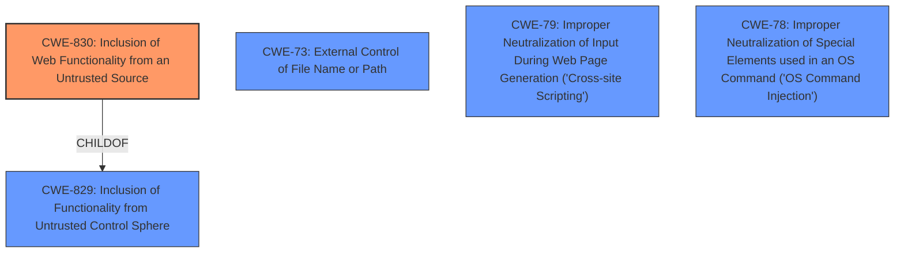

# Raw Analyzer Response for CVE-2021-27770

# Summary
| CWE ID | CWE Name | Confidence | CWE Abstraction Level | CWE Vulnerability Mapping Label | CWE-Vulnerability Mapping Notes |
|---|---|---|---|---|---|
| CWE-830 | Inclusion of Web Functionality from an Untrusted Source | 0.9 | Variant | Allowed | Primary CWE |
| CWE-73 | External Control of File Name or Path | 0.5 | Base | Allowed | Secondary Candidate |
| CWE-79 | Improper Neutralization of Input During Web Page Generation ('Cross-site Scripting') | 0.5 | Base | Allowed | Secondary Candidate |
| CWE-78 | Improper Neutralization of Special Elements used in an OS Command ('OS Command Injection') | 0.5 | Base | Allowed | Secondary Candidate |

## Evidence and Confidence

*   **Confidence Score:** 0.7
*   **Evidence Strength:** MEDIUM

## Relationship Analysis
The primary CWE, CWE-830, is a Variant of CWE-829, indicating a more specific instance of including functionality from an untrusted source. CWE-73, CWE-79, and CWE-78 are related to input handling and injection vulnerabilities. They are considered as alternative, secondary candidates if the root cause is more directly related to how the untrusted source is handled after inclusion.

## Vulnerability Chain
The vulnerability chain starts with the inclusion of untrusted web functionality (CWE-830). Depending on how the included functionality is handled, this could lead to various injection-related vulnerabilities such as **OS Command Injection** (CWE-78), **Cross-Site Scripting (XSS)** (CWE-79), or **Path Traversal** (CWE-73) if the base64 encoded URL is not properly validated.

## Summary of Analysis
The initial assessment focused on the **FaviconService** taking a base64-encoded URL and requesting it from the webserver. The core issue seems to be rooted in the service's acceptance and subsequent use of an externally provided URL.

The primary CWE selected is CWE-830 (Inclusion of Web Functionality from an Untrusted Source). This is because the vulnerability stems from the inclusion of functionality (fetching a favicon) from a potentially untrusted source (the base64-encoded URL). The description explicitly mentions an external URL being requested by the webserver.

While CWE-79 (Improper Neutralization of Input During Web Page Generation ('Cross-site Scripting')), CWE-78 (Improper Neutralization of Special Elements used in an OS Command ('OS Command Injection')), and CWE-73 (External Control of File Name or Path) were considered due to their relevance to input validation and injection, the initial description does not provide enough information to definitively say that the base64 encoded URL leads directly to these vulnerabilities. If the FaviconService improperly handles the fetched favicon, then these other CWEs could be applicable.

The selection of CWE-830 is at the Variant level, which is more specific than its parent, CWE-829. This level of specificity is justified because the vulnerability involves web functionality and the associated risks of untrusted sources in a web-based environment.

Relevant CWE Information:

# Enhanced Context (25 CWEs)
The following CWEs were identified as potentially relevant to this vulnerability:

## CWE-74: Improper Neutralization of Special Elements in Output Used by a Downstream Component ('Injection')
**Abstraction Level**: Class

## CWE-538: Insertion of Sensitive Information into Externally-Accessible File or Directory
**Abstraction Level**: Base

## CWE-668: Exposure of Resource to Wrong Sphere
**Abstraction Level**: Class

## CWE-807: Reliance on Untrusted Inputs in a Security Decision
**Abstraction Level**: Base

## CWE-41: Improper Resolution of Path Equivalence
**Abstraction Level**: Base

## CWE-212: Improper Removal of Sensitive Information Before Storage or Transfer
**Abstraction Level**: Base

## CWE-472: External Control of Assumed-Immutable Web Parameter
**Abstraction Level**: Base

## CWE-138: Improper Neutralization of Special Elements
**Abstraction Level**: Class

## CWE-451: User Interface (UI) Misrepresentation of Critical Information
**Abstraction Level**: Class

## CWE-73: External Control of File Name or Path
**Abstraction Level**: Base

## CWE-79: Improper Neutralization of Input During Web Page Generation ('Cross-site Scripting')
**Abstraction Level**: Base

## CWE-88: Improper Neutralization of Argument Delimiters in a Command ('Argument Injection')
**Abstraction Level**: Base

## CWE-116: Improper Encoding or Escaping of Output
**Abstraction Level**: Class

## CWE-639: Authorization Bypass Through User-Controlled Key
**Abstraction Level**: Base

## CWE-138: Improper Neutralization of Special Elements
**Abstraction Level**: Class

## CWE-79: Improper Neutralization of Input During Web Page Generation ('Cross-site Scripting')
**Abstraction Level**: base

## CWE-78: Improper Neutralization of Special Elements used in an OS Command ('OS Command Injection')
**Abstraction Level**: base

## CWE-22: Improper Limitation of a Pathname to a Restricted Directory ('Path Traversal')
**Abstraction Level**: base

## CWE-1284: Improper Validation of Specified Quantity in Input
**Abstraction Level**: base

## CWE-494: Download of Code Without Integrity Check
**Abstraction Level**: base

## CWE-209: Generation of Error Message Containing Sensitive Information
**Abstraction Level**: base

## CWE-201: Insertion of Sensitive Information Into Sent Data
**Abstraction Level**: base

## CWE-88: Improper Neutralization of Argument Delimiters in a Command ('Argument Injection')
**Abstraction Level**: base

## CWE-202: Exposure of Sensitive Information Through Data Queries
**Abstraction Level**: base

## CWE-386: Symbolic Name not Mapping to Correct Object
**Abstraction Level**: base