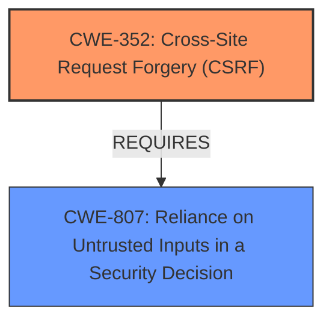

# Enhanced Analysis for CVE-2021-27885

# Summary
| CWE ID | CWE Name | Confidence | CWE Abstraction Level | CWE Vulnerability Mapping Label | CWE-Vulnerability Mapping Notes |
|---|---|---|---|---|---|
| CWE-352 | Cross-Site Request Forgery (CSRF) | 1.0 | Compound | Allowed | Primary CWE |
| CWE-807 | Reliance on Untrusted Inputs in a Security Decision | 0.7 | Base | Allowed | Secondary Candidate |

## Evidence and Confidence

*   **Confidence Score:** 1.0
*   **Evidence Strength:** HIGH

## Relationship Analysis
The primary relationship influencing the CWE selection is that the vulnerability description explicitly mentions a lack of CSRF protection. CWE-352 is a compound CWE that accurately represents this **weakness**. CWE-807 was also considered as a contributing factor, where the application relies on inputs without proper validation, leading to the CSRF **vulnerability**.



## Vulnerability Chain
The chain of events leading to the vulnerability is as follows:
1.  **Root Cause:** Lack of CSRF protection (**CWE-352**).
2.  **Weakness:** Reliance on untrusted inputs in a security decision (**CWE-807**), where the application does not properly validate the origin of the request.
3.  **Impact:** Potential modification of user settings without their knowledge or consent.

## Summary of Analysis
The analysis is primarily based on the evidence provided in the "CVE Reference Links Content Summary," which states that "The **vulnerability stems from a lack of proper CSRF (Cross-Site Request Forgery) protection** in user settings forms." This statement directly aligns with the description of CWE-352. The relationship graph highlights the reliance on untrusted inputs (CWE-807) as a contributing factor that enables CSRF attacks.

The selection of CWE-352 is optimal because it directly addresses the **root cause** described in the vulnerability. The retriever results also support this selection, with CWE-352 being the top combined result.

Relevant CWE Information:

# Enhanced Context (25 CWEs)
The following CWEs were identified as potentially relevant to this vulnerability:

## CWE-807: Reliance on Untrusted Inputs in a Security Decision
**Abstraction Level**: Base
**Similarity Score**: 0.78
**Source**: dense

**Description**:
The product uses a protection mechanism that relies on the existence or values of an input, but the input can be modified by an untrusted actor in a way that bypasses the protection mechanism.

**Mapping Guidance**:
- Usage: Allowed
- Rationale: This CWE entry is at the Base level of abstraction, which is a preferred level of abstraction for mapping to the root causes of vulnerabilities.

## CWE-352: Cross-Site Request Forgery (CSRF)
**Abstraction:** Compound
**Status:** Stable

### Description
The web application does not, or can not, sufficiently verify whether a well-formed, valid, consistent request was intentionally provided by the user who submitted the request.

### Extended Description
When a web server is designed to receive a request from a client without any mechanism for verifying that it was intentionally sent, then it might be possible for an attacker to trick a client into making an unintentional request to the web server which will be treated as an authentic request. This can be done via a URL, image load, XMLHttpRequest, etc. and can result in exposure of data or unintended code execution.

### Relationships
ChildOf -> CWE-345
ChildOf -> CWE-345
Requires -> CWE-346
Requires -> CWE-441
Requires -> CWE-642
Requires -> CWE-613

### Mapping Guidance
**Usage:** Allowed
**Rationale:** This is a well-known Composite of multiple weaknesses that must all occur simultaneously, although it is attack-oriented in nature.

## CWE-79: Improper Neutralization of Input During Web Page Generation ('Cross-site Scripting')
**Abstraction:** Base
**Status:** Stable

### Description
The product does not neutralize or incorrectly neutralizes user-controllable input before it is placed in output that is used as a web page that is served to other users.

### Extended Description
(omitted for brevity)

### Relationships
ChildOf -> CWE-74
ChildOf -> CWE-74
CanPrecede -> CWE-494
PeerOf -> CWE-352

### Mapping Guidance
**Usage:** Allowed
**Rationale:** This CWE entry is at the Base level of abstraction, which is a preferred level of abstraction for mapping to the root causes of vulnerabilities.

**CWE-352:** Cross-Site Request Forgery (CSRF) is the primary CWE. The vulnerability description explicitly mentions the **lack of CSRF protection**. CWE-352 is a compound weakness, and its description and extended description perfectly match the vulnerability scenario. The evidence is strong, leading to a high confidence score.

**CWE-807:** Reliance on Untrusted Inputs in a Security Decision was considered as a secondary CWE. The application's **failure** to validate the origin of requests (untrusted inputs) contributes to the CSRF **vulnerability**. This is a base-level CWE, and its description aligns with the application's behavior. This adds more context to the root cause, and is a contributing factor.

**CWE-79:** Improper Neutralization of Input During Web Page Generation ('Cross-site Scripting') was considered because it is a peer of CWE-352 and can sometimes be related. However, there is no indication of improper neutralization of input in the vulnerability description, so it was not selected.


## CWE Relationship Analysis

Current CWEs represent these abstraction levels: .


### Vulnerability Chain Analysis

**Chain starting from CWE-807:**
- 807 (Reliance on Untrusted Inputs in a Security Decision) - ROOT


**Chain starting from CWE-494:**
- 494 (Download of Code Without Integrity Check) - ROOT


### CWE Relationship Diagram

```mermaid
graph TD
    classDef primary fill:#f96,stroke:#333,stroke-width:2px
    classDef secondary fill:#69f,stroke:#333
    classDef tertiary fill:#9e9,stroke:#333
```