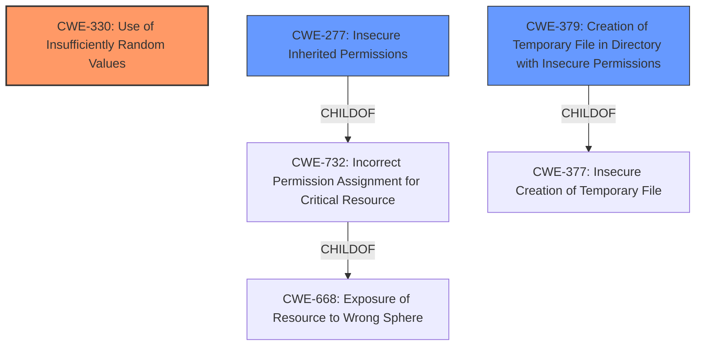

# Analysis Report for CVE-2021-28099

# Vulnerability Analysis Report: CVE-2021-28099

## Description


## Analysis (with Relationship Data)

# Summary

| CWE ID | CWE Name | Confidence | CWE Abstraction Level | CWE Vulnerability Mapping Label | CWE-Vulnerability Mapping Notes |
|---|---|---|---|---|---|
| CWE-330 | Use of Insufficiently Random Values | 0.9 | Class | Allowed-with-Review | Primary CWE |
| CWE-379 | Creation of Temporary File in Directory with Insecure Permissions | 0.7 | Base | Allowed | Secondary CWE |
| CWE-277 | Insecure Inherited Permissions | 0.6 | Variant | Allowed | Secondary CWE |

## Evidence and Confidence

*   **Confidence Score:** 0.8
*   **Evidence Strength:** HIGH

## Relationship Analysis

The primary weakness is the **use of insecure randomness** (CWE-330), which allows an attacker to predict file names. This, combined with the fact that the application creates temporary directories without proper permission checks, leads to a situation where an attacker can pre-create directories with wide permissions. The insecure permissions on the temporary directory (CWE-379) is a result of both the **insecure randomness** and the application's failure to properly secure the temporary directory. CWE-277 comes into play as the insecure permissions on the parent directory are inherited by the created temporary files.



## Vulnerability Chain

The vulnerability chain starts with the **insecure randomness** (CWE-330). This allows an attacker to predict the names of the temporary files. The application then creates these temporary files in a directory that has insecure permissions (CWE-379). The insecure permissions are inherited by the files created in the directory (CWE-277). This enables the attacker to pre-create the directories with wide permissions, leading to potential information disclosure or data modification.

## Summary of Analysis

The primary vulnerability is the **use of insufficiently random values** (CWE-330). The "Vulnerability Description Key Phrases" section indicates the **rootcause** is "**insecure randomness**". Additionally, the "CVE Reference Links Content Summary" states, "an **insecure source of randomness** is used, allowing file names to be deterministically calculated." This aligns directly with the description of CWE-330: "The product uses insufficiently random numbers or values in a security context that depends on unpredictable numbers."

CWE-330 is a Class, but the evidence strongly supports this classification, making it a more appropriate choice than its children. The weakness allows an attacker to pre-create the directories.

The next weakness is CWE-379, which describes the "Creation of Temporary File in Directory with Insecure Permissions". The "CVE Reference Links Content Summary" notes, "The application creates temporary directories without proper permission checks," indicating that the directory where the temporary file is created has insecure permissions. The vulnerability description also says, "an attacker can pre-create these directories with wide permissions".

CWE-277, Insecure Inherited Permissions, is also relevant. The description states: "A product defines a set of insecure permissions that are inherited by objects that are created by the program." The attacker can create directories with wide permissions that are then inherited by the temporary files created in those directories.

CWE-59, Improper Link Resolution Before File Access ('Link Following'), was considered because the attacker could potentially create a symbolic link to a sensitive file. However, the description focuses more on the ability to pre-create directories with wide permissions and the impact of the **insecure randomness**, so CWE-59 is not as direct a fit.

CWE-732, Incorrect Permission Assignment for Critical Resource, was considered, but it is too high level and doesn't capture the specific issue of temporary file creation with insecure permissions.

CWE-427, Uncontrolled Search Path Element, was also considered but does not align with the description since the vulnerability focuses on the creation of temporary files and their permissions, not on the search path used to locate resources.

The final decision to map CWE-330, CWE-379, and CWE-277 is based on the evidence provided in the vulnerability description and CVE reference links content summary. The relationship analysis shows how these weaknesses are connected and contribute to the overall vulnerability. The mapping guidance was followed, with careful consideration given to the abstraction level and usage recommendations for each CWE.


## CWE Relationship Analysis

Current CWEs represent these abstraction levels: .


### Vulnerability Chain Analysis

**Chain starting from CWE-277:**
- 277 (Insecure Inherited Permissions) - ROOT


**Chain starting from CWE-330:**
- 330 (Use of Insufficiently Random Values) - ROOT


### CWE Relationship Diagram

```mermaid
graph TD
    classDef primary fill:#f96,stroke:#333,stroke-width:2px
    classDef secondary fill:#69f,stroke:#333
    classDef tertiary fill:#9e9,stroke:#333
```


*Report generated on 2025-03-31 08:16:37*
