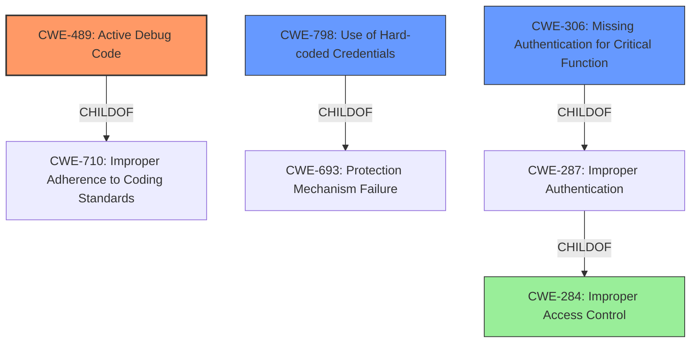

# Analysis for CVE-2021-28112

# Summary
| CWE ID | CWE Name | Confidence | CWE Abstraction Level | CWE Vulnerability Mapping Label | CWE-Vulnerability Mapping Notes |
|---|---|---|---|---|---|
| CWE-489 | Active Debug Code | 1 | Base | Primary | Allowed |
| CWE-798 | Use of Hard-coded Credentials | 0.9 | Base | Secondary | Allowed |
| CWE-306 | Missing Authentication for Critical Function | 0.8 | Base | Secondary | Allowed |

## Evidence and Confidence

*   **Confidence Score:** 0.9
*   **Evidence Strength:** HIGH

## Relationship Analysis
The primary CWE is CWE-489, representing the presence of active debug code. This is further exacerbated by CWE-798, the use of hardcoded credentials, which allows attackers to leverage the debug code. CWE-306 (Missing Authentication) is also present because the debug port lacks proper authentication mechanisms, allowing unauthorized access.

## Vulnerability Chain
The vulnerability chain starts with the presence of **Active Debug Code (CWE-489)**. This debug code is accessible due to **Missing Authentication for Critical Function (CWE-306)** and is further exploitable due to the **Use of Hard-coded Credentials (CWE-798)**, ultimately leading to remote code execution.

## Summary of Analysis
The initial assessment correctly identified the **Active Debug Code (CWE-489)** as a primary weakness. The provided evidence clearly states that the **rootcause** is the "**Active Debug Code**" on a debug port. The CVE Reference Links Content Summary confirms this by stating, "The vulnerability stems from the presence of an unused debug port...**Active Debug Code (CWE-489)**: The existence of an active, yet unused, debug port represents a vulnerability as it provides an unintended entry point." The presence of **hard-coded credentials (CWE-798)** and **Missing Authentication for Critical Function (CWE-306)** are also contributing factors, enabling the exploitation of the debug port.

The graph relationships influenced the selection by highlighting the connections between authentication, access control, and the presence of debug code. CWE-489 is the most specific and accurately reflects the **rootcause**, while CWE-798 and CWE-306 describe the conditions that allow the exploitation. These CWEs are at the optimal level of specificity, providing a clear understanding of the vulnerability.

Relevant CWE Information:
- CWE-489: Active Debug Code
  - The product is deployed to unauthorized actors with debugging code still enabled or active, which can create unintended entry points or expose sensitive information.
  - The vulnerability description specifically mentions **Active Debug Code** on a debug port, leading to remote code execution.
- CWE-798: Use of Hard-coded Credentials
  - The product contains hard-coded credentials, such as a password or cryptographic key.
  - The CVE Reference Links Content Summary confirms the presence of hardcoded credentials associated with the debug port.
- CWE-306: Missing Authentication for Critical Function
  - The product does not perform any authentication for functionality that requires a provable user identity or consumes a significant amount of resources.
  - The debug port lacks proper authentication mechanisms, allowing unauthorized access.

CWE-287 (Improper Authentication) and CWE-284 (Improper Access Control) were considered but deemed too general. CWE-425 (Direct Request) was also considered but did not directly apply as the primary issue isn't about unauthorized access to URLs, but rather the presence of active debug code combined with authentication issues.
CWE-1244 was not selected because it is more about providing internal assets with the wrong debug access level, not the existence of active debug code.
CWE-912 (Hidden Functionality) was considered but the description matches CWE-489 more closely.

The assessment is based on the provided evidence, specifically the vulnerability description and the CVE Reference Links Content Summary. The CVE description states "Draeger X-Dock Firmware before 03.00.13 has **Active Debug Code** on a debug port, leading to remote code execution by an authenticated attacker." This statement directly supports the selection of CWE-489.