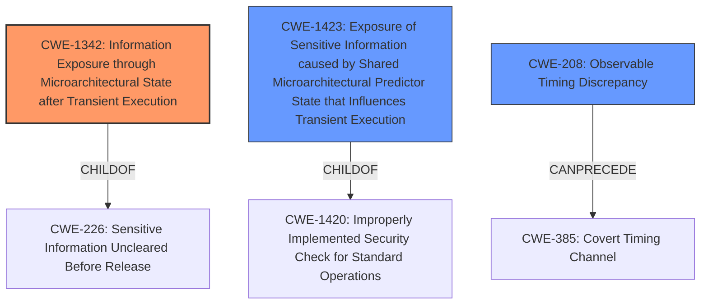

# Enhanced Analysis for CVE-2021-28689

# Summary
| CWE ID | CWE Name | Confidence | CWE Abstraction Level | CWE Vulnerability Mapping Label | CWE-Vulnerability Mapping Notes |
|---|---|---|---|---|---|
| CWE-1342 | Information Exposure through Microarchitectural State after Transient Execution | 0.8 | Base | Allowed | Primary CWE |
| CWE-1423 | Exposure of Sensitive Information caused by Shared Microarchitectural Predictor State that Influences Transient Execution | 0.7 | Base | Allowed | Secondary Candidate |
| CWE-208 | Observable Timing Discrepancy | 0.6 | Base | Allowed | Secondary Candidate |

## Evidence and Confidence

*   **Confidence Score:** 0.8
*   **Evidence Strength:** HIGH

## Relationship Analysis
The primary CWE, CWE-1342 (Information Exposure through Microarchitectural State after Transient Execution), is a base-level CWE, indicating a specific type of weakness. It is a child of CWE-226, which suggests it falls under the broader category of "sensitive information uncleared before release".

CWE-1423 (Exposure of Sensitive Information caused by Shared Microarchitectural Predictor State that Influences Transient Execution) is also a Base CWE and a child of CWE-1420. It is a more specific case of CWE-1342.

CWE-208 (Observable Timing Discrepancy) can be related as the microarchitectural state may lead to timing differences detectable by an attacker.



## Vulnerability Chain
The vulnerability chain starts with the architectural **weakness** in x86 processors regarding speculative execution in ring 1. This leads to information exposure due to the **speculative vulnerabilities** which allows an attacker to **execute sidechannel attacks**. The chain can be summarized as:

1.  Architectural Design (Ring 1 Usage)
2.  **Speculative Execution**
3.  **Information Exposure through Microarchitectural State**
4.  Potential **Observable Timing Discrepancy**

## Summary of Analysis
The initial analysis identified the core issue as **speculative vulnerabilities** in x86 processors when running 32-bit PV guests in ring 1. The key evidence is: "x86 **Speculative vulnerabilities with bare (non-shim) 32-bit PV guests**...IBRS does not architecturally protect ring 0 from predictions learnt in ring 1... The situation is quite likely to be similar for speculative execution attacks which have yet to be discovered, disclosed, or mitigated."

The Retriever results strongly suggest CWE-1342 (Information Exposure through Microarchitectural State after Transient Execution) as a potential match, and this aligns well with the vulnerability description, especially given the context of speculative execution and its effect on microarchitectural state.

CWE-1423 (Exposure of Sensitive Information caused by Shared Microarchitectural Predictor State that Influences Transient Execution) is also considered because the attack involves shared microarchitectural predictor state. However, CWE-1342 is more general and encompasses the broader issue of information exposure via transient execution.

CWE-208 (Observable Timing Discrepancy) is potentially applicable as a consequence of the microarchitectural issues, but it represents a potential impact rather than the root cause.

Therefore, CWE-1342 is selected as the primary CWE because it directly addresses the **root cause**: the processor's failure to properly clear microarchitectural state after speculative execution, leading to information exposure. It is at the appropriate level of specificity (Base) and aligns with the MITRE mapping guidance.

CWE-1423 could be considered as a secondary CWE since it describes how shared predictor state may allow code to influence transient execution.

CWE-208 could also be considered as a secondary CWE since the attack leads to information leakage due to timing discrepancies.

Relevant CWE Information:

# Enhanced Context (25 CWEs)

## CWE-191: Integer Underflow (Wrap or Wraparound)
**Abstraction Level**: Base
**Similarity Score**: 0.78
**Source**: dense

**Description**:
The product subtracts one value from another, such that the result is less than the minimum allowable integer value, which produces a value that is not equal to the correct result.

**Mapping Guidance**:
- Usage: Allowed
- Rationale: This CWE entry is at the Base level of abstraction, which is a preferred level of abstraction for mapping to the root causes of vulnerabilities.

## CWE-197: Numeric Truncation Error
**Abstraction Level**: Base
**Similarity Score**: 0.77
**Source**: dense

**Description**:
Truncation errors occur when a primitive is cast to a primitive of a smaller size and data is lost in the conversion.

**Mapping Guidance**:
- Usage: Allowed
- Rationale: This CWE entry is at the Base level of abstraction, which is a preferred level of abstraction for mapping to the root causes of vulnerabilities.

## CWE-190: Integer Overflow or Wraparound
**Abstraction Level**: Base
**Similarity Score**: 0.76
**Source**: dense

**Description**:
The product performs a calculation that can
         produce an integer overflow or wraparound when the logic
         assumes that the resulting value will always be larger than
         the original value. This occurs when an integer value is
         incremented to a value that is too large to store in the
         associated representation. When this occurs, the value may
         become a very small or negative number.

**Mapping Guidance**:
- Usage: Allowed
- Rationale: This CWE entry is at the Base level of abstraction, which is a preferred level of abstraction for mapping to the root causes of vulnerabilities.

## CWE-131: Incorrect Calculation of Buffer Size
**Abstraction Level**: Base
**Similarity Score**: 0.76
**Source**: dense

**Description**:
The product does not correctly calculate the size to be used when allocating a buffer, which could lead to a buffer overflow.

**Mapping Guidance**:
- Usage: Allowed
- Rationale: This CWE entry is at the Base level of abstraction, which is a preferred level of abstraction for mapping to the root causes of vulnerabilities.

## CWE-680: Integer Overflow to Buffer Overflow
**Abstraction Level**: Compound
**Similarity Score**: 0.75
**Source**: dense

**Description**:
The product performs a calculation to determine how much memory to allocate, but an integer overflow can occur that causes less memory to be allocated than expected, leading to a buffer overflow.

**Mapping Guidance**:
- Usage: Discouraged
- Rationale: This CWE entry is a named chain, which combines multiple weaknesses.

## CWE-681: Incorrect Conversion between Numeric Types
**Abstraction Level**: Base
**Similarity Score**: 0.75
**Source**: dense

**Description**:
When converting from one data type to another, such as long to integer, data can be omitted or translated in a way that produces unexpected values. If the resulting values are used in a sensitive context, then dangerous behaviors may occur.

**Mapping Guidance**:
- Usage: Allowed
- Rationale: This CWE entry is at the Base level of abstraction, which is a preferred level of abstraction for mapping to the root causes of vulnerabilities.

## CWE-667: Improper Locking
**Abstraction Level**: Class
**Similarity Score**: 0.74
**Source**: dense

**Description**:
The product does not properly acquire or release a lock on a resource, leading to unexpected resource state changes and behaviors.

**Mapping Guidance**:
- Usage: Allowed-with-Review
- Rationale: This CWE entry is a Class and might have Base-level children that would be more appropriate

## CWE-1342: Information Exposure through Microarchitectural State after Transient Execution
**Abstraction Level**: Base
**Similarity Score**: 0.74
**Source**: dense

**Description**:
The processor does not properly clear microarchitectural state after incorrect microcode assists or speculative execution, resulting in transient execution.

**Mapping Guidance**:
- Usage: Allowed
- Rationale: This CWE entry is at the Base level of abstraction, which is a preferred level of abstraction for mapping to the root causes of vulnerabilities.

## CWE


## CWE Relationship Analysis

Current CWEs represent these abstraction levels: .


### Vulnerability Chain Analysis

**Chain starting from CWE-190:**
- 190 (Integer Overflow or Wraparound) - ROOT


**Chain starting from CWE-208:**
- 208 (Observable Timing Discrepancy) - ROOT


### CWE Relationship Diagram

```mermaid
graph TD
    classDef primary fill:#f96,stroke:#333,stroke-width:2px
    classDef secondary fill:#69f,stroke:#333
    classDef tertiary fill:#9e9,stroke:#333
```