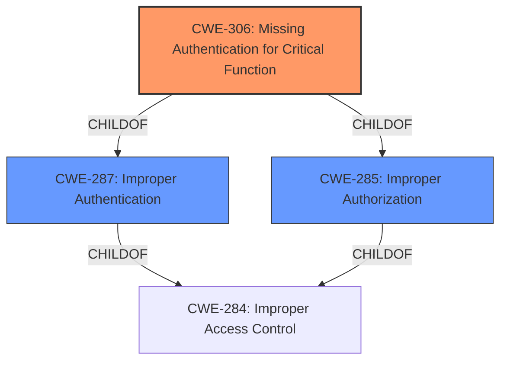

# Analysis for CVE-2021-28809

# Summary
| CWE ID | CWE Name | Confidence | CWE Abstraction Level | CWE Vulnerability Mapping Label | CWE-Vulnerability Mapping Notes |
|---|---|---|---|---|---|
| CWE-306 | Missing Authentication for Critical Function | 1.0 | Base | Allowed | Primary CWE |
| CWE-285 | Improper Authorization | 0.7 | Class | Discouraged | Secondary Candidate |
| CWE-287 | Improper Authentication | 0.6 | Class | Discouraged | Secondary Candidate |

## Evidence and Confidence

*   **Confidence Score:** 0.9
*   **Evidence Strength:** HIGH

## Relationship Analysis
The primary CWE selected is CWE-306 (**Missing Authentication for Critical Function**). This choice is influenced by its base-level abstraction and direct alignment with the vulnerability description, which clearly indicates a lack of authentication for critical system configuration modifications. CWE-287 (**Improper Authentication**) and CWE-285 (**Improper Authorization**) are parent classes of CWE-306 and were considered but ultimately deemed less specific. The graph shows the relationship between these CWEs:

## Vulnerability Chain
The vulnerability chain starts with **missing authentication** (CWE-306) for the RTSS server. This **lack of authentication** allows unauthorized access and modification of system configurations, ultimately leading to remote code execution and compromise of the operating system. The chain can be summarized as: CWE-306 -> Remote Configuration Modification -> Remote Code Execution -> OS Compromise.

## Summary of Analysis
The initial assessment focused on the **improper access control** vulnerability in QNAP HBS 3. The key evidence supporting CWE-306 is from the "CVE Reference Links Content Summary," which states: "The vulnerability stems from a **lack of authentication** in the RTSS server of QNAP NAS devices... Specifically, the issue arises because the server allows alterations to the system configuration without requiring any prior authentication." The retriever results also ranked CWE-306 as the top candidate.

CWE-285 and CWE-287 were considered due to the "improper access control" description and their relationship to authentication and authorization issues. However, CWE-306 is more precise, as it directly addresses the **missing authentication**, which is the root cause.

The final decision to use CWE-306 is based on:
  - Direct evidence of **missing authentication** from the vulnerability description.
  - The base-level abstraction of CWE-306, aligning with the goal of identifying the root cause.
  - MITRE mapping guidance favoring base-level CWEs.
  - The retriever results, which ranked CWE-306 as the top candidate.

CWE-285 (**Improper Authorization**) and CWE-287 (**Improper Authentication**) were not selected as primary because they are higher-level classes and less specific than CWE-306. While related, they do not capture the precise nature of the vulnerability, which is the complete **absence of authentication** for critical functions.

Other CWEs considered but not selected include:

*   CWE-78 (**Improper Neutralization of Special Elements used in an OS Command ('OS Command Injection')**): While remote code execution is an impact, the root cause is not related to command injection.
*   CWE-22 (**Improper Limitation of a Pathname to a Restricted Directory ('Path Traversal')**): Not relevant, as the vulnerability does not involve path traversal.
*   CWE-120 (**Buffer Copy without Checking Size of Input ('Classic Buffer Overflow')**): Not relevant, as the vulnerability does not involve buffer overflows.
*   CWE-610 (**Externally Controlled Reference to a Resource in Another Sphere**): Not directly relevant, as the core issue is the **lack of authentication**, not the external control of resources.
*   CWE-1336 (**Improper Neutralization of Special Elements Used in a Template Engine**): Not relevant, as the vulnerability does not involve template engines.
*   CWE-121 (**Stack-based Buffer Overflow**): Not relevant, as the vulnerability does not involve buffer overflows.
*   CWE-23 (**Relative Path Traversal**): Not relevant, as the vulnerability does not involve path traversal.