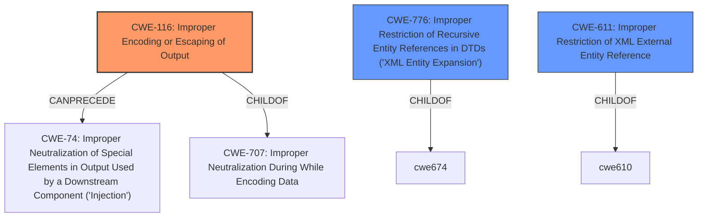

# Analysis Report for CVE-2021-28965

# Vulnerability Analysis Report: CVE-2021-28965

## Description


## Analysis (with Relationship Data)

# Summary
| CWE ID | CWE Name | Confidence | CWE Abstraction Level | CWE Vulnerability Mapping Label | CWE-Vulnerability Mapping Notes |
|---|---|---|---|---|---|
| CWE-116 | Improper Encoding or Escaping of Output | 0.8 | Class | Primary | Allowed-with-Review |
| CWE-776 | Improper Restriction of Recursive Entity References in DTDs ('XML Entity Expansion') | 0.5 | Base | Secondary | Allowed |
| CWE-611 | Improper Restriction of XML External Entity Reference | 0.5 | Base | Secondary | Allowed |

## Evidence and Confidence

*   **Confidence Score:** 0.7
*   **Evidence Strength:** MEDIUM

## Relationship Analysis
The primary CWE selected is CWE-116, which is a Class-level CWE. It has a ChildOf relationship with CWE-707 (Improper Neutralization During While Encoding Data) and a CanPrecede relationship with CWE-74 (Improper Neutralization of Special Elements in Output Used by a Downstream Component ('Injection')). This relationship suggests that improper encoding can lead to injection vulnerabilities.
CWE-776 and CWE-611 are related to XML processing and can lead to denial-of-service or information disclosure.



## Vulnerability Chain
The vulnerability chain starts with the **improper handling of XML round-trip issues**, which can lead to an **incorrect document being produced**. This can be seen as a form of **improper encoding or escaping of output** (CWE-116). In some cases, the improper handling of XML can be related to **XML Entity Expansion** (CWE-776) or **XML External Entity Reference** (CWE-611).

## Summary of Analysis
The initial analysis focused on the fact that the REXML gem before certain versions **does not properly address XML round-trip issues**. This means that after parsing and serializing an XML document, an **incorrect document can be produced**.

The Retriever results suggested several CWEs, including CWE-777 (Regular Expression without Anchors), CWE-116 (Improper Encoding or Escaping of Output), and CWE-611 (Improper Restriction of XML External Entity Reference).

CWE-116 (Improper Encoding or Escaping of Output) was chosen as the primary CWE because the vulnerability description and the CVE reference summary both point to issues with how the XML data is handled during parsing and serialization. The "XML round-trip issues" suggest that the encoding or escaping mechanisms are not properly preserving the structure of the XML document.

CWE-776 (Improper Restriction of Recursive Entity References in DTDs ('XML Entity Expansion')) and CWE-611 (Improper Restriction of XML External Entity Reference) are included as secondary CWEs because they are related to potential issues that can occur when processing XML documents, especially with external or recursive entities. The vulnerability could potentially involve these issues, depending on the specifics of the crafted XML document.

The selection of CWE-116 is based on the evidence that the XML structure is not being preserved during parsing and serialization, indicating an issue with encoding or escaping. The fact that the vulnerability leads to an "incorrect document" further supports this classification. The evidence for CWE-776 and CWE-611 is less direct, but the potential for these issues to be involved in XML processing vulnerabilities justifies their inclusion as secondary CWEs.

The abstraction level of CWE-116 is Class, while CWE-776 and CWE-611 are Base. Ideally, a more specific Variant of CWE-116 would be preferred, but given the available information, the Class level provides a reasonable fit.

Relevant CWE Information:

# Enhanced Context (25 CWEs)
The following CWEs were identified as potentially relevant to this vulnerability:

## CWE-611: Improper Restriction of XML External Entity Reference
**Abstraction Level**: Base
**Similarity Score**: 0.78
**Source**: dense

**Description**:
The product processes an XML document that can contain XML entities with URIs that resolve to documents outside of the intended sphere of control, causing the product to embed incorrect documents into its output.

**Mapping Guidance**:
- Usage: Allowed
- Rationale: This CWE entry is at the Base level of abstraction, which is a preferred level of abstraction for mapping to the root causes of vulnerabilities.

## CWE-116: Improper Encoding or Escaping of Output
**Abstraction Level**: Class
**Similarity Score**: 0.75
**Source**: dense

**Description**:
The product prepares a structured message for communication with another component, but encoding or escaping of the data is either missing or done incorrectly. As a result, the intended structure of the message is not preserved.

**Mapping Guidance**:
- Usage: Allowed-with-Review
- Rationale: This CWE entry is a Class and might have Base-level children that would be more appropriate

## CWE-776: Improper Restriction of Recursive Entity References in DTDs ('XML Entity Expansion')
**Abstraction Level**: Base
**Similarity Score**: 0.76
**Source**: dense

**Description**:
The product uses XML documents and allows their structure to be defined with a Document Type Definition (DTD), but it does not properly control the number of recursive definitions of entities.

**Mapping Guidance**:
- Usage: Allowed
- Rationale: This CWE entry is at the Base level of abstraction, which is a preferred level of abstraction for mapping to the root causes of vulnerabilities.


## CWE Relationship Analysis

Current CWEs represent these abstraction levels: .


### Vulnerability Chain Analysis

**Chain starting from CWE-777:**
- 777 (Regular Expression without Anchors) - ROOT


**Chain starting from CWE-707:**
- 707 (Improper Neutralization) - ROOT


### CWE Relationship Diagram

```mermaid
graph TD
    classDef primary fill:#f96,stroke:#333,stroke-width:2px
    classDef secondary fill:#69f,stroke:#333
    classDef tertiary fill:#9e9,stroke:#333
```


*Report generated on 2025-03-30 13:02:18*
