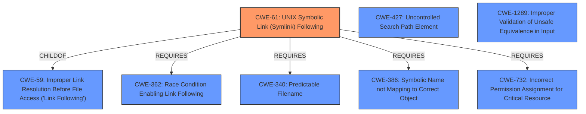

# Raw Analyzer Response for CVE-2021-29468

# Summary
| CWE ID | CWE Name | Confidence | CWE Abstraction Level | CWE Vulnerability Mapping Label | CWE-Vulnerability Mapping Notes |
|---|---|---|---|---|---|
| CWE-61 | UNIX Symbolic Link (Symlink) Following | 0.9 | Compound | Allowed | Primary CWE |
| CWE-427 | Uncontrolled Search Path Element | 0.7 | Base | Allowed | Secondary Candidate |
| CWE-1289 | Improper Validation of Unsafe Equivalence in Input | 0.6 | Base | Allowed | Secondary Candidate |

## Evidence and Confidence

*   **Confidence Score:** 0.8
*   **Evidence Strength:** HIGH

## Relationship Analysis
The primary CWE is CWE-61, which is a compound CWE representing a combination of weaknesses required for symlink following exploitation. This is related to CWE-59, as CWE-61 is a ChildOf CWE-59. CWE-61 also REQUIRES several other CWEs to be present, including CWE-362, CWE-340, CWE-386, and CWE-732. Several other CWEs were considered as secondary matches including CWE-427 and CWE-1289 due to the possibility of an **uncontrolled search path** or **improper validation**, respectively.

## Vulnerability Chain
The vulnerability chain starts with a crafted repository containing symbolic links and files with backslash characters. This leads to **improper input sanitization** and potentially an **uncontrolled search path**, allowing an attacker to overwrite arbitrary files, including Git hooks, leading to arbitrary code execution.

## Summary of Analysis
The initial assessment focused on the **improper handling of symbolic links** and **inadequate sanitization of filenames**. The Retriever Results pointed to several candidate CWEs, including CWE-1289, CWE-88, CWE-427, and CWE-61.

CWE-61, "UNIX Symbolic Link (Symlink) Following," was selected as the primary CWE because the vulnerability description and CVE details explicitly mention symbolic links as a key component of the attack. The vulnerability relies on the **improper handling of symbolic links** within a Git repository on Cygwin, allowing an attacker to potentially overwrite arbitrary files. The description notes: "A specially crafted repository that contains symbolic links as well as files with backslash characters in the file name may cause just-checked out code to be executed."

CWE-427, "Uncontrolled Search Path Element," was considered as a secondary CWE because the attack involves the execution of code during the checkout process, which could be influenced by the search path used by Git. However, the primary driver is the symlink following, so CWE-61 is the more direct cause.

CWE-1289, "Improper Validation of Unsafe Equivalence in Input," was also considered given the **improper sanitization of filenames**. The presence of backslashes in filenames, combined with symlinks, allowed for unexpected file overwrites.

The selection of CWE-61 as the primary CWE is supported by the evidence that the attack relies on specially crafted symbolic links to achieve arbitrary file overwrite and code execution. The other CWEs, while potentially contributing factors, are secondary to the core weakness of **improper symlink handling**. The evidence is found in these quotes from the vulnerability description: "A specially crafted repository that contains symbolic links as well as files with backslash characters in the file name may cause just-checked out code to be executed" and "The vulnerability stems from how Git handles symbolic links and filenames containing backslashes on the Cygwin platform."

Relevant CWE Information:
# Enhanced Context (25 CWEs)
The following CWEs were identified as potentially relevant to this vulnerability:

## CWE-125: Out-of-bounds Read
**Abstraction Level**: Base
**Similarity Score**: 0.76
**Source**: dense

**Description**:
The product reads data past the end, or before the beginning, of the intended buffer.

**Mapping Guidance**:
- Usage: Allowed
- Rationale: This CWE entry is at the Base level of abstraction, which is a preferred level of abstraction for mapping to the root causes of vulnerabilities.

*This CWE was considered but not selected because there is no evidence of out-of-bounds reads in the description.*

## CWE-1289: Improper Validation of Unsafe Equivalence in Input
**Abstraction Level**: Base
**Similarity Score**: 0.76
**Source**: dense

**Description**:
The product receives an input value that is used as a resource identifier or other type of reference, but it does not validate or incorrectly validates that the input is equivalent to a potentially-unsafe value.

**Mapping Guidance**:
- Usage: Allowed
- Rationale: This CWE entry is at the Base level of abstraction, which is a preferred level of abstraction for mapping to the root causes of vulnerabilities.

*This CWE was selected as a secondary CWE as the backslashes are not properly validated as a safe input.*

## CWE-59: Improper Link Resolution Before File Access ('Link Following')
**Abstraction Level**: Base
**Similarity Score**: 0.76
**Source**: dense

**Description**:
The product attempts to access a file based on the filename, but it does not properly prevent that filename from identifying a link or shortcut that resolves to an unintended resource.

**Mapping Guidance**:
- Usage: Allowed
- Rationale: This CWE entry is at the Base level of abstraction, which is a preferred level of abstraction for mapping to the root causes of vulnerabilities.

*This is the parent of CWE-61 and was used to confirm that CWE-61 was the best selection*

## CWE-41: Improper Resolution of Path Equivalence
**Abstraction Level**: Base
**Similarity Score**: 0.75
**Source**: dense

**Description**:
The product is vulnerable to file system contents disclosure through path equivalence. Path equivalence involves the use of special characters in file and directory names. The associated manipulations are intended to generate multiple names for the same object.

**Mapping Guidance**:
- Usage: Allowed
- Rationale: This CWE entry is at the Base level of abstraction, which is a preferred level of abstraction for mapping to the root causes of vulnerabilities.

*This CWE was considered but not selected because the vulnerability is not for disclosing file system contents, but instead for arbitrary code execution via file overwrite.*

## CWE-130: Improper Handling of Length Parameter Inconsistency
**Abstraction Level**: Base
**Similarity Score**: 0.75
**Source**: dense

**Description**:
The product parses a formatted message or structure, but it does not handle or incorrectly handles a length field that is inconsistent with the actual length of the associated data.

**Mapping Guidance**:
- Usage: Allowed
- Rationale: This CWE entry is at the Base level of abstraction, which is a preferred level of abstraction for mapping to the root causes of vulnerabilities.

*This CWE was considered but not selected because there is no formatted message or structure being parsed.*

## CWE-74: Improper Neutralization of Special Elements in Output Used by a Downstream Component ('Injection')
**Abstraction Level**: Class
**Similarity Score**: 0.75
**Source**: dense

**Description**:
The product constructs all or part of a command, data structure, or record using externally-influenced input from an upstream component, but it does not neutralize or incorrectly neutralizes special elements that could modify how it is parsed or interpreted when it is sent to a downstream component.

**Mapping Guidance**:
- Usage: Discouraged
- Rationale: CWE-74 is high-level and often misused when lower-level weaknesses are more appropriate.

*This CWE was considered but not selected because it is too high level and there are more specific CWEs available.*

##