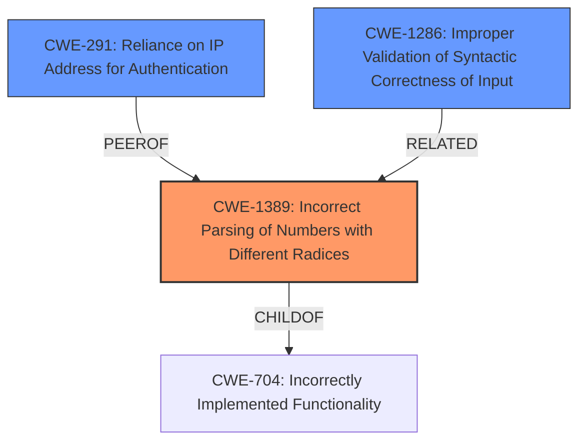

# Analysis for CVE-2021-29662

# Summary
| CWE ID  | CWE Name                                                      | Confidence | CWE Abstraction Level | CWE Vulnerability Mapping Label | CWE-Vulnerability Mapping Notes |
| :-------- | :------------------------------------------------------------ | :--------- | :---------------------- | :------------------------------ | :------------------------------ |
| CWE-1389  | Incorrect Parsing of Numbers with Different Radices         | 0.9        | Base                    | Primary                       | Allowed                       |
| CWE-291   | Reliance on IP Address for Authentication                   | 0.7        | Variant                 | Secondary                     | Allowed                       |
| CWE-1286 | Improper Validation of Syntactic Correctness of Input | 0.6 | Base | Secondary | Allowed |

## Evidence and Confidence

*   **Confidence Score:** 0.8
*   **Evidence Strength:** HIGH

## Relationship Analysis

The primary CWE is CWE-1389, which directly addresses the **incorrect parsing** of numbers due to the **improper handling** of different radices (octal in this case). This leads to issues with IP address validation. CWE-291 is a related weakness, where the system **relies on potentially spoofed IP addresses for authentication**, which this vulnerability exploits. CWE-1286, while less directly related, captures the broader issue of **improper input validation**. CWE-1389 is a child of CWE-704 (Incorrectly Implemented Functionality), highlighting that the **parsing logic is flawed**.

## Vulnerability Chain

The vulnerability chain starts with the **improper parsing** of IP addresses (**CWE-1389**) due to the **failure to account for** octal representations. This leads to the IP address validation being bypassed, which then allows **unauthenticated access** because the system is **relying on IP addresses for authentication** (**CWE-291**). A more general **improper input validation** (**CWE-1286**) could also be considered to be present.

## Summary of Analysis

The initial assessment identified **CWE-1389 (Incorrect Parsing of Numbers with Different Radices)** as the primary weakness, based on the vulnerability description explicitly mentioning the **failure to properly consider extraneous zero characters** at the beginning of an IP address, which leads to incorrect parsing. The CVE Reference Links Content Summary further supports this by highlighting the "Improper input validation of octal strings in Perl's Data::Validate::IP module." which is the **root cause**. The description aligns perfectly with CWE-1389's description: "The product parses numeric input assuming base 10 (decimal) values, but it does not account for inputs that use a different base number (radix)."

The presence of **CWE-291 (Reliance on IP Address for Authentication)** is a secondary concern because the vulnerability allows bypassing access control that is based on IP addresses. This is also supported by the CVE Reference Links Content Summary, which state "Attackers can bypass IP address validation, potentially leading to SSRF, RFI, and LFI vulnerabilities. Allows unauthorized access or modification of data."

I also considered **CWE-1286 (Improper Validation of Syntactic Correctness of Input)** as a more general weakness that encompasses the **improper parsing** issue. The vulnerability description states that the "DataValidateIP module through 0.29 for Perl **does not properly consider extraneous zero characters at the beginning of an IP address string**", indicating that the syntactic correctness of the input IP address is not being properly validated.

The graph relationships helped to clarify the connections between the CWEs. **CWE-1389** is a child of **CWE-704 (Incorrectly Implemented Functionality)**, which reinforces the idea that the core issue is a **flawed parsing implementation**. **CWE-291** and **CWE-1286** are related as weaknesses that are exposed by the **improper parsing**.

I selected CWEs at the **Base** and **Variant** level of specificity because they provide the most accurate representation of the vulnerability's **root cause** and contributing factors.

Relevant CWE Information:

# Enhanced Context (25 CWEs)

## CWE-1289: Improper Validation of Unsafe Equivalence in Input
**Abstraction Level**: Base
**Similarity Score**: 0.79

**Description**:
The product receives an input value that is used as a resource identifier or other type of reference, but it does not validate or incorrectly validates that the input is equivalent to a potentially-unsafe value.

**Mapping Guidance**:
- Usage: Allowed
- Rationale: This CWE entry is at the Base level of abstraction, which is a preferred level of abstraction for mapping to the root causes of vulnerabilities.

*Not Selected:* While related to input validation, this is not about equivalence validation.

## CWE-41: Improper Resolution of Path Equivalence
**Abstraction Level**: Base
**Similarity Score**: 0.78

**Description**:
The product is vulnerable to file system contents disclosure through path equivalence. Path equivalence involves the use of special characters in file and directory names. The associated manipulations are intended to generate multiple names for the same object.

**Mapping Guidance**:
- Usage: Allowed
- Rationale: This CWE entry is at the Base level of abstraction, which is a preferred level of abstraction for mapping to the root causes of vulnerabilities.

*Not Selected:* This is specific to file system paths, not general input validation.

## CWE-184: Incomplete List of Disallowed Inputs
**Abstraction Level**: Base
**Similarity Score**: 0.78

**Description**:
The product implements a protection mechanism that relies on a list of inputs (or properties of inputs) that are not allowed by policy or otherwise require other action to neutralize before additional processing takes place, but the list is incomplete.

**Mapping Guidance**:
- Usage: Allowed
- Rationale: This CWE entry is at the Base level of abstraction, which is a preferred level of abstraction for mapping to the root causes of vulnerabilities.

*Not Selected:* The issue isn't about a list of disallowed inputs.

## CWE-74: Improper Neutralization of Special Elements in Output Used by a Downstream Component ('Injection')
**Abstraction Level**: Class
**Similarity Score**: 0.78

**Description**:
The product constructs all or part of a command, data structure, or record using externally-influenced input from an upstream component, but it does not neutralize or incorrectly neutralizes special elements that could modify how it is parsed or interpreted when it is sent to a downstream component.

**Mapping Guidance**:
- Usage: Discouraged
- Rationale: CWE-74 is high-level and often misused when lower-level weaknesses are more appropriate.

*Not Selected:* This is an input parsing issue, not an injection issue.

## CWE-1389: Incorrect Parsing of Numbers with Different Radices
**Abstraction Level**: Base
**Similarity Score**: 0.77

**Description**:
The product parses numeric input assuming base 10 (decimal) values, but it does not account for inputs that use a different base number (radix).

**Mapping Guidance**:
- Usage: Allowed
- Rationale: This CWE entry is at the Base level of abstraction, which is a preferred level of abstraction for mapping to the root causes of vulnerabilities.

*Selected:* As described above.

## CWE-138: Improper Neutralization of Special Elements
**Abstraction Level**: Class
**Similarity Score**: 0.77

**Description**:
The product receives input from an upstream component, but it does not neutralize or incorrectly neutralizes special elements that could be interpreted as control elements or syntactic markers when they are sent to a downstream component.

**Mapping Guidance**:
- Usage: Discouraged
- Rationale: This CWE entry is a level-1 Class (i.e., a child of a Pillar). It might have lower-level children that would be more appropriate

*Not Selected:* Too general.

## CWE-668: Exposure of Resource to Wrong Sphere
**Abstraction Level**: Class
**Similarity Score**: 0.77

**Description**:
The product exposes a resource to the wrong control sphere, providing unintended actors with inappropriate access to the resource.

**Mapping Guidance**:
- Usage: Discouraged
- Rationale: CWE-668 is high-level and is often misused as a catch-all when lower-level CWE IDs might be applicable. It is sometimes used for low-information