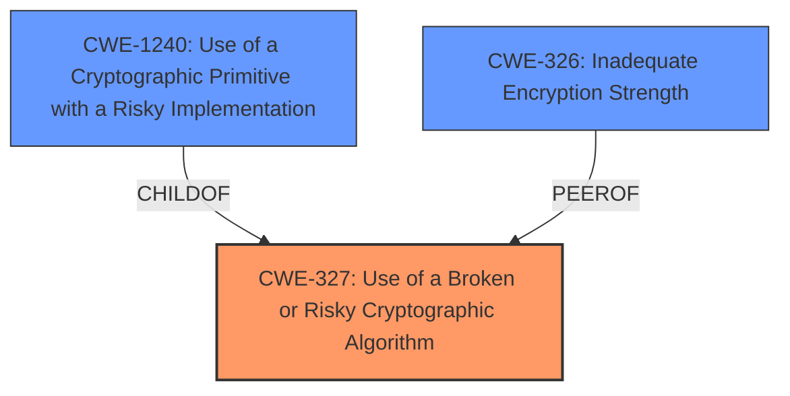

# Analysis for CVE-2021-29704

# Summary
| CWE ID | CWE Name | Confidence | CWE Abstraction Level | CWE Vulnerability Mapping Label | CWE-Vulnerability Mapping Notes |
|---|---|---|---|---|---|
| CWE-327 | Use of a Broken or Risky Cryptographic Algorithm | 0.9 | Class | Allowed-with-Review | Primary CWE |
| CWE-1240 | Use of a Cryptographic Primitive with a Risky Implementation | 0.7 | Base | Allowed | Secondary Candidate |
| CWE-326 | Inadequate Encryption Strength | 0.6 | Class | Allowed-with-Review | Secondary Candidate |

## Evidence and Confidence

*   **Confidence Score:** 0.8
*   **Evidence Strength:** HIGH

## Relationship Analysis
The primary CWE is CWE-327, which is a Class-level CWE. CWE-1240 (Base) is a child of CWE-327, representing a more specific instantiation of the weakness. CWE-326 (Class) is a peer which represents a similar weakness that could be present. The evidence points towards the use of a risky algorithm which leads to using CWE-327.

## Vulnerability Chain
The chain of events starts with the **use of weak cryptographic algorithms** (CWE-327), potentially leading to an attacker being able to **decrypt highly sensitive information**. The root cause is the insecure cryptographic algorithm, and the impact is the decryption of sensitive information.

## Summary of Analysis
The initial assessment identified CWE-327 as the primary candidate due to the **rootcause** being the **use of weak cryptographic algorithms**. The "Vulnerability Description Key Phrases" section explicitly mentions "**weak cryptographic algorithms**", and the "CVE Reference Links Content Summary" confirms the **root cause** is the system allows connections over the outdated TLS 1.0 protocol.

The graph relationships influenced the selection by highlighting the hierarchical connection between CWE-327 and CWE-1240. While CWE-1240 is more specific, the provided information does not fully confirm the nature of the risky cryptographic primitive, making CWE-327 a more appropriate initial mapping.

The selected CWEs are at the optimal level of specificity because they directly address the identified **weakness** (CWE-327) and offer potential further refinement if more details were known (CWE-1240).

Relevant CWE Information:

# Enhanced Context (25 CWEs)
The following CWEs were identified as potentially relevant to this vulnerability:

## CWE-1240: Use of a Cryptographic Primitive with a Risky Implementation
**Abstraction Level**: Base
**Similarity Score**: 0.78
**Source**: dense

**Description**:
To fulfill the need for a cryptographic primitive, the product implements a cryptographic algorithm using a non-standard, unproven, or disallowed/non-compliant cryptographic implementation.

**Mapping Guidance**:
- Usage: Allowed
- Rationale: This CWE entry is at the Base level of abstraction, which is a preferred level of abstraction for mapping to the root causes of vulnerabilities.

## CWE-327: Use of a Broken or Risky Cryptographic Algorithm
**Abstraction:** Class
**Status:** Draft

### Description
The product uses a broken or risky cryptographic algorithm or protocol.

### Extended Description
Cryptographic algorithms are the methods by which data is scrambled to prevent observation or influence by unauthorized actors. Insecure cryptography can be exploited to expose sensitive information, modify data in unexpected ways, spoof identities of other users or devices, or other impacts.

### Mapping Guidance
**Usage:** Allowed-with-Review
**Rationale:** This CWE entry is a Class and might have Base-level children that would be more appropriate

CWE-327 is chosen as the primary because the description explicitly mentions using **weaker than expected cryptographic algorithms**, and the CVE reference link summary states connections are allowed over the outdated TLS 1.0 protocol.

CWE-1240 was considered but not chosen as the primary because the description says "weaker than expected cryptographic algorithms" which is less specific than a "risky implementation". There is no evidence to support this at this time.
CWE-326 was considered but not chosen because the description says "weaker than expected cryptographic algorithms", but doesn't say if the algorithms are "not strong enough for the level of protection required." There is no evidence to support this at this time.