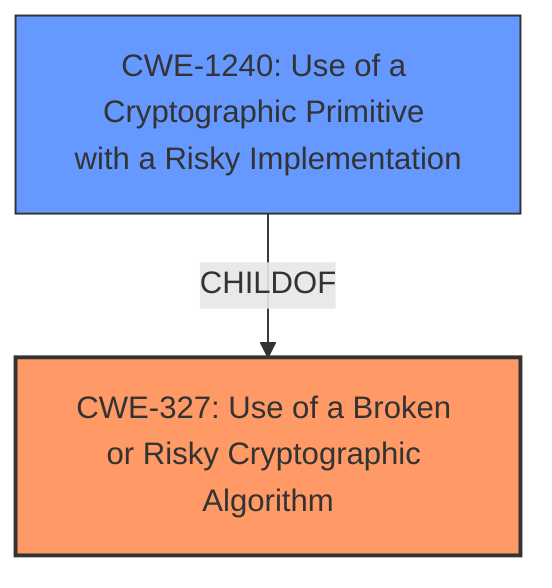

# Raw Analyzer Response for CVE-2021-29723

# Summary
| CWE ID | CWE Name | Confidence | CWE Abstraction Level | CWE Vulnerability Mapping Label | CWE-Vulnerability Mapping Notes |
|---|---|---|---|---|---|
| CWE-327 | Use of a Broken or Risky Cryptographic Algorithm | 0.9 | Class | Primary | Allowed-with-Review |
| CWE-1240 | Use of a Cryptographic Primitive with a Risky Implementation | 0.7 | Base | Secondary | Allowed |

## Evidence and Confidence

*   **Confidence Score:** 0.8
*   **Evidence Strength:** HIGH

## Relationship Analysis
The primary relationship influencing my decision is the ChildOf relationship between CWE-1240 and CWE-327. CWE-1240 is a more specific instance of CWE-327, but it requires more specific evidence about the cryptographic primitive implementation being risky. Both CWEs are related to the use of cryptography, but at different levels of abstraction. CWE-327 is a class-level CWE, whereas CWE-1240 is a base-level CWE. The evidence supports the use of a risky cryptographic algorithm; however, it is not clear that it is a risky *implementation* which would require more evidence, and hence the slightly lower confidence.

## Vulnerability Chain
The vulnerability chain consists of the **use of weaker than expected cryptographic algorithms** (CWE-327) leading to the ability of an attacker to decrypt highly sensitive information.

## Summary of Analysis
The initial analysis pointed to CWE-327 (Use of a Broken or Risky Cryptographic Algorithm) as the primary candidate, supported by the vulnerability description's key phrase "**weaker than expected cryptographic algorithms**." The retriever results also listed CWE-327 as the top match. The final decision was influenced by the evidence available and the relationships between the considered CWEs.

The provided evidence, specifically the vulnerability description stating the use of "**weaker than expected cryptographic algorithms**," strongly supports the selection of CWE-327. The retriever results further reinforce this choice by listing CWE-327 as the top match.

CWE-327 is at the optimal level of specificity because while CWE-1240 (Use of a Cryptographic Primitive with a Risky Implementation) is more specific, the current evidence doesn't fully confirm whether the *implementation* of the algorithm is risky, only that the algorithm itself is **weaker than expected**.

Relevant CWE Information:

# Enhanced Context (25 CWEs)
The following CWEs were identified as potentially relevant to this vulnerability:

## CWE-1240: Use of a Cryptographic Primitive with a Risky Implementation
**Abstraction Level**: Base
**Similarity Score**: 0.81
**Source**: dense

**Description**:
To fulfill the need for a cryptographic primitive, the product implements a cryptographic algorithm using a non-standard, unproven, or disallowed/non-compliant cryptographic implementation.

**Mapping Guidance**:
- Usage: Allowed
- Rationale: This CWE entry is at the Base level of abstraction, which is a preferred level of abstraction for mapping to the root causes of vulnerabilities.

## CWE-327: Use of a Broken or Risky Cryptographic Algorithm
**Abstraction:** Class
**Status:** Draft

### Description
The product uses a broken or risky cryptographic algorithm or protocol.

### Extended Description
Cryptographic algorithms are the methods by which data is scrambled to prevent observation or influence by unauthorized actors. Insecure cryptography can be exploited to expose sensitive information, modify data in unexpected ways, spoof identities of other users or devices, or other impacts.

### Alternative Terms
None

### Relationships
ChildOf -> CWE-693
PeerOf -> CWE-311

### Mapping Guidance
**Usage:** Allowed-with-Review
**Rationale:** This CWE entry is a Class and might have Base-level children that would be more appropriate
**Comments:** Examine children of this entry to see if there is a better fit
**Reasons:**
- Abstraction