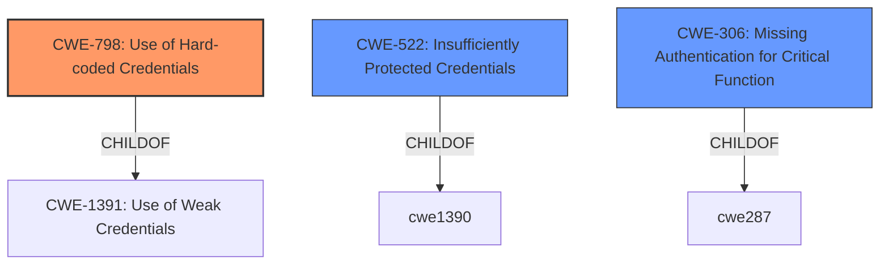

# Analysis for CVE-2021-30116

# Summary
| CWE ID | CWE Name | Confidence | CWE Abstraction Level | CWE Vulnerability Mapping Label | CWE-Vulnerability Mapping Notes |
|---|---|---|---|---|---|
| CWE-798 | Use of Hard-coded Credentials | 0.9 | Base | Allowed | Primary CWE |
| CWE-522 | Insufficiently Protected Credentials | 0.7 | Class | Allowed-with-Review | Secondary Candidate |
| CWE-306 | Missing Authentication for Critical Function | 0.6 | Base | Allowed | Secondary Candidate |

## Evidence and Confidence

*   **Confidence Score:** 0.8
*   **Evidence Strength:** HIGH

## Relationship Analysis
The primary relationship influencing the decision is the hierarchical structure, specifically the ChildOf relationship. CWE-798, being a Base level CWE, fits the specific **use of hard-coded credentials** better than its parent class CWE-1391 (Use of Weak Credentials), offering a more precise classification. CWE-522 (Insufficiently Protected Credentials) and CWE-306 (Missing Authentication for Critical Function) were considered due to the **credential disclosure** and **authentication bypass**, but they are not the root cause.

## Vulnerability Chain
The vulnerability chain begins with the **hard-coded credentials** (CWE-798) within the KaseyaD.ini file. This leads to **credential disclosure**, which then allows an attacker to **bypass authentication** and gain unauthorized access to the system.
1.  **CWE-798 (Root Cause):** Hard-coded Agent_Guid and AgentPassword in KaseyaD.ini.
2.  **Credential Disclosure:** Leaking of Agent_Guid and AgentPassword.
3.  **Authentication Bypass:** Using the leaked credentials to obtain a sessionId cookie and bypass authentication.

## Summary of Analysis
The initial analysis pointed towards **credential disclosure** and **authentication bypass**. However, a deeper analysis revealed that the root cause is the **use of hard-coded credentials** (CWE-798). The vulnerability description explicitly states that the KaseyaD.ini file contains an Agent_Guid and AgentPassword, which are hard-coded. The CVE Reference Links Content Summary also mentions "Credentials Leak" and "Business Logic Flaw" as weaknesses. The hierarchical relationships guided the selection of CWE-798 as the most specific and appropriate classification. The mapping guidance for CWE-798 allows its use at the Base level, further solidifying the choice.

The evidence supporting CWE-798 includes:

*   Vulnerability Description: "the file KaseyaD.ini is generated (C:\Program Files (x86)\Kaseya\XXXXXXXXXX\KaseyaD.ini) which contains an Agent_Guid and AgentPassword"
*   CVE Reference Links Content Summary: "A credentials leak and business logic flaw in Kaseya VSA."

Other CWEs Considered:

*   CWE-522 (Insufficiently Protected Credentials): Considered but deemed less accurate as it describes the general case of credentials being insecurely handled, whereas CWE-798 specifically addresses the root cause of **hard-coded credentials.**
*   CWE-306 (Missing Authentication for Critical Function): Considered because the leaked credentials lead to authentication bypass. However, the **lack of authentication** is a consequence of the **hard-coded credentials**, not the primary weakness.

The selected CWEs are at the optimal level of specificity because they directly address the root cause (CWE-798) and the immediate impact (credential disclosure and subsequent authentication bypass). CWE-798 is a Base level CWE, which is preferred for root cause analysis.

Relevant CWE Information:

# Enhanced Context (25 CWEs)
The following CWEs were identified as potentially relevant to this vulnerability:

## CWE-798: Use of Hard-coded Credentials
**Abstraction Level**: Base
**Similarity Score**: 0.80
**Source**: dense

**Description**:
The product contains **hard-coded credentials**, such as a password or cryptographic key.

**Mapping Guidance**:
- Usage: Allowed
- Rationale: This CWE entry is at the Base level of abstraction, which is a preferred level of abstraction for mapping to the root causes of vulnerabilities.

## CWE-312: Cleartext Storage of Sensitive Information
**Abstraction Level**: Base
**Similarity Score**: 0.79
**Source**: dense

**Description**:
The product stores sensitive information in cleartext within a resource that might be accessible to another control sphere.

**Mapping Guidance**:
- Usage: Allowed
- Rationale: This CWE entry is at the Base level of abstraction, which is a preferred level of abstraction for mapping to the root causes of vulnerabilities.

## CWE-1391: Use of Weak Credentials
**Abstraction Level**: Class
**Similarity Score**: 0.78
**Source**: dense

**Description**:
The product uses weak credentials (such as a default key or **hard-coded password**) that can be calculated, derived, reused, or guessed by an attacker.

**Mapping Guidance**:
- Usage: Allowed-with-Review
- Rationale: This CWE entry is a Class and might have Base-level children that would be more appropriate

## CWE-73: External Control of File Name or Path
**Abstraction Level**: Base
**Similarity Score**: 0.78
**Source**: dense

**Description**:
The product allows user input to control or influence paths or file names that are used in filesystem operations.

**Mapping Guidance**:
- Usage: Allowed
- Rationale: This CWE entry is at the Base level of abstraction, which is a preferred level of abstraction for mapping to the root causes of vulnerabilities.

## CWE-668: Exposure of Resource to Wrong Sphere
**Abstraction Level**: Class
**Similarity Score**: 0.78
**Source**: dense

**Description**:
The product exposes a resource to the wrong control sphere, providing unintended actors with inappropriate access to the resource.

**Mapping Guidance**:
- Usage: Discouraged
- Rationale: CWE-668 is high-level and is often misused as a catch-all when lower-level CWE IDs might be applicable. It is sometimes used for low-information vulnerability reports [REF-1287]. It is a level-1 Class (i.e., a child of a Pillar). It is not useful for trend analysis.

## CWE-807: Reliance on Untrusted Inputs in a Security Decision
**Abstraction Level**: Base
**Similarity Score**: 0.78
**Source**: dense

**Description**:
The product uses a protection mechanism that relies on the existence or values of an input, but the input can be modified by an untrusted actor in a way that bypasses the protection mechanism.

**Mapping Guidance**:
- Usage: Allowed
- Rationale: This CWE entry is at the Base level of abstraction, which is a preferred level of abstraction for mapping to the root causes of vulnerabilities.

## CWE-345: Insufficient Verification of Data Authenticity
**Abstraction Level**: Class
**Similarity Score**: 0.77
**Source**: dense

**Description**:
The product does not sufficiently verify the origin or authenticity of data, in a way that causes it to accept invalid data.

**Mapping Guidance**:
- Usage: Discouraged
- Rationale: This CWE entry is a level-1 Class (i.e., a child of a Pillar). It might have lower-level children that would be more appropriate

## CWE-522: Insufficiently Protected Credentials
**Abstraction Level**: Class
**Similarity Score**: 0.77
**Source**: dense

**Description**:
The product transmits or stores authentication credentials, but it uses an insecure method that is susceptible to unauthorized interception and/or retrieval.

**Mapping Guidance**:
- Usage: Allowed-with-Review
- Rationale: This CWE entry is a Class and might have Base-level children that would be more appropriate

## CWE-538: Insertion of Sensitive Information into Externally-Accessible File or Directory
**Abstraction Level**: Base
**Similarity Score**: 0.77
**Source**: dense

**Description**:
The product places sensitive information into files or directories that are accessible to actors who are allowed to have access to the files, but not to the sensitive information.

**Mapping Guidance**:
- Usage: Allowed
- Rationale: This CWE entry is at the Base level of abstraction, which is a preferred level of abstraction for mapping to the root causes of vulnerabilities