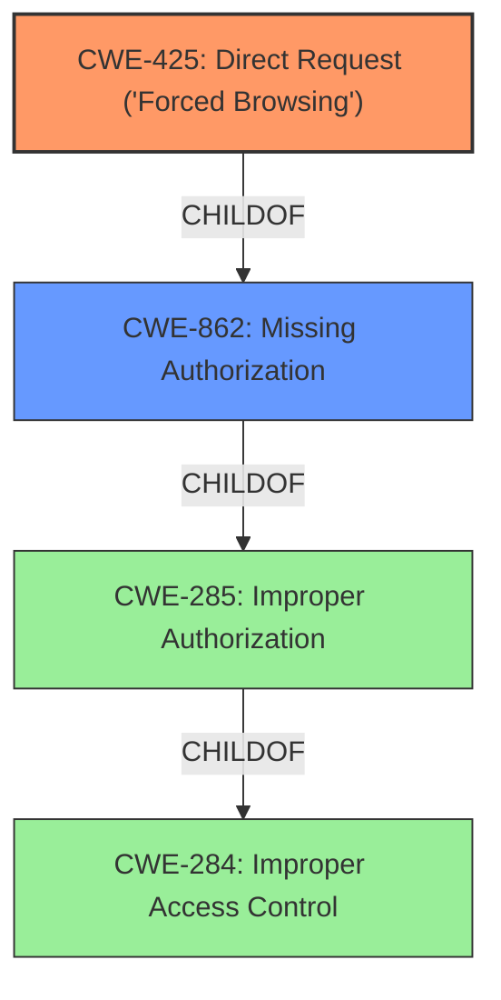

# Analysis Report for CVE-2021-30144

# Vulnerability Analysis Report: CVE-2021-30144

## Description


## Analysis (with Relationship Data)

# Summary
| CWE ID | CWE Name | Confidence | CWE Abstraction Level | CWE Vulnerability Mapping Label | CWE-Vulnerability Mapping Notes |
|---|---|---|---|---|---|
| CWE-425 | Direct Request ('Forced Browsing') | 0.8 | Base | Allowed | Primary CWE: The application does not adequately enforce authorization on all restricted URLs, scripts, or files. |
| CWE-862 | Missing Authorization | 0.7 | Class | Allowed-with-Review | Secondary CWE: The product does not perform an authorization check when an actor attempts to access a resource or perform an action. |

## Evidence and Confidence

*   **Confidence Score:** 0.75
*   **Evidence Strength:** MEDIUM

## Relationship Analysis
The primary CWE is CWE-425, which is a Base level CWE and a child of CWE-862. CWE-862 is a Class level CWE. The vulnerability description indicates that low-privileged users can bypass access control, aligning with the concept of accessing resources directly without proper authorization checks.



## Vulnerability Chain
The vulnerability chain starts with the **missing authorization** or **improper access control**, leading to the ability of low-privileged users to view sensitive information (last ten events, connected users, users in the tech category).

## Summary of Analysis
The initial analysis focused on the **bypass access control** weakness, leading to the consideration of CWE-425 and CWE-862. The retriever results also highlighted these CWEs as potential candidates.

The vulnerability description states that low-privileged users can **bypass access control** to view information. This aligns with the definition of CWE-425, where the application does not adequately enforce authorization on restricted URLs.
> The Dashboard plugin through 1.0.2 for GLPI allows remote low-privileged users to **bypass access control** on viewing information about the last ten events, the connected users, and the users in the tech category. For example, plugins/dashboard/front/main2.php can be used.

CWE-425 is chosen as the primary CWE because it accurately represents the **root cause** of the vulnerability: the lack of proper authorization checks on specific URLs, scripts, or files. CWE-862 is considered as a secondary CWE as it describes the general case of missing authorization, but CWE-425 provides more specific details about the vulnerability.

The selection of CWE-425 is at the optimal level of specificity, as it's a Base level CWE that accurately reflects the vulnerability's characteristics.

Relevant CWE Information:

# Enhanced Context (25 CWEs)

## CWE-639: Authorization Bypass Through User-Controlled Key
**Abstraction Level**: Base
**Similarity Score**: 0.78
**Source**: dense

**Description**:
The system's authorization functionality does not prevent one user from gaining access to another user's data or record by modifying the key value identifying the data.
*This CWE was considered, but the vulnerability description doesn't suggest manipulation of a key, so it was not chosen.*

## CWE-266: Incorrect Privilege Assignment
**Abstraction Level**: Base
**Similarity Score**: 0.77
**Source**: dense

**Description**:
A product incorrectly assigns a privilege to a particular actor, creating an unintended sphere of control for that actor.
*This CWE was considered, but the vulnerability description focuses on **bypassing access control**, not incorrect assignment of privileges.*

## CWE-668: Exposure of Resource to Wrong Sphere
**Abstraction Level**: Class
**Similarity Score**: 0.77
**Source**: dense

**Description**:
The product exposes a resource to the wrong control sphere, providing unintended actors with inappropriate access to the resource.
*This CWE was considered but is too high-level. The specific issue is the **bypass of access control**, which is better described by other CWEs.*

## CWE-274: Improper Handling of Insufficient Privileges
**Abstraction Level**: Base
**Similarity Score**: 0.77
**Source**: dense

**Description**:
The product does not handle or incorrectly handles when it has insufficient privileges to perform an operation, leading to resultant weaknesses.
*This CWE was considered, but the core issue is the ability to **bypass access control**, not the handling of insufficient privileges.*

## CWE-280: Improper Handling of Insufficient Permissions or Privileges
**Abstraction Level**: Base
**Similarity Score**: 0.77
**Source**: dense

**Description**:
The product does not handle or incorrectly handles when it has insufficient privileges to access resources or functionality as specified by their permissions. This may cause it to follow unexpected code paths that may leave the product in an invalid state.
*Similar to CWE-274, the main issue is **bypassing access control**, not the handling of permissions.*

## CWE-267: Privilege Defined With Unsafe Actions
**Abstraction Level**: Base
**Similarity Score**: 0.76
**Source**: dense

**Description**:
A particular privilege, role, capability, or right can be used to perform unsafe actions that were not intended, even when it is assigned to the correct entity.
*This CWE was considered, but the vulnerability isn't about unsafe actions related to existing privileges.*

## CWE-807: Reliance on Untrusted Inputs in a Security Decision
**Abstraction Level**: Base
**Similarity Score**: 0.76
**Source**: dense

**Description**:
The product uses a protection mechanism that relies on the existence or values of an input, but the input can be modified by an untrusted actor in a way that bypasses the protection mechanism.
*This CWE was considered, but the vulnerability description doesn't indicate reliance on untrusted inputs in a security decision.*

## CWE-1220: Insufficient Granularity of Access Control
**Abstraction Level**: Base
**Similarity Score**: 0.76
**Source**: dense

**Description**:
The product implements access controls via a policy or other feature with the intention to disable or restrict accesses (reads and/or writes) to assets in a system from untrusted agents. However, implemented access controls lack required granularity, which renders the control policy too broad because it allows accesses from unauthorized agents to the security-sensitive assets.
*This CWE was considered, but the vulnerability description doesn't explicitly state insufficient granularity.*

## CWE-472: External Control of Assumed-Immutable Web Parameter
**Abstraction Level**: Base
**Similarity Score**: 0.76
**Source**: dense

**Description**:
The web application does not sufficiently verify inputs that are assumed to be immutable but are actually externally controllable, such as hidden form fields.
*This CWE was considered, but the vulnerability description doesn't mention externally controllable parameters.*

## CWE-212: Improper Removal of Sensitive Information Before Storage or Transfer
**Abstraction Level**: Base
**Similarity Score**: 0.76
**Source**: dense

**Description**:
The product stores, transfers, or shares a resource that contains sensitive information, but it does not properly remove that information before the product makes the resource available to unauthorized actors.
*This CWE was considered, but the vulnerability description focuses on unauthorized access, not removal of sensitive information.*

## CWE-425: Direct Request ('Forced Browsing')
**Abstraction Level**: Base
**Similarity Score**: 5655.93
**Source**: sparse

**Description**:
The web application does not adequately enforce appropriate authorization on all restricted URLs, scripts, or files.
*This is the selected primary CWE*

## CWE-306: Missing Authentication for Critical Function
**Abstraction Level**: Base
**Similarity Score**: 5238.86
**Source**: sparse

**Description**:
The product does not perform any authentication for functionality that requires a provable user identity or consumes a significant amount of resources.
*This CWE was considered, but the vulnerability description states low-privileged users are able to **bypass access control**, implying they are already authenticated.*

## CWE-863: Incorrect Authorization
**Abstraction Level**: Class
**Similarity Score**: 5605.46
**Source**: sparse

**Description**:
The product performs an authorization check when an actor attempts to access a resource or perform an action, but it does not correctly perform the check.
*This CWE was considered but is a Class-level CWE. A more specific CWE, such as CWE-425 or CWE


## CWE Relationship Analysis

Current CWEs represent these abstraction levels: .


### Vulnerability Chain Analysis

**Chain starting from CWE-862:**
- 862 (Missing Authorization) - ROOT


**Chain starting from CWE-425:**
- 425 (Direct Request ('Forced Browsing')) - ROOT


### CWE Relationship Diagram

```mermaid
graph TD
    classDef primary fill:#f96,stroke:#333,stroke-width:2px
    classDef secondary fill:#69f,stroke:#333
    classDef tertiary fill:#9e9,stroke:#333
```


*Report generated on 2025-03-30 23:17:20*
