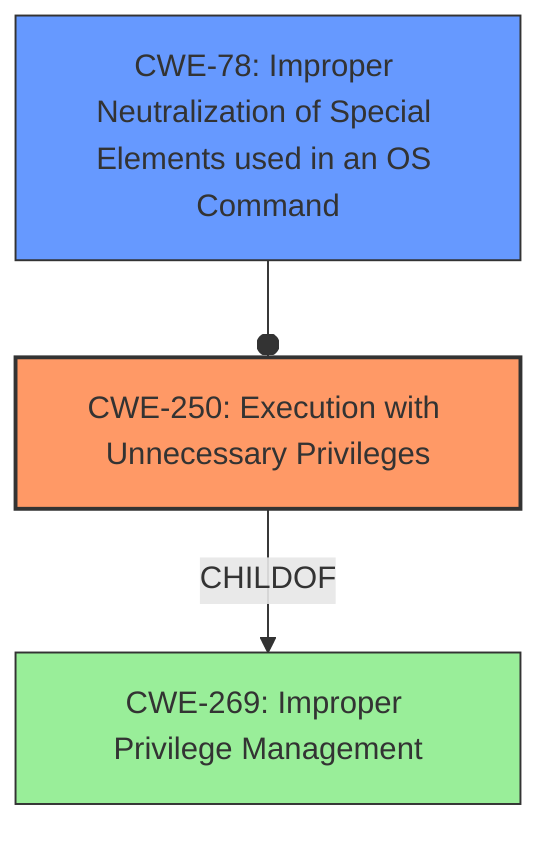

# Enhanced Analysis for CVE-2021-3020

# Summary
| CWE ID | CWE Name | Confidence | CWE Abstraction Level | CWE Vulnerability Mapping Label | CWE-Vulnerability Mapping Notes |
|---|---|---|---|---|---|
| CWE-250 | Execution with Unnecessary Privileges | 0.9 | Base | Allowed | Primary CWE. The `hawk_invoke` program executes with root privileges but does not properly restrict commands. |
| CWE-78 | Improper Neutralization of Special Elements used in an OS Command ('OS Command Injection') | 0.7 | Base | Allowed | Secondary CWE. The program allows the execution of an interactive shell which leads to command injection, however the primary issue is the unnecessary privileges. |

## Evidence and Confidence

*   **Confidence Score:** 0.8
*   **Evidence Strength:** HIGH

## Relationship Analysis
The primary relationship that impacted the decision was the ChildOf relationship between CWE-250 and CWE-269 (Improper Privilege Management), where CWE-250 is the more specific Base case. While the attack leads to OS Command Injection (CWE-78), the root cause is the unnecessary privileges granted to the hawk_invoke binary. The chain relationship of CWE-78 potentially following CWE-184 (Incomplete List of Disallowed Inputs) was considered, but ultimately, the core issue is not a filtering bypass, but rather the excessive privileges in the first place.



## Vulnerability Chain
The vulnerability chain starts with **Execution with Unnecessary Privileges (CWE-250)**, where the `hawk_invoke` binary is setuid root. This leads to a lack of proper command restrictions, ultimately resulting in the ability to run arbitrary commands as root, which can be viewed as **Improper Neutralization of Special Elements used in an OS Command ('OS Command Injection') (CWE-78)**.

## Summary of Analysis
The initial assessment identified several potential CWEs, including CWE-250, CWE-78 and other injection related weaknesses. The final decision to prioritize CWE-250 as the primary weakness stems from the root cause analysis. The vulnerability description states that the `hawk_invoke` binary "allows the hacluster user to invoke certain commands as root... This user is able to execute an interactive shell that isnt limited to the commands specified in hawk_invoke, allowing escalation to root." This clearly indicates that the program is running with higher privileges than necessary and lacks proper command restrictions.

CWE-78 is a secondary weakness because the root cause is the program running with elevated privileges allowing the user to execute an interactive shell. The primary weakness is not a failure to neutralize special elements in user-supplied input, but rather the program running with root privileges in the first place.

The selected CWEs are at the optimal level of specificity. CWE-250 is a Base level CWE, providing a specific characterization of the unnecessary privileges. CWE-78 is also a Base level CWE, describing the command injection vulnerability that arises due to the lack of restrictions.


## CWE Relationship Analysis

Current CWEs represent these abstraction levels: .


### Vulnerability Chain Analysis

**Chain starting from CWE-78:**
- 78 (Improper Neutralization of Special Elements used in an OS Command ('OS Command Injection')) - ROOT


**Chain starting from CWE-250:**
- 250 (Execution with Unnecessary Privileges) - ROOT


### CWE Relationship Diagram

```mermaid
graph TD
    classDef primary fill:#f96,stroke:#333,stroke-width:2px
    classDef secondary fill:#69f,stroke:#333
    classDef tertiary fill:#9e9,stroke:#333
```