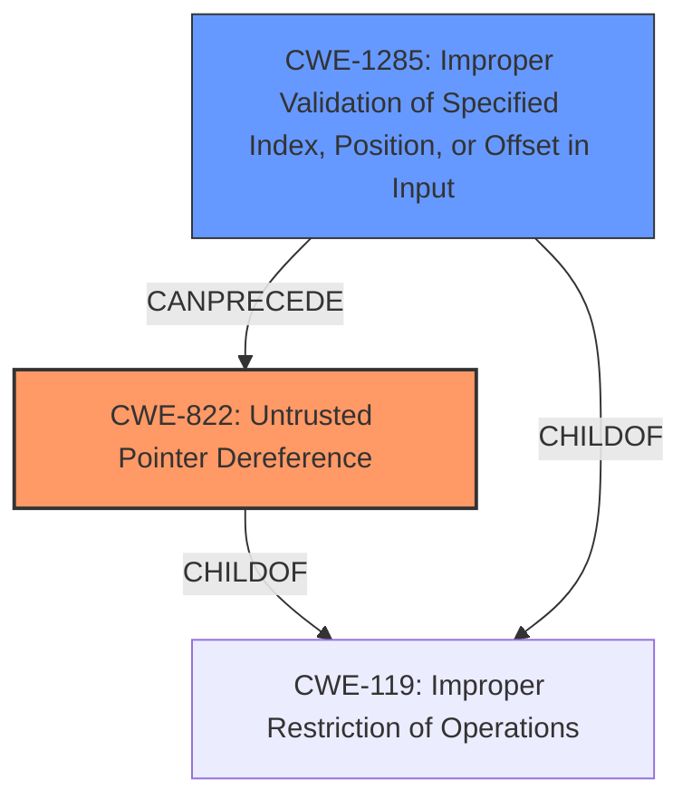

# Analysis for CVE-2021-30262

# Summary
| CWE ID    | CWE Name                                                    | Confidence | CWE Abstraction Level | CWE Vulnerability Mapping Label | CWE-Vulnerability Mapping Notes |
| :-------- | :---------------------------------------------------------- | :--------- | :---------------------- | :------------------------------ | :------------------------------ |
| CWE-822   | Untrusted Pointer Dereference                               | 0.75       | Base                    | Allowed                         | Primary CWE                     |
| CWE-1285  | Improper Validation of Specified Index, Position, or Offset in Input | 0.65       | Base                    | Allowed                         | Secondary Candidate             |

## Evidence and Confidence

*   **Confidence Score:** 0.70
*   **Evidence Strength:** MEDIUM

## Relationship Analysis
The primary relationship that influenced the decision was the hierarchical structure where **CWE-822 (Untrusted Pointer Dereference)** and **CWE-1285 (Improper Validation of Specified Index, Position, or Offset in Input)** both fall under the broader category of **CWE-119 (Improper Restriction of Operations)**. The vulnerability description suggests a problem related to memory access due to **improper validation of socket state**, which could lead to an untrusted pointer dereference. The chain relationship suggests that if the index, position, or offset is not validated, it can lead to an untrusted pointer dereference. The abstraction levels, both being Base, indicate they are specific enough for the weakness.

## Vulnerability Chain
The vulnerability chain starts with **improper validation of socket state**, leading to a potential **untrusted pointer dereference**, and finally resulting in **invalid access of memory**.

## Summary of Analysis
The assessment is primarily based on the provided vulnerability description, which highlights the **improper validation of a socket state** as the root cause. This can be directly quoted as evidence: "**Improper validation of a socket state** when socket events are being sent to clients can lead to invalid access of memory".

**CWE-822 (Untrusted Pointer Dereference)** is selected as the primary CWE because the vulnerability could result in the product obtaining a value from an untrusted source, converting it to a pointer, and dereferencing that pointer. This aligns well with the description of **CWE-822**.

**CWE-1285 (Improper Validation of Specified Index, Position, or Offset in Input)** is a plausible secondary CWE because the **improper validation** aspect of the socket state could involve an index, position, or offset that is not correctly validated.

The selected CWEs are at the Base level of specificity, which is considered optimal according to the provided guidance.

Relevant CWE Information:

# Enhanced Context (25 CWEs)
The following CWEs were identified as potentially relevant to this vulnerability:

## CWE-1285: Improper Validation of Specified Index, Position, or Offset in Input
**Abstraction Level**: Base
**Similarity Score**: 0.80
**Source**: dense

**Description**:
The product receives input that is expected to specify an index, position, or offset into an indexable resource such as a buffer or file, but it does not validate or incorrectly validates that the specified index/position/offset has the required properties.

**Mapping Guidance**:
- Usage: Allowed
- Rationale: This CWE entry is at the Base level of abstraction, which is a preferred level of abstraction for mapping to the root causes of vulnerabilities.

## CWE-822: Untrusted Pointer Dereference
**Abstraction Level**: Base
**Similarity Score**: 0.80
**Source**: dense

**Description**:
The product obtains a value from an untrusted source, converts this value to a pointer, and dereferences the resulting pointer.

**Mapping Guidance**:
- Usage: Allowed
- Rationale: This CWE entry is at the Base level of abstraction, which is a preferred level of abstraction for mapping to the root causes of vulnerabilities.

## CWE-126: Buffer Over-read
**Abstraction Level**: Variant
**Similarity Score**: 0.80
**Source**: dense

**Description**:
The product reads from a buffer using buffer access mechanisms such as indexes or pointers that reference memory locations after the targeted buffer.

**Mapping Guidance**:
- Usage: Allowed
- Rationale: This CWE entry is at the Variant level of abstraction, which is a preferred level of abstraction for mapping to the root causes of vulnerabilities.

## CWE-367: Time-of-check Time-of-use (TOCTOU) Race Condition
**Abstraction Level**: Base
**Similarity Score**: 0.80
**Source**: dense

**Description**:
The product checks the state of a resource before using that resource, but the resource's state can change between the check and the use in a way that invalidates the results of the check. This can cause the product to perform invalid actions when the resource is in an unexpected state.

**Mapping Guidance**:
- Usage: Allowed
- Rationale: This CWE entry is at the Base level of abstraction, which is a preferred level of abstraction for mapping to the root causes of vulnerabilities.

## CWE-823: Use of Out-of-range Pointer Offset
**Abstraction Level**: Base
**Similarity Score**: 0.80
**Source**: dense

**Description**:
The product performs pointer arithmetic on a valid pointer, but it uses an offset that can point outside of the intended range of valid memory locations for the resulting pointer.

**Mapping Guidance**:
- Usage: Allowed
- Rationale: This CWE entry is at the Base level of abstraction, which is a preferred level of abstraction for mapping to the root causes of vulnerabilities.