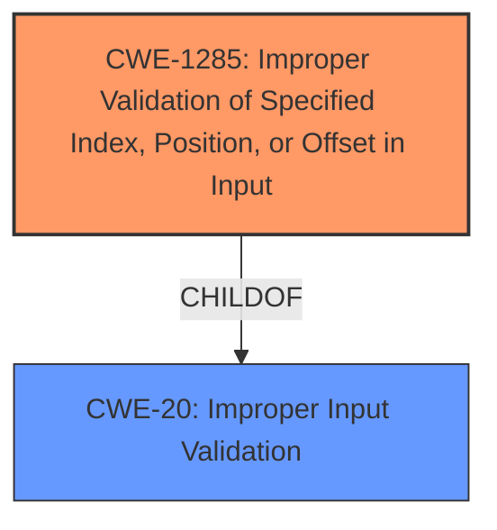

# Enhanced Analysis for CVE-2021-30278

# Summary
| CWE ID | CWE Name | Confidence | CWE Abstraction Level | CWE Vulnerability Mapping Label | CWE-Vulnerability Mapping Notes |
|---|---|---|---|---|---|
| CWE-1285 | Improper Validation of Specified Index, Position, or Offset in Input | 0.8 | Base | Allowed | Primary CWE |

## Evidence and Confidence

*   **Confidence Score:** 0.8
*   **Evidence Strength:** MEDIUM

## Relationship Analysis
The analysis focused on the root cause, which is **improper input validation**. CWE-1285 is a direct match and provides a base-level abstraction suitable for mapping to the root cause. While other CWEs like CWE-126 (Buffer Over-read) were considered, they represent potential impacts rather than the primary weakness.



## Vulnerability Chain
The vulnerability chain starts with **improper input validation** (CWE-1285), which, if exploited, can lead to information disclosure.

## Summary of Analysis
The primary weakness is **improper input validation** in the TrustZone memory transfer interface. The description clearly states this is the root cause, which can lead to information disclosure.

The selected CWE, CWE-1285 (Improper Validation of Specified Index, Position, or Offset in Input), directly addresses this root cause. The vulnerability description specifies **"Improper input validation in TrustZone memory transfer interface"**. This directly aligns with the CWE's description: **"The product receives input that is expected to specify an index, position, or offset into an indexable resource such as a buffer or file, but it does not validate or incorrectly validates that the specified index/position/offset has the required properties."**

CWE-1285 is at the Base level of abstraction, which is preferred for mapping root causes. The retriever results also list CWE-1285 with a high score, supporting this selection.

The other suggested CWEs were considered but deemed less appropriate:

*   CWE-126 (Buffer Over-read): This is a potential impact of the vulnerability, but not the root cause.
*   CWE-1314 (Missing Write Protection for Parametric Data Values): While related to security, it is not directly tied to input validation in the described context.
*   CWE-822 (Untrusted Pointer Dereference): This could be a consequence of the **improper input validation**, but it is not the initial weakness.
*   CWE-367 (Time-of-check Time-of-use (TOCTOU) Race Condition): Not relevant to the description, as it describes a race condition scenario.
*   CWE-252 (Unchecked Return Value): Not directly relevant to the input validation issue.

Relevant CWE Information:

# Enhanced Context (25 CWEs)
The following CWEs were identified as potentially relevant to this vulnerability:

## CWE-1285: Improper Validation of Specified Index, Position, or Offset in Input
**Abstraction:** Base
**Status:** Incomplete

### Description
The product receives input that is expected to specify an index, position, or offset into an indexable resource such as a buffer or file, but it does not validate or incorrectly validates that the specified index/position/offset has the required properties.

### Extended Description


Often, indexable resources such as memory buffers or files can be accessed using a specific position, index, or offset, such as an index for an array or a position for a file. When untrusted input is not properly validated before it is used as an index, attackers could access (or attempt to access) unauthorized portions of these resources. This could be used to cause buffer overflows, excessive resource allocation, or trigger unexpected failures. 


### Alternative Terms
None

### Relationships
ChildOf -> CWE-20

### Mapping Guidance
**Usage:** Allowed
**Rationale:** This CWE entry is at the Base level of abstraction, which is a preferred level of abstraction for mapping to the root causes of vulnerabilities.
**Comments:** Carefully read both the name and description to ensure that this mapping is an appropriate fit. Do not try to 'force' a mapping to a lower-level Base/Variant simply to comply with this preferred level of abstraction.
**Reasons:**
- Acceptable-Use


### Additional Notes
**[Maintenance]** This entry is still under development and will continue to see updates and content improvements.


### Observed Examples
- **CVE-2005-0369:** large ID in packet used as array index
- **CVE-2001-1009:** negative array index as argument to POP LIST command


## CWE Relationship Analysis

Current CWEs represent these abstraction levels: .


### Vulnerability Chain Analysis

**Chain starting from CWE-822:**
- 822 (Untrusted Pointer Dereference) - ROOT


**Chain starting from CWE-20:**
- 20 (Improper Input Validation) - ROOT


### CWE Relationship Diagram

```mermaid
graph TD
    classDef primary fill:#f96,stroke:#333,stroke-width:2px
    classDef secondary fill:#69f,stroke:#333
    classDef tertiary fill:#9e9,stroke:#333
```