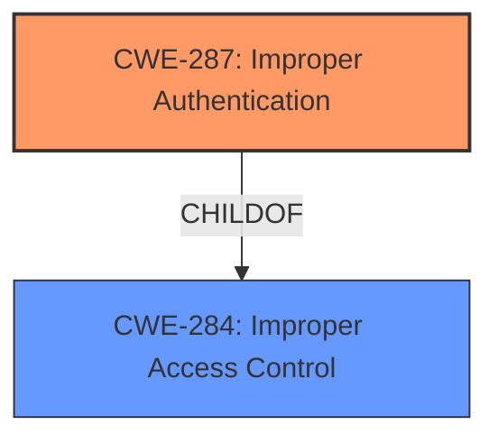

# Analysis Report for CVE-2021-30344

# Vulnerability Analysis Report: CVE-2021-30344

## Description


## Analysis (with Relationship Data)

# Summary
| CWE ID | CWE Name | Confidence | CWE Abstraction Level | CWE Vulnerability Mapping Label | CWE-Vulnerability Mapping Notes |
|---|---|---|---|---|---|
| CWE-287 | Improper Authentication | 0.8 | Class | Primary | Allowed-with-Review |
| CWE-284 | Improper Access Control | 0.6 | Pillar | Secondary | Discouraged |

## Evidence and Confidence

*   **Confidence Score:** 0.7
*   **Evidence Strength:** MEDIUM

## Relationship Analysis
The primary relationship that influenced my decision was the hierarchical relationship between CWE-284 (Improper Access Control) and CWE-287 (Improper Authentication), where CWE-287 is a child of CWE-284. Since the vulnerability description specifically mentions "**Improper authorization**" in the context of security mode commands, I initially considered CWE-284. However, because authentication is a prerequisite for authorization, and the vulnerability involves replayed security mode commands, I chose the more specific CWE-287 (Improper Authentication) as the primary CWE.



## Vulnerability Chain
The vulnerability chain starts with the **improper authorization** of a replayed LTE security mode command. This leads to a denial of service. The chain is as follows:
1.  **Root Cause:** **Improper Authorization** (CWE-287, Improper Authentication)
2.  **Impact:** Denial of Service

## Summary of Analysis
Initially, I considered CWE-284 (Improper Access Control) due to the "**Improper authorization**" phrase in the vulnerability description. However, upon further analysis, I determined that CWE-287 (Improper Authentication) is a more precise fit. The vulnerability stems from **improper authorization** of replayed security commands, which directly relates to authentication failures as a prerequisite. This is based on the description which says "Improper authorization of a replayed LTE security mode command can lead to a denial of service". The provided information points to a failure in verifying the legitimacy or freshness of the security mode command, implying an authentication bypass. While access control is a broader term, the vulnerability's specifics align more closely with authentication issues. CWE-284 is still relevant as authentication is a part of access control.

The selection of CWE-287 is at the optimal level of specificity because it directly addresses the authentication aspect of the vulnerability, which is the root cause. CWE-284 is too broad, while other CWEs like those related to memory corruption are not directly relevant to the described vulnerability.

Relevant CWE Information:

# Enhanced Context (25 CWEs)

## CWE-284: Improper Access Control
**Abstraction:** Pillar
**Status:** Incomplete

### Description
The product does not restrict or incorrectly restricts access to a resource from an unauthorized actor.

### Extended Description
Access control involves the use of several protection mechanisms such as:

*   Authentication (proving the identity of an actor)
*   Authorization (ensuring that a given actor can access a resource), and
*   Accountability (tracking of activities that were performed)

When any mechanism is not applied or otherwise fails, attackers can compromise the security of the product by gaining privileges, reading sensitive information, executing commands, evading detection, etc.

### Alternative Terms
Authorization: The terms "access control" and "authorization" are often used interchangeably, although many people have distinct definitions. The CWE usage of "access control" is intended as a general term for the various mechanisms that restrict which users can access which resources, and "authorization" is more narrowly defined. It is unlikely that there will be community consensus on the use of these terms.

### Mapping Guidance
**Usage:** Discouraged
**Rationale:** CWE-284 is extremely high-level, a Pillar. Its name, "Improper Access Control," is often misused in low-information vulnerability reports [REF-1287] or by active use of the OWASP Top Ten, such as "A01:2021-Broken Access Control". It is not useful for trend analysis.
**Comments:** Consider using descendants of CWE-284 that are more specific to the kind of access control involved, such as those involving authorization (Missing Authorization (CWE-862), Incorrect Authorization (CWE-863), Incorrect Permission Assignment for Critical Resource (CWE-732), etc.); authentication (Missing Authentication (CWE-306) or Weak Authentication (CWE-1390)); Incorrect User Management (CWE-286); Improper Restriction of Communication Channel to Intended Endpoints (CWE-923); etc.

## CWE-287: Improper Authentication
**Abstraction:** Class
**Status:** Incomplete

### Description
The product requires an actor to prove its identity before allowing access to resources or capabilities, but it does not do so in a way that is sufficiently resistant to attack.

### Extended Description
Improper authentication can occur in any context in which an actor is required to prove its identity. Examples include:

*   Local login to a workstation or server
*   Remote access to a network or system
*   Requests to access an application or API
*   Requests to access a protected resource such as a file or database entry

Improper authentication is a common weakness that can occur due to a number of different root causes. Some of these are covered by more specific CWEs:

*   Missing Authentication (CWE-306) - The product does not require any authentication.
*   Weak Password Recovery Mechanism for Forgotten Password (CWE-640) - The procedure for changing or resetting a password is not secure.
*   Use of Hard-coded Credentials (CWE-798) - The product uses credentials that are fixed or known, such as a default password.
*   Reliance on Cookies without Validation and Integrity Checking (CWE-565) - The product uses cookies for authentication but does not ensure that they have not been modified.
*   Improper Certificate Validation (CWE-295) - The product does not validate certificates properly.
*   Insufficiently Protected Credentials (CWE-256) - Credentials are not adequately protected.
*   Cleartext Transmission of Sensitive Information (CWE-319) - Credentials are sent in cleartext.

### Mapping Guidance
**Usage:** Allowed-with-Review
**Rationale:** This CWE entry is a Class and might have Base-level children that would be more appropriate
**Comments:** Examine the vulnerability to determine if there is a more specific CWE that applies.
**Reasons:**
- Acceptable-Use
- Abstraction
**Suggested Alternatives:**
- CWE-306: Missing Authentication
- CWE-640: Weak Password Recovery Mechanism for Forgotten Password
- CWE-798: Use of Hard-coded Credentials
- CWE-565: Reliance on Cookies without Validation and Integrity Checking
- CWE-295: Improper Certificate Validation
- CWE-256: Plaintext Storage of Passwords
- CWE-319: Cleartext Transmission of Sensitive Information

### Observed Examples
*   **CVE-2023-43154:** An improper authentication vulnerability exists in WAGO I/O System 750-8212 PFC200 GEN2 devices, potentially allowing unauthorized users to gain access.
*   **CVE-2023-42829:** Improper authentication in SICK Flexi Compact safety controller allows an attacker to potentially perform unauthorized actions by bypassing authentication mechanisms.
*   **CVE-2023-42761:** Improper authentication vulnerability in OpenClinic GA v5.19 allows an attacker to bypass authentication and gain unauthorized access to the system.


## CWE Relationship Analysis

Current CWEs represent these abstraction levels: .


### Vulnerability Chain Analysis

**Chain starting from CWE-862:**
- 862 (Missing Authorization) - ROOT


**Chain starting from CWE-640:**
- 640 (Weak Password Recovery Mechanism for Forgotten Password) - ROOT


### CWE Relationship Diagram

```mermaid
graph TD
    classDef primary fill:#f96,stroke:#333,stroke-width:2px
    classDef secondary fill:#69f,stroke:#333
    classDef tertiary fill:#9e9,stroke:#333
```


*Report generated on 2025-03-31 02:42:44*
