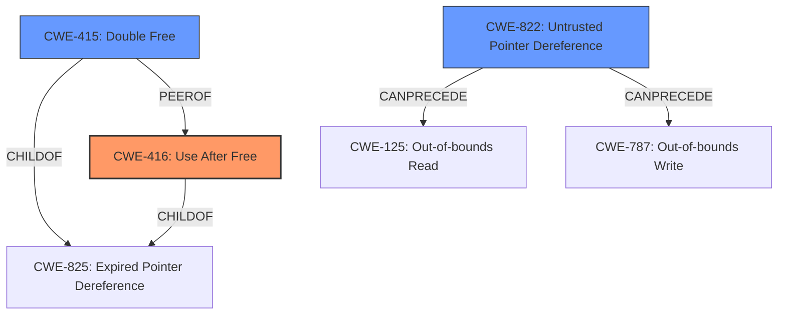

# Analysis Report for CVE-2021-30349

# Vulnerability Analysis Report: CVE-2021-30349

## Description


## Analysis (with Relationship Data)

# Summary
| CWE ID | CWE Name | Confidence | CWE Abstraction Level | CWE Vulnerability Mapping Label | CWE-Vulnerability Mapping Notes |
|---|---|---|---|---|---|
| CWE-416 | Use After Free | 0.8 | Variant | Allowed | Primary CWE |
| CWE-415 | Double Free | 0.7 | Variant | Allowed | Secondary Candidate |
| CWE-822 | Untrusted Pointer Dereference | 0.6 | Base | Allowed | Secondary Candidate |

## Evidence and Confidence

*   **Confidence Score:** 0.8
*   **Evidence Strength:** MEDIUM

## Relationship Analysis
The primary CWE is CWE-416 **Use After Free**. CWE-415 **Double Free** is a peer of CWE-416, and both are variants of CWE-825 **Expired Pointer Dereference**. CWE-822 **Untrusted Pointer Dereference** can lead to CWE-125 **Out-of-bounds Read** or CWE-787 **Out-of-bounds Write**.



## Vulnerability Chain
The vulnerability chain starts with the **improper access control sequence for AC database after memory allocation**. This **improper access control** can lead to a **use-after-free** condition (CWE-416) or a **double-free** condition (CWE-415), which then results in memory corruption.

## Summary of Analysis
The initial analysis focused on the **improper access control sequence for AC database after memory allocation** leading to memory corruption. The retriever results suggested CWE-415 **Double Free**, CWE-416 **Use After Free**, and CWE-822 **Untrusted Pointer Dereference**.

The vulnerability description states that the **improper access control sequence** leads to memory corruption. This suggests that memory is being accessed after it has been freed, which aligns with CWE-416 **Use After Free**. A double-free condition (CWE-415) is also possible, but **use-after-free** seems slightly more probable given the evidence. It's less likely that an **untrusted pointer** is being directly dereferenced (CWE-822) even if that is possible too.

The selected CWEs are at the optimal level of specificity because they directly relate to the **rootcause** of the vulnerability, which is an **improper access control** leading to memory corruption via **use-after-free** or **double-free** conditions.

Relevant CWE Information:

# Enhanced Context (25 CWEs)
The following CWEs were identified as potentially relevant to this vulnerability:

## CWE-822: Untrusted Pointer Dereference
**Abstraction Level**: Base
**Similarity Score**: 0.80
**Source**: dense

**Description**:
The product obtains a value from an untrusted source, converts this value to a pointer, and dereferences the resulting pointer.

**Mapping Guidance**:
- Usage: Allowed
- Rationale: This CWE entry is at the Base level of abstraction, which is a preferred level of abstraction for mapping to the root causes of vulnerabilities.

## CWE-415: Double Free
**Abstraction Level**: Variant
**Similarity Score**: 0.80
**Source**: sparse

**Description**:
The product calls free() twice on the same memory address, potentially leading to modification of unexpected memory locations.

**Mapping Guidance**:
- Usage: Allowed
- Rationale: This CWE entry is at the Variant level of abstraction, which is a preferred level of abstraction for mapping to the root causes of vulnerabilities.

## CWE-416: Use After Free
**Abstraction Level**: variant
**Similarity Score**: 4.53
**Source**: graph

**Description**:
CWE-416: Use After Free

**Mapping Guidance**:
- Usage: Allowed
- Rationale: This CWE entry is at the Variant level of abstraction, which is a preferred level of abstraction for mapping to the root causes of vulnerabilities.

### CWE Selection:

*   **CWE-416: Use After Free**
    *   **Technical Explanation:** The **improper access control sequence after memory allocation** strongly suggests that the memory is being accessed after it has been freed. This perfectly aligns with the description of CWE-416, where the product attempts to use memory that is no longer valid.
    *   **Security Implications:** A **use-after-free** vulnerability can lead to arbitrary code execution, denial of service, or information disclosure. An attacker could potentially overwrite the freed memory with malicious data and then trigger the use of that data, leading to code execution.
    *   **Relationships:** CWE-416 is a variant of CWE-825 **Expired Pointer Dereference**.
    *   **Mapping Guidance:** The usage is ALLOWED.
*   **CWE-415: Double Free**
    *   **Technical Explanation:** While not as directly implied as **use-after-free**, the **improper access control sequence** could also lead to a double-free condition if the memory is freed twice.
    *   **Security Implications:** A double-free vulnerability can lead to memory corruption and potentially arbitrary code execution.
    *   **Relationships:** CWE-415 is a peer of CWE-416 and a child of CWE-825 **Expired Pointer Dereference**.
    *   **Mapping Guidance:** The usage is ALLOWED.
*   **CWE-822: Untrusted Pointer Dereference**
    *   **Technical Explanation:** It is possible that the **improper access control sequence** involves dereferencing a pointer to a memory location that is no longer valid or has been corrupted.
    *   **Security Implications:** Dereferencing an untrusted pointer can lead to arbitrary code execution, denial of service, or information disclosure.
    *   **Relationships:** CWE-822 can precede CWE-125 **Out-of-bounds Read** or CWE-787 **Out-of-bounds Write**.
    *   **Mapping Guidance:** The usage is ALLOWED.

### CWEs Considered But Not Used:
*   CWE-126 **Buffer Over-read**, CWE-367 **Time-of-check Time-of-use (TOCTOU) Race Condition**, CWE-390 **Detection of Error Condition Without Action**, CWE-823 **Use of Out-of-range Pointer Offset**, CWE-1314 **Missing Write Protection for Parametric Data Values**, CWE-252 **Unchecked Return Value**, and CWE-781 **Improper Address Validation in IOCTL with METHOD_NEITHER I/O Control Code** were considered but are not as directly relevant as CWE-416, CWE-415, and CWE-822. The vulnerability description does not provide enough specific details to justify mapping to these CWEs with a high degree of confidence.


## CWE Relationship Analysis

Current CWEs represent these abstraction levels: .


### Vulnerability Chain Analysis

**Chain starting from CWE-825:**
- 825 (Expired Pointer Dereference) - ROOT


**Chain starting from CWE-823:**
- 823 (Use of Out-of-range Pointer Offset) - ROOT


### CWE Relationship Diagram

```mermaid
graph TD
    classDef primary fill:#f96,stroke:#333,stroke-width:2px
    classDef secondary fill:#69f,stroke:#333
    classDef tertiary fill:#9e9,stroke:#333
```


*Report generated on 2025-03-30 13:37:14*
