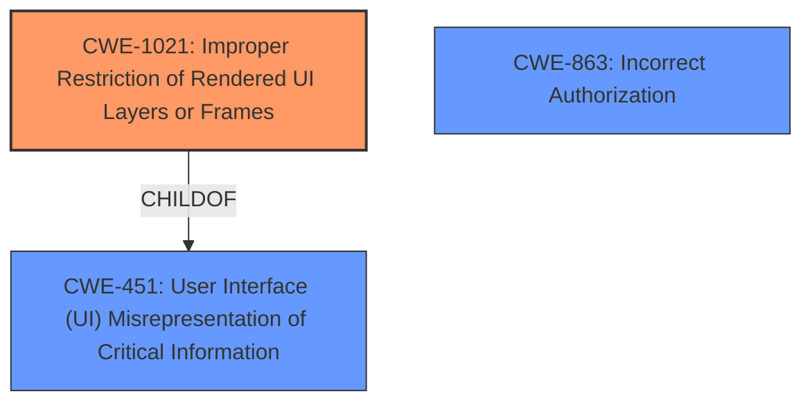

# Raw Analyzer Response for CVE-2021-30533

# Summary
| CWE ID | CWE Name | Confidence | CWE Abstraction Level | CWE Vulnerability Mapping Label | CWE-Vulnerability Mapping Notes |
|---|---|---|---|---|---|
| CWE-1021 | Improper Restriction of Rendered UI Layers or Frames | 0.8 | Base | Allowed | Primary CWE |
| CWE-451 | User Interface (UI) Misrepresentation of Critical Information | 0.5 | Class | Allowed-with-Review | Secondary CWE |
| CWE-863 | Incorrect Authorization | 0.4 | Class | Allowed-with-Review | Secondary CWE |

## Evidence and Confidence

*   **Confidence Score:** 0.8
*   **Evidence Strength:** HIGH

## Relationship Analysis
The primary CWE selected is CWE-1021 which is a Base level CWE. CWE-1021 is related to CWE-451 through a ChildOf relationship, where CWE-451 is a Class-level CWE. The relationship between CWE-1021 and CWE-451 indicates that UI misrepresentation can be a factor in improper restriction of UI layers or frames.

## Vulnerability Chain
The vulnerability chain starts with **insufficient policy enforcement** in the PopupBlocker, leading to the ability for a remote attacker to bypass navigation restrictions via a crafted iframe. This allows the attacker to inject content into the UI in a way that the user might misinterpret, which then bypasses the PopupBlocker.

## Summary of Analysis
The primary CWE mapping is CWE-1021 (Improper Restriction of Rendered UI Layers or Frames) due to the vulnerability description explicitly stating that a remote attacker can bypass navigation restrictions via a crafted iframe. The **root cause** is **insufficient policy enforcement** in the PopupBlocker, and the impact is bypassing navigation restrictions.

The vulnerability description states, "Insufficient policy enforcement in PopupBlocker in Google Chrome prior to 91.0.4472.77 allowed a remote attacker to bypass navigation restrictions via a crafted iframe." This indicates that the application is not correctly restricting frame objects or UI layers, aligning with CWE-1021. The retriever results also identified CWE-1021 as a relevant CWE.

CWE-451 (User Interface (UI) Misrepresentation of Critical Information) was considered as a secondary CWE because the crafted iframe could be used to misrepresent information to the user. This is because the attacker could inject content into the UI in a way that the user might misinterpret.

CWE-863 (Incorrect Authorization) was considered, but the description is more about policy enforcement than specific authorization failures.

Other CWEs considered:

*   CWE-356 (Product UI does not Warn User of Unsafe Actions): This was considered because the PopupBlocker is intended to warn the user of unsafe actions. However, the vulnerability description focuses on bypassing navigation restrictions rather than the lack of a warning.
*   CWE-358 (Improperly Implemented Security Check for Standard): This was considered because the vulnerability description mentions **insufficient policy enforcement**. However, the description focuses on bypassing navigation restrictions rather than a specific security check that was not implemented correctly.

The selected CWEs are at the optimal level of specificity because they accurately represent the weakness described in the vulnerability description. CWE-1021 is a Base-level CWE, which is a preferred level of abstraction for mapping to the root causes of vulnerabilities. The evidence is sufficient to justify this classification, and the relationship analysis supports the selection of CWE-1021 as the primary CWE.