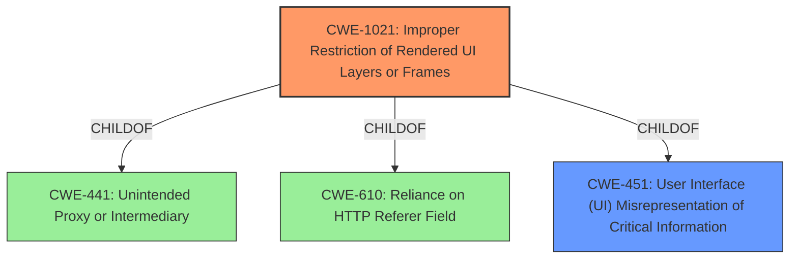

# Analysis Report for CVE-2021-30533

# Vulnerability Analysis Report: CVE-2021-30533

## Description


## Analysis (with Relationship Data)

# Summary
| CWE ID | CWE Name | Confidence | CWE Abstraction Level | CWE Vulnerability Mapping Label | CWE-Vulnerability Mapping Notes |
|---|---|---|---|---|---|
| CWE-1021 | Improper Restriction of Rendered UI Layers or Frames | 0.8 | Base | Allowed | Primary CWE |
| CWE-451 | User Interface (UI) Misrepresentation of Critical Information | 0.5 | Class | Allowed-with-Review | Secondary Candidate |

## Evidence and Confidence

*   **Confidence Score:** 0.8
*   **Evidence Strength:** HIGH

## Relationship Analysis
The primary CWE is CWE-1021, which is a Base level CWE. CWE-1021 is a child of CWE-441, CWE-610, and CWE-451. This indicates that CWE-1021 is more specific than these parent CWEs. CWE-451 was considered as a potential candidate, but it is at the Class level of abstraction.



## Vulnerability Chain
The vulnerability chain involves an **insufficient policy enforcement** in the PopupBlocker, which leads to a bypass of navigation restrictions via a crafted iframe.

## Summary of Analysis
The initial analysis focused on the **insufficient policy enforcement** in the PopupBlocker, which allowed a remote attacker to bypass navigation restrictions. The key phrase "bypass navigation restrictions via a crafted iframe" indicates a potential issue with how the application handles or restricts the rendering of UI layers or frames.

The vulnerability description states: "Insufficient policy enforcement in PopupBlocker in Google Chrome prior to 91.0.4472.77 allowed a remote attacker to bypass navigation restrictions via a crafted iframe." The CVE Reference Links Content Summary confirms the **root cause** as "Insufficient policy enforcement in PopupBlocker" and the impact as "A remote attacker could bypass the PopupBlocker."

The Retriever Results identified CWE-1021 as a relevant candidate with a relatively high score. CWE-1021, "Improper Restriction of Rendered UI Layers or Frames," directly addresses the scenario where a web application does not restrict frame objects or UI layers, leading to user confusion or, in this case, a bypass of navigation restrictions.

CWE-451, "User Interface (UI) Misrepresentation of Critical Information," was also considered, but it is a more general Class-level CWE. While UI misrepresentation might be a consequence, the more specific **root cause** is the **improper restriction** of UI layers or frames.

Therefore, CWE-1021 is the most appropriate CWE because it directly reflects the weakness described in the vulnerability.

Relevant CWE Information:

# Enhanced Context (25 CWEs)
The following CWEs were identified as potentially relevant to this vulnerability:

## CWE-451: User Interface (UI) Misrepresentation of Critical Information
**Abstraction Level**: Class
**Similarity Score**: 0.77
**Source**: dense

**Description**:
The user interface (UI) does not properly represent critical information to the user, allowing the information - or its source - to be obscured or spoofed. This is often a component in phishing attacks.

**Mapping Guidance**:
- Usage: Allowed-with-Review
- Rationale: This CWE entry is a Class and might have Base-level children that would be more appropriate

## CWE-1021: Improper Restriction of Rendered UI Layers or Frames
**Abstraction:** Base
**Status:** Incomplete

### Description
The web application does not restrict or incorrectly restricts frame objects or UI layers that belong to another application or domain, which can lead to user confusion about which interface the user is interacting with.

### Extended Description
A web application is expected to place restrictions on whether it is allowed to be rendered within frames, iframes, objects, embed or applet elements. Without the restrictions, users can be tricked into interacting with the application when they were not intending to.

### Alternative Terms
Clickjacking
UI Redress Attack
Tapjacking: "Tapjacking" is similar to clickjacking, except it is used for mobile applications in which the user "taps" the application instead of performing a mouse click.

### Relationships
ChildOf -> CWE-441
ChildOf -> CWE-610
ChildOf -> CWE-451

### Mapping Guidance
**Usage:** Allowed
**Rationale:** This CWE entry is at the Base level of abstraction, which is a preferred level of abstraction for mapping to the root causes of vulnerabilities.
**Comments:** Carefully read both the name and description to ensure that this mapping is an appropriate fit. Do not try to 'force' a mapping to a lower-level Base/Variant simply to comply with this preferred level of abstraction.
**Reasons:**
- Acceptable-Use

### Observed Examples
- **CVE-2017-7440:** E-mail preview feature in a desktop application allows clickjacking attacks via a crafted e-mail message
- **CVE-2017-5697:** Hardware/firmware product has insufficient clickjacking protection in its web user interface
- **CVE-2017-4015:** Clickjacking in data-loss prevention product via HTTP response header.


## CWE Relationship Analysis

Current CWEs represent these abstraction levels: .


### Vulnerability Chain Analysis

**Chain starting from CWE-1021:**
- 1021 (Improper Restriction of Rendered UI Layers or Frames) - ROOT


**Chain starting from CWE-441:**
- 441 (Unintended Proxy or Intermediary ('Confused Deputy')) - ROOT


### CWE Relationship Diagram

```mermaid
graph TD
    classDef primary fill:#f96,stroke:#333,stroke-width:2px
    classDef secondary fill:#69f,stroke:#333
    classDef tertiary fill:#9e9,stroke:#333
```


*Report generated on 2025-04-02 04:48:10*
