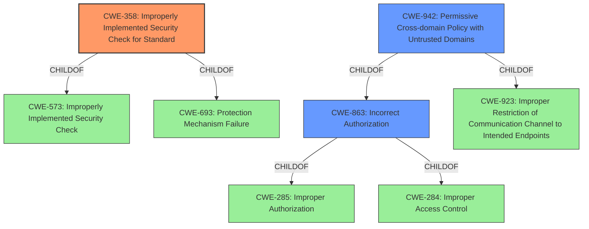

# Raw Analyzer Response for CVE-2021-30538

# Summary
| CWE ID    | CWE Name                                                                 | Confidence | CWE Abstraction Level | CWE Vulnerability Mapping Label | CWE-Vulnerability Mapping Notes |
| --------- | ------------------------------------------------------------------------ | ---------- | --------------------- | ------------------------------- | ------------------------------- |
| CWE-358   | Improperly Implemented Security Check for Standard                       | 0.8        | Base                  | Allowed                         | Primary CWE                     |
| CWE-942   | Permissive Cross-domain Policy with Untrusted Domains                    | 0.6        | Variant               | Allowed                         | Secondary Candidate             |
| CWE-863   | Incorrect Authorization                                                  | 0.5        | Class                 | Allowed-with-Review           | Secondary Candidate             |

## Evidence and Confidence

*   **Confidence Score:** 0.7
*   **Evidence Strength:** HIGH

## Relationship Analysis
The primary CWE selected is CWE-358, which is a Base level CWE, making it a good fit. CWE-358 is a child of CWE-573 and CWE-693. CWE-942, a Variant level CWE, and CWE-863, a Class level CWE, were considered as secondary candidates. CWE-942 is a child of CWE-863 and CWE-923. The relationships are analyzed below in the Mermaid diagram.

## Vulnerability Chain
The chain of events starts with the **insufficient policy enforcement**, leading to a bypass of the content security policy, ultimately allowing a remote attacker to inject and execute malicious code.

## Summary of Analysis
The initial assessment focused on the vulnerability description which explicitly states "**Insufficient policy enforcement in content security policy**". The CVE reference links content summary reinforces this by stating "Insufficient policy enforcement" as a weakness.

Based on this evidence, CWE-358 (Improperly Implemented Security Check for Standard) was chosen as the primary CWE. This is because the vulnerability involves the content security policy not being correctly implemented, which is a security-relevant check as per the definition of CWE-358.

CWE-942 (Permissive Cross-domain Policy with Untrusted Domains) was considered as a secondary CWE because it involves a policy file that includes domains that should not be trusted, but it does not describe content security policy directly.

CWE-863 (Incorrect Authorization) was also considered because authorization is a part of content security policy, but it is too high-level for this vulnerability.

The final selection of CWE-358 is based on its specific match to the root cause "**insufficient policy enforcement in content security policy**" and is at the appropriate level of specificity (Base).

Relevant CWE Information:

# Enhanced Context (25 CWEs)

## CWE-358: Improperly Implemented Security Check for Standard
**Abstraction Level**: Base
**Similarity Score**: 0.305
**Source**: sparse

**Description**:
The product does not implement or incorrectly implements one or more security-relevant checks as specified by the design of a standardized algorithm, protocol, or technique.

**Mapping Guidance**:
- Usage: Allowed
- Rationale: This CWE entry is at the Base level of abstraction, which is a preferred level of abstraction for mapping to the root causes of vulnerabilities.

## CWE-942: Permissive Cross-domain Policy with Untrusted Domains
**Abstraction Level**: Variant
**Similarity Score**: 0.563
**Source**: dense

**Description**:
The product uses a cross-domain policy file that includes domains that should not be trusted.

**Mapping Guidance**:
- Usage: Allowed
- Rationale: This CWE entry is at the Variant level of abstraction, which is a preferred level of abstraction for mapping to the root causes of vulnerabilities.

## CWE-863: Incorrect Authorization
**Abstraction Level**: Class
**Similarity Score**: 0.249
**Source**: sparse

**Description**:
The product performs an authorization check when an actor attempts to access a resource or perform an action, but it does not correctly perform the check.

**Mapping Guidance**:
- Usage: Allowed-with-Review
- Rationale: This CWE entry is a Class and might have Base-level children that would be more appropriate