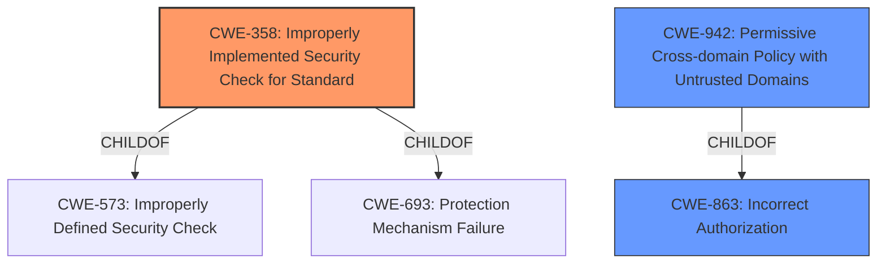

# Analysis Report for CVE-2021-30539

# Vulnerability Analysis Report: CVE-2021-30539

## Description


## Analysis (with Relationship Data)

# Summary
| CWE ID    | CWE Name                                                                  | Confidence | CWE Abstraction Level | CWE Vulnerability Mapping Label | CWE-Vulnerability Mapping Notes |
| :---------- | :------------------------------------------------------------------------ | :--------- | :-------------------- | :------------------------------ | :------------------------------ |
| CWE-358   | Improperly Implemented Security Check for Standard                     | 0.9        | Base                  | Primary CWE                     | Allowed                       |
| CWE-942   | Permissive Cross-domain Policy with Untrusted Domains                   | 0.7        | Variant               | Secondary Candidate             | Allowed                       |
| CWE-863   | Incorrect Authorization                                                   | 0.6        | Class                 | Secondary Candidate             | Allowed-with-Review           |

## Evidence and Confidence

*   **Confidence Score:** 0.8
*   **Evidence Strength:** HIGH

## Relationship Analysis
The primary CWE, CWE-358, is a Base level CWE and a child of CWE-573 and CWE-693 which represents the root cause. The vulnerability involves **insufficient policy enforcement** and relates to a security check standard. CWE-942, although seemingly relevant, is more applicable to cross-domain policies, which is not the primary issue here, but is still a possible variant of the enforcement problem. CWE-863 is a class-level CWE, less specific than CWE-358 but still related to authorization and access control.



## Vulnerability Chain
The vulnerability chain starts with the **insufficient policy enforcement** (CWE-358), leading to a bypass of the content security policy, and potentially allowing an attacker to execute malicious code.

## Summary of Analysis
The initial assessment focused on the **insufficient policy enforcement** reported in the vulnerability description, which clearly indicates an issue with how security checks are implemented. The evidence from the CVE Reference Links Content Summary supports this: "root_cause": "Insufficient policy enforcement in content security policy." The Retriever Results also suggested CWE-358, which aligns with the root cause.

CWE-358 is the most appropriate because it directly addresses the core issue of **improperly implemented security checks** within the content security policy. While other CWEs like CWE-942 and CWE-863 touch upon related concepts, they are not as precise in capturing the essence of the vulnerability.

The selection of CWE-358 is based on the evidence from the vulnerability description, the CVE Reference Links Content Summary, and the Retriever Results, as well as the CWE's description and mapping guidance. The confidence level is high (0.9) due to the clear alignment between the vulnerability and the CWE's characteristics.

CWE-NVD-Other and CWE-20 were in the Top CWEs list, but they are too generic. They don't reflect the specific weakness of **insufficient policy enforcement**.

CWE-942 was considered because it relates to cross-domain policies, but the vulnerability description doesn't specifically mention cross-domain issues. It's more focused on the general **insufficient enforcement** of the content security policy.

CWE-863 was also considered because it deals with incorrect authorization, but it's a broader category than **improperly implemented security checks**. The content security policy is about more than just authorization; it also controls what resources a web page is allowed to load.

CWE-356 was considered, but it is more about warning the user, not about the underlying **insufficient enforcement**.

The final selection of CWE-358 is at the optimal level of specificity because it directly addresses the **improper implementation of security checks**, which is the core weakness.


## CWE Relationship Analysis

Current CWEs represent these abstraction levels: .


### Vulnerability Chain Analysis

**Chain starting from CWE-942:**
- 942 (Permissive Cross-domain Policy with Untrusted Domains) - ROOT


**Chain starting from CWE-693:**
- 693 (Protection Mechanism Failure) - ROOT


### CWE Relationship Diagram

```mermaid
graph TD
    classDef primary fill:#f96,stroke:#333,stroke-width:2px
    classDef secondary fill:#69f,stroke:#333
    classDef tertiary fill:#9e9,stroke:#333
```


*Report generated on 2025-03-31 13:12:22*
