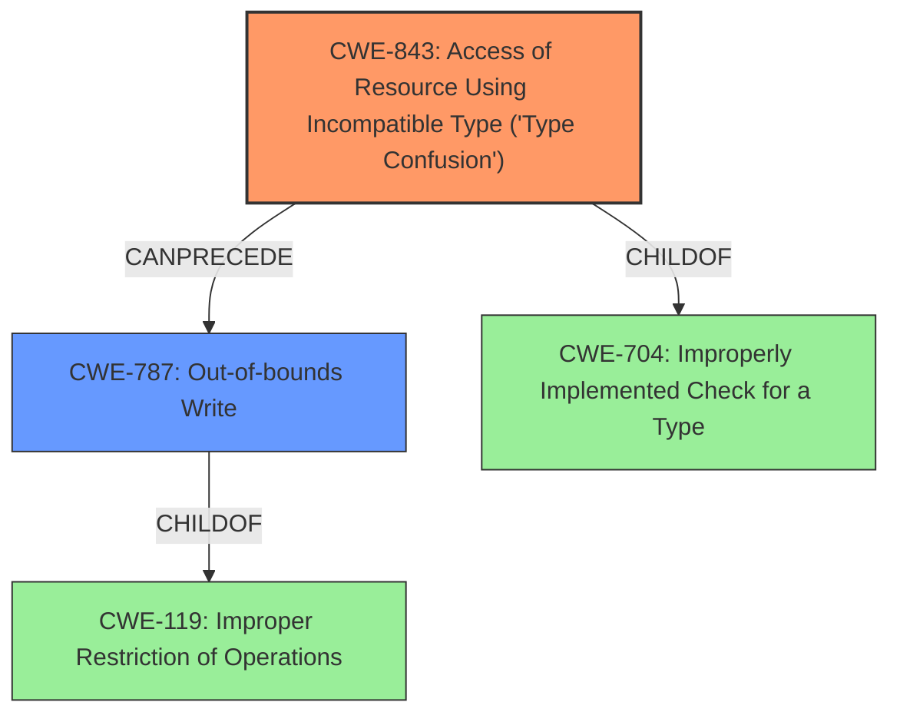

# Enhanced Analysis for CVE-2021-30551

# Summary
| CWE ID | CWE Name | Confidence | CWE Abstraction Level | CWE Vulnerability Mapping Label | CWE-Vulnerability Mapping Notes |
|---|---|---|---|---|---|
| CWE-843 | Access of Resource Using Incompatible Type ('Type Confusion') | 1.0 | Base | Allowed | Primary CWE |
| CWE-787 | Out-of-bounds Write | 0.7 | Base | Allowed | Secondary Candidate |

## Evidence and Confidence

*   **Confidence Score:** 0.9
*   **Evidence Strength:** HIGH

## Relationship Analysis
The primary CWE, CWE-843, is a base-level CWE and a child of CWE-704, which represents broader classes of flaws related to incorrect type handling. CWE-787 is also a Base CWE and a child of CWE-119 (Improper Restriction of Operations within the Bounds of a Memory Buffer). The relationship between CWE-843 and CWE-787 is that type confusion (CWE-843) can potentially lead to out-of-bounds write (CWE-787) in languages without memory safety. Selecting the Base level CWEs provides a detailed and accurate representation of the vulnerability.



## Vulnerability Chain
The vulnerability chain starts with the **type confusion** (CWE-843) in the V8 engine, leading to **heap corruption**, which can result in arbitrary code execution.
- **Root Cause:** CWE-843 (Type Confusion)
- **Weakness:** Heap Corruption
- **Impact:** Potential Arbitrary Code Execution

## Summary of Analysis
The initial analysis correctly identifies CWE-843 as the primary weakness due to the **type confusion** in the V8 engine. The vulnerability description and CVE reference links content summary both highlight the **type confusion** as the root cause. The description also mentions **heap corruption** as the weakness, which can be a consequence of **type confusion**. The secondary candidate, CWE-787 (Out-of-bounds Write), is considered because type confusion can lead to memory corruption, including out-of-bounds write, especially in languages like C and C++.

The evidence from the vulnerability description and the CVE reference links content summary strongly supports the selection of CWE-843. The relationship graph shows how **type confusion** can precede out-of-bounds write.

The selection of CWE-843 as the primary CWE is based on the following evidence:
- Vulnerability Description: "**Type confusion** in V8 in Google Chrome...allowed a remote attacker to potentially exploit **heap corruption**"
- Vulnerability Description Key Phrases: "**rootcause: type confusion**" and "**weakness: heap corruption**"
- CVE Reference Links Content Summary: "**root_cause:** Type Confusion in V8" and "**weaknesses:** Type confusion"

CWE-843 is at the optimal level of specificity because it directly addresses the **type confusion** issue, which is the root cause of the vulnerability. While **heap corruption** is mentioned, it's a consequence of the type confusion.

CWE-787 was considered because **type confusion** can lead to memory corruption. However, the description focuses on the **type confusion** as the root cause.


## CWE Relationship Analysis

Current CWEs represent these abstraction levels: .


### Vulnerability Chain Analysis

**Chain starting from CWE-787:**
- 787 (Out-of-bounds Write) - ROOT


**Chain starting from CWE-119:**
- 119 (Improper Restriction of Operations within the Bounds of a Memory Buffer) - ROOT


### CWE Relationship Diagram

```mermaid
graph TD
    classDef primary fill:#f96,stroke:#333,stroke-width:2px
    classDef secondary fill:#69f,stroke:#333
    classDef tertiary fill:#9e9,stroke:#333
```