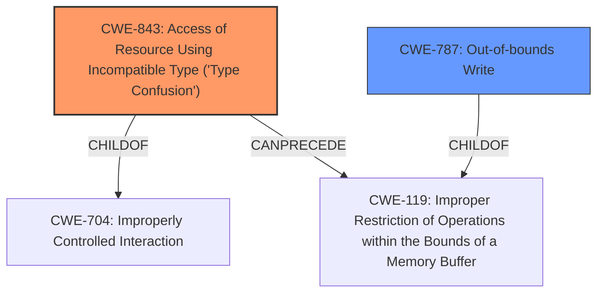

# Analysis Report for CVE-2021-30551

# Vulnerability Analysis Report: CVE-2021-30551

## Description


## Analysis (with Relationship Data)

# Summary
| CWE ID | CWE Name | Confidence | CWE Abstraction Level | CWE Vulnerability Mapping Label | CWE-Vulnerability Mapping Notes |
|---|---|---|---|---|---|
| CWE-843 | Access of Resource Using Incompatible Type ('Type Confusion') | 1 | Base | Allowed | Primary CWE. The vulnerability description explicitly states "Type confusion in V8".  |
| CWE-787 | Out-of-bounds Write | 0.7 | Base | Allowed | Secondary Candidate.  The vulnerability description mentions "**heap corruption**" which may be caused by an out-of-bounds write. |

## Evidence and Confidence

*   **Confidence Score:** 0.9
*   **Evidence Strength:** HIGH

## Relationship Analysis
The primary CWE, CWE-843, is a base level CWE. CWE-843 `CHILDOF` CWE-704 (Improperly Controlled Interaction). CWE-843 `CANPRECEDE` CWE-119 (Improper Restriction of Operations within the Bounds of a Memory Buffer). CWE-787 is a base level CWE. CWE-787 `CHILDOF` CWE-119.



## Vulnerability Chain
The vulnerability chain starts with a **type confusion** (CWE-843) in the V8 engine, which leads to **heap corruption**. The **heap corruption** could potentially lead to an out-of-bounds write (CWE-787) and ultimately arbitrary code execution.

## Summary of Analysis
The primary weakness is a **type confusion** vulnerability (CWE-843) in the V8 engine. The vulnerability description states, "Type confusion in V8...allowed a remote attacker to potentially exploit **heap corruption** via a crafted HTML page." The CVE Reference Links Content Summary confirms "Type Confusion in V8" as the root cause and the "impact" as "Arbitrary code execution".

CWE-843 is the most specific and accurate representation of the root cause. The retriever results and similar CVE descriptions also point to CWE-843 as the primary CWE.

CWE-787 (Out-of-bounds Write) is a potential secondary weakness because **heap corruption** could result from an out-of-bounds write.

Relevant CWE Information:
- CWE-843: Access of Resource Using Incompatible Type ('Type Confusion')
  - The product allocates or initializes a resource such as a pointer, object, or variable using one type, but it later accesses that resource using a type that is incompatible with the original type.
- CWE-787: Out-of-bounds Write
  - The product writes data past the end, or before the beginning, of the intended buffer.

CWEs considered but not used:
- CWE-120 (Buffer Copy without Checking Size of Input ('Classic Buffer Overflow')): While a buffer overflow could occur due to the type confusion, the description does not specifically mention a buffer copy operation.
- CWE-416 (Use After Free): This is not directly mentioned in the description.
- CWE-415 (Double Free): This is not directly mentioned in the description.
- CWE-125 (Out-of-bounds Read): The primary issue is the type confusion leading to memory corruption, not necessarily a read out of bounds.


## CWE Relationship Analysis

Current CWEs represent these abstraction levels: .


### Vulnerability Chain Analysis

**Chain starting from CWE-787:**
- 787 (Out-of-bounds Write) - ROOT


**Chain starting from CWE-415:**
- 415 (Double Free) - ROOT


### CWE Relationship Diagram

```mermaid
graph TD
    classDef primary fill:#f96,stroke:#333,stroke-width:2px
    classDef secondary fill:#69f,stroke:#333
    classDef tertiary fill:#9e9,stroke:#333
```


*Report generated on 2025-04-02 17:05:32*
