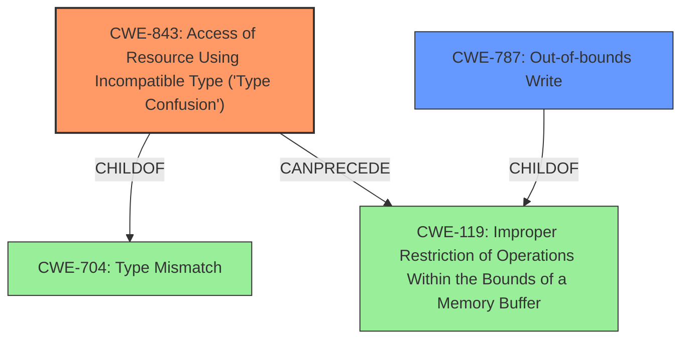

# Analysis Report for CVE-2021-30563

# Vulnerability Analysis Report: CVE-2021-30563

## Description


## Analysis (with Relationship Data)

# Summary
| CWE ID | CWE Name | Confidence | CWE Abstraction Level | CWE Vulnerability Mapping Label | CWE-Vulnerability Mapping Notes |
|---|---|---|---|---|---|
| CWE-843 | Access of Resource Using Incompatible Type ('Type Confusion') | 1.0 | Base | Allowed | Primary CWE |
| CWE-787 | Out-of-bounds Write | 0.7 | Base | Allowed | Secondary Candidate |

## Evidence and Confidence

*   **Confidence Score:** 0.9
*   **Evidence Strength:** HIGH

## Relationship Analysis
The primary CWE is CWE-843, which represents the root cause of the vulnerability. It is a base-level CWE and is a child of CWE-704. CWE-787 is related to memory corruption and can be a consequence of type confusion.



## Vulnerability Chain
The vulnerability chain starts with the **type confusion** (CWE-843) in the V8 engine. This **type confusion** can lead to **heap corruption**, which, in turn, may result in an out-of-bounds write (CWE-787) and potentially arbitrary code execution.
- CWE-843: **Type Confusion** (Root Cause)
- CWE-787: Out-of-bounds Write (**heap corruption**)
- Arbitrary code execution (Impact)

## Summary of Analysis
The vulnerability is primarily caused by a **type confusion** in the V8 engine of Google Chrome. This **type confusion** allows a remote attacker to potentially exploit **heap corruption** via a crafted HTML page.

The analysis is primarily based on the vulnerability description, which explicitly mentions **type confusion** as the root cause and **heap corruption** as the weakness.

The "Vulnerability Description Key Phrases" section confirms "**rootcause:** **type confusion**" and "**weakness:** **heap corruption**".

The "CVE Reference Links Content Summary" states "root_cause: Type Confusion in V8" and "weaknesses: Type Confusion".

The "Retriever Results" lists CWE-843 as the top combined result with a similarity score of 0.700.

Based on the evidence, CWE-843 is the most appropriate CWE for this vulnerability. While heap corruption is mentioned, it is a consequence of the type confusion. Therefore, CWE-787 (Out-of-bounds Write) could be considered as a secondary CWE but is not the primary root cause.

CWE-416 (Use After Free), CWE-122 (Heap-based Buffer Overflow), and CWE-415 (Double Free) were considered but deemed less relevant as they are potential consequences of heap corruption, but the root cause is **type confusion**.

CWE-451 (User Interface (UI) Misrepresentation of Critical Information) was also considered but is not applicable as the vulnerability is not related to UI misrepresentation.

The selected CWEs are at the optimal level of specificity as CWE-843 is a Base-level CWE that directly represents the root cause of the vulnerability.

Relevant CWE Information:

# Enhanced Context (25 CWEs)

## CWE-843: Access of Resource Using Incompatible Type ('Type Confusion')
**Abstraction:** Base
**Status:** Incomplete

### Description
The product allocates or initializes a resource such as a pointer, object, or variable using one type, but it later accesses that resource using a type that is incompatible with the original type.

### Extended Description
When the product accesses the resource using an incompatible type, this could trigger logical errors because the resource does not have expected properties. In languages without memory safety, such as C and C++, type confusion can lead to out-of-bounds memory access.

### Relationships
ChildOf -> CWE-704
CanPrecede -> CWE-119

### Mapping Guidance
**Usage:** Allowed
**Rationale:** This CWE entry is at the Base level of abstraction, which is a preferred level of abstraction for mapping to the root causes of vulnerabilities.

## CWE-787: Out-of-bounds Write
**Abstraction:** Base
**Status:** Draft

### Description
The product writes data past the end, or before the beginning, of the intended buffer.

### Relationships
ChildOf -> CWE-119

### Mapping Guidance
**Usage:** Allowed
**Rationale:** This CWE entry is at the Base level of abstraction, which is a preferred level of abstraction for mapping to the root causes of vulnerabilities.


## CWE Relationship Analysis

Current CWEs represent these abstraction levels: .


### Vulnerability Chain Analysis

**Chain starting from CWE-787:**
- 787 (Out-of-bounds Write) - ROOT


**Chain starting from CWE-415:**
- 415 (Double Free) - ROOT


### CWE Relationship Diagram

```mermaid
graph TD
    classDef primary fill:#f96,stroke:#333,stroke-width:2px
    classDef secondary fill:#69f,stroke:#333
    classDef tertiary fill:#9e9,stroke:#333
```


*Report generated on 2025-04-01 23:48:40*
