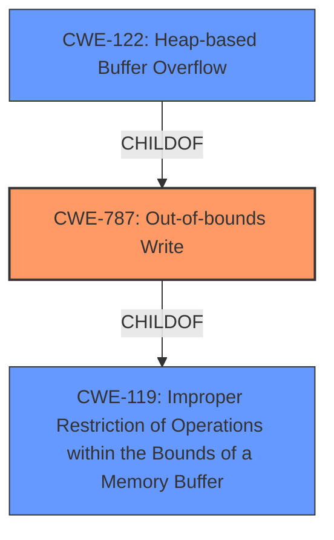

# Raw Analyzer Response for CVE-2021-30632

# Summary
| CWE ID  | CWE Name                                                      | Confidence | CWE Abstraction Level | CWE Vulnerability Mapping Label | CWE-Vulnerability Mapping Notes |
|---------|---------------------------------------------------------------|------------|-----------------------|---------------------------------|-----------------------------------|
| CWE-787 | Out-of-bounds Write                                           | 1.0        | Base                  | Primary CWE                      | Allowed                           |
| CWE-119 | Improper Restriction of Operations within the Bounds of a Memory Buffer | 0.7        | Class                 | Secondary CWE                      | Allowed                           |
| CWE-122 | Heap-based Buffer Overflow                                     | 0.6        | Variant               | Secondary CWE                     | Allowed                           |

## Evidence and Confidence

*   **Confidence Score:** 0.9
*   **Evidence Strength:** HIGH

## Relationship Analysis
The primary CWE is CWE-787 **Out-of-bounds Write**, which is a **Base** level CWE. This is a child of CWE-119 **Improper Restriction of Operations within the Bounds of a Memory Buffer**, which is a **Class** level CWE. CWE-122 **Heap-based Buffer Overflow** is a variant of CWE-787, specifying the location of the buffer. The relationships influenced the selection by ensuring that the most specific and accurate CWE was chosen while still considering the broader context.

## Vulnerability Chain
The vulnerability chain starts with an **out-of-bounds write** (CWE-787), leading to potential **heap corruption** (CWE impact).

## Summary of Analysis
The initial analysis focused on identifying the root cause and weakness described in the vulnerability description. The description clearly states "**Out of bounds write** in V8... allowed a remote attacker to potentially exploit **heap corruption**". The CVE Reference Links Content Summary confirms this with "root_cause: Out of bounds write in V8" and "weaknesses: [ "Out-of-bounds write" ]".

The primary CWE match from the provided data is CWE-787, which aligns perfectly with the **root cause** of the vulnerability. The retriever results also list CWE-787 as a relevant CWE. The relationship analysis shows that CWE-787 is a child of CWE-119, which indicates a broader class of buffer-related weaknesses. While CWE-119 is relevant, CWE-787 is more specific and accurately captures the nature of the vulnerability. Additionally, since the issue leads to **heap corruption**, CWE-122 **Heap-based Buffer Overflow** is considered, further specifying the location of the overflow.

The final decision to prioritize CWE-787 is based on the direct evidence from the vulnerability description, the primary CWE match for similar CVE descriptions, and the retriever results. The hierarchical relationship analysis confirms that CWE-787 is at the appropriate level of specificity.

Relevant CWE Information:

# Enhanced Context (25 CWEs)

## CWE-124: Buffer Underwrite ('Buffer Underflow')
**Abstraction Level**: Base
**Similarity Score**: 0.80
**Source**: dense

**Description**:
The product writes to a buffer using an index or pointer that references a memory location prior to the beginning of the buffer.
**Rationale**: Not selected because the vulnerability is an out-of-bounds write past the end of the buffer, not before the beginning.

## CWE-191: Integer Underflow (Wrap or Wraparound)
**Abstraction Level**: Base
**Similarity Score**: 0.80
**Source**: dense

**Description**:
The product subtracts one value from another, such that the result is less than the minimum allowable integer value, which produces a value that is not equal to the correct result.
**Rationale**: Not selected because there's no evidence of integer underflow in the description.

## CWE-131: Incorrect Calculation of Buffer Size
**Abstraction Level**: Base
**Similarity Score**: 0.78
**Source**: dense

**Description**:
The product does not correctly calculate the size to be used when allocating a buffer, which could lead to a buffer overflow.
**Rationale**: Not selected because the description doesn't provide information on buffer size calculations.

## CWE-805: Buffer Access with Incorrect Length Value
**Abstraction Level**: Base
**Similarity Score**: 0.77
**Source**: dense

**Description**:
The product uses a sequential operation to read or write a buffer, but it uses an incorrect length value that causes it to access memory that is outside of the bounds of the buffer.
**Rationale**: Not selected because it is less specific than CWE-787.

## CWE-193: Off-by-one Error
**Abstraction Level**: Base
**Similarity Score**: 0.77
**Source**: dense

**Description**:
A product calculates or uses an incorrect maximum or minimum value that is 1 more, or 1 less, than the correct value.
**Rationale**: Not selected because the description does not mention an off-by-one error.

## CWE-127: Buffer Under-read
**Abstraction Level**: Variant
**Similarity Score**: 0.77
**Source**: dense

**Description**:
The product reads from a buffer using buffer access mechanisms such as indexes or pointers that reference memory locations prior to the targeted buffer.
**Rationale**: Not selected because the vulnerability is an out-of-bounds write, not a read.

## CWE-197: Numeric Truncation Error
**Abstraction Level**: Base
**Similarity Score**: 0.76
**Source**: dense

**Description**:
Truncation errors occur when a primitive is cast to a primitive of a smaller size and data is lost in the conversion.
**Rationale**: Not selected because there is no evidence of numeric truncation errors.

## CWE-786: Access of Memory Location Before Start of Buffer
**Abstraction Level**: Base
**Similarity Score**: 0.76
**Source**: dense

**Description**:
The product reads or writes to a buffer using an index or pointer that references a memory location prior to the beginning of the buffer.
**Rationale**: Not selected because the vulnerability is an out-of-bounds write past the end of the buffer, not before the beginning.

## CWE-823: Use of Out-of-range Pointer Offset
**Abstraction Level**: Base
**Similarity Score**: 0.75
**Source**: dense

**Description**:
The product performs pointer arithmetic on a valid pointer, but it uses an offset that can point outside of the intended range of valid memory locations for the resulting pointer.
**Rationale**: Not selected because it is less specific than CWE-787.

## CWE-125: Out-of-bounds Read
**Abstraction Level**: Base
**Similarity Score**: 0.75
**Source**: dense

**Description**:
The product reads data past the end, or before the beginning, of the intended buffer.
**Rationale**: Not selected because the vulnerability is an out-of-bounds write, not a read.

## CWE-123: Write-what-where Condition
**Abstraction Level**: base
**Similarity Score**: 4.82
**Source**: graph

**Description**:
CWE-123: Write-what-where Condition
**Rationale**: Not selected because it is too abstract and doesn't pinpoint the out-of-bounds nature of the write.

## CWE-120: Buffer Copy without Checking Size of Input ('Classic Buffer Overflow')
**Abstraction Level**: base
**Similarity Score**: 4.82
**Source**: graph

**Description**:
CWE-120: Buffer Copy without Checking Size of Input ('Classic Buffer Overflow')
**Rationale**: This is a potential cause for CWE-787, but the description does not have enough information to confirm, so it is not selected.

## CWE-416: Use After Free
**Abstraction Level**: variant
**Similarity Score**: 4.33
**Source**: graph

**Description**:
CWE-416: Use After Free
**Rationale**: Not selected as the vulnerability is caused by writing out of bounds, not using memory after it has been freed.

## CWE-825: Expired Pointer Dereference
**Abstraction Level**: base
**Similarity Score**: 4.33
**Source**: graph

**Description**:
CWE-825: Expired Pointer Dereference
**Rationale**: Not selected as the vulnerability is caused by writing out of bounds, not by dereferencing an expired pointer.

## CWE-170