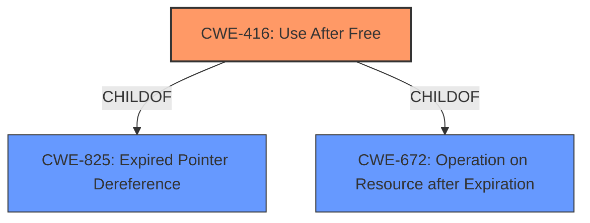

# Raw Analyzer Response for CVE-2021-30661

# Summary
| CWE ID | CWE Name | Confidence | CWE Abstraction Level | CWE Vulnerability Mapping Label | CWE-Vulnerability Mapping Notes |
|---|---|---|---|---|---|
| CWE-416 | Use After Free | 1.0 | Variant | Allowed | Primary CWE |

## Evidence and Confidence

*   **Confidence Score:** 1.0
*   **Evidence Strength:** HIGH

## Relationship Analysis
The primary identified weakness is **CWE-416 (Use After Free)**, which is a Variant level CWE. This is the most specific CWE that directly describes the vulnerability. CWE-416 is a child of CWE-825 (Expired Pointer Dereference) and CWE-672 (Operation on Resource after Expiration). There are no other relationships that appear to better describe this weakness.

## Vulnerability Chain
The vulnerability chain starts with a **use after free** condition, leading to potential arbitrary code execution.

## Summary of Analysis
The vulnerability description clearly states a **"use after free issue"** was addressed. The CVE Reference Links Content Summary also explicitly mentions the **root cause** as **"A use after free issue was addressed with improved memory management."** and lists **"Use-after-free"** as a weakness.

The retriever results list CWE-416 as a top result based on the term **"use after free"** in the vulnerability description.

CWE-416 (Use After Free) is a Variant level CWE, and is the most specific and accurate representation of the vulnerability. The MITRE mapping guidance for CWE-416 indicates that its usage is ALLOWED and that it is at a preferred level of abstraction.

CWE-787 (Out-of-bounds Write), CWE-843 (Access of Resource Using Incompatible Type ('Type Confusion')), CWE-665 (Improper Initialization), CWE-415 (Double Free), CWE-667 (Improper Locking), CWE-123 (Write-what-where Condition), CWE-20 (Improper Input Validation), CWE-119 (Improper Restriction of Operations within the Bounds of a Memory Buffer), and CWE-190 (Integer Overflow or Wraparound) were all considered but do not accurately represent the **root cause** of this vulnerability which is a **"use after free"**.