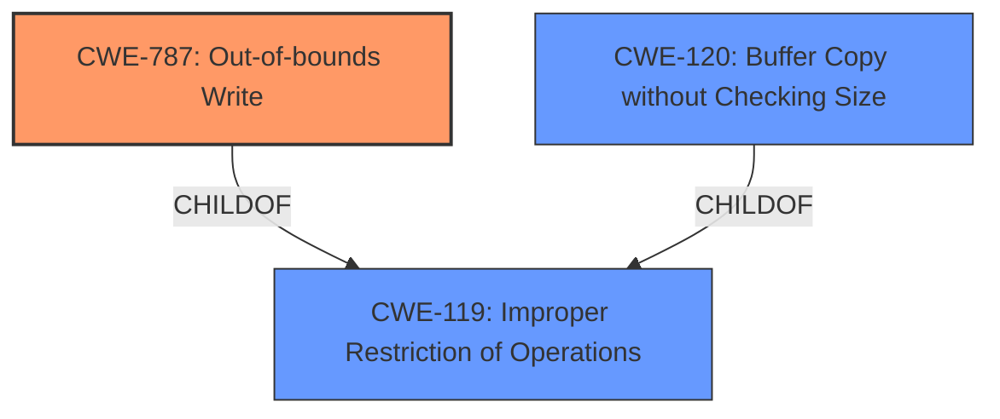

# Analysis for CVE-2021-30666

# Summary
| CWE ID  | CWE Name   | Confidence | CWE Abstraction Level | CWE Vulnerability Mapping Label | CWE-Vulnerability Mapping Notes |
|-----------------|--------------------------------------------------------------------|--------------------|-------------------------|-----------------------------------|--------------------------------------------------------------------------------------------------------------------------------------------------------------------------------------|
| CWE-787  | Out-of-bounds Write  | 1 | Base  | Allowed  | Primary CWE. The vulnerability description specifically mentions a **buffer overflow** which leads to writing data past the end or before the beginning of the intended buffer. |
| CWE-119 | Improper Restriction of Operations within the Bounds of a Memory Buffer | 0.7 | Class  | Discouraged | Secondary candidate. CWE-119 is a more general category that encompasses out-of-bounds read and write issues. While technically applicable, it is less specific than CWE-787. |
| CWE-120 | Buffer Copy without Checking Size of Input ('Classic Buffer Overflow') | 0.6 | Base | Allowed-with-Review | Secondary candidate. The description mentions a **buffer overflow** due to processing maliciously crafted web content. This CWE applies when a buffer is copied without checking the size of the input, which can lead to an overflow. |

## Evidence and Confidence

*   **Confidence Score:** 1
*   **Evidence Strength:** HIGH

## Relationship Analysis
The primary CWE is CWE-787, which is a child of CWE-119. CWE-120 is related to CWE-119 as well. This hierarchical relationship indicates that CWE-787 is a more specific classification of the **buffer overflow** issue than CWE-119.

## Vulnerability Chain
The vulnerability chain starts with the processing of maliciously crafted web content, leading to a **buffer overflow** (CWE-787), and ultimately resulting in arbitrary code execution.
  - Processing maliciously crafted web content -> **Buffer Overflow** (CWE-787) -> Arbitrary code execution

## Summary of Analysis
The vulnerability description clearly states that the issue is a **buffer overflow** that can lead to arbitrary code execution. The "CVE Reference Links Content Summary" confirms the root cause as a **buffer overflow**. Given this information, CWE-787 (Out-of-bounds Write) is the most appropriate CWE because it directly addresses the **buffer overflow** by writing data past the end or before the beginning of the intended buffer.

The selection of CWE-787 is further supported by its relationship to CWE-119 (Improper Restriction of Operations within the Bounds of a Memory Buffer), which is a more general class of memory buffer errors. Since CWE-787 is a child of CWE-119, it provides a more specific classification for this particular vulnerability. The mapping guidance for CWE-119 even suggests considering its children, such as CWE-787, for more detailed mappings.

The choice of CWE-787 is also influenced by the fact that it is a Base level CWE, which is the preferred level of abstraction for mapping vulnerabilities.

I considered CWE-120 (Buffer Copy without Checking Size of Input), but while it's related to **buffer overflows**, it specifically addresses cases where the size of the input is not checked before copying it to a buffer. The provided information does not explicitly state that the **buffer overflow** is due to a missing size check, making CWE-787 a more direct and accurate fit.

Relevant CWE Information:

# Enhanced Context (25 CWEs)
The following CWEs were identified as potentially relevant to this vulnerability:

## CWE-415: Double Free
**Abstraction Level**: Variant
**Similarity Score**: 0.76
**Source**: dense

**Description**:
The product calls free() twice on the same memory address, potentially leading to modification of unexpected memory locations.

**Mapping Guidance**:
- Usage: Allowed
- Rationale: This CWE entry is at the Variant level of abstraction, which is a preferred level of abstraction for mapping to the root causes of vulnerabilities.

## CWE-226: Sensitive Information in Resource Not Removed Before Reuse
**Abstraction Level**: Base
**Similarity Score**: 0.75
**Source**: dense

**Description**:
The product releases a resource such as memory or a file so that it can be made available for reuse, but it does not clear or "zeroize" the information contained in the resource before the product performs a critical state transition or makes the resource available for reuse by other entities.

**Mapping Guidance**:
- Usage: Allowed
- Rationale: This CWE entry is at the Base level of abstraction, which is a preferred level of abstraction for mapping to the root causes of vulnerabilities.

## CWE-131: Incorrect Calculation of Buffer Size
**Abstraction Level**: Base
**Similarity Score**: 0.74
**Source**: dense

**Description**:
The product does not correctly calculate the size to be used when allocating a buffer, which could lead to a buffer overflow.

**Mapping Guidance**:
- Usage: Allowed
- Rationale: This CWE entry is at the Base level of abstraction, which is a preferred level of abstraction for mapping to the root causes of vulnerabilities.

## CWE-404: Improper Resource Shutdown or Release
**Abstraction Level**: Class
**Similarity Score**: 0.74
**Source**: dense

**Description**:
The product does not release or incorrectly releases a resource before it is made available for re-use.

**Mapping Guidance**:
- Usage: Allowed-with-Review
- Rationale: This CWE entry is a Class and might have Base-level children that would be more appropriate

## CWE-191: Integer Underflow (Wrap or Wraparound)
**Abstraction Level**: Base
**Similarity Score**: 0.74
**Source**: dense

**Description**:
The product subtracts one value from another, such that the result is less than the minimum allowable integer value, which produces a value that is not equal to the correct result.

**Mapping Guidance**:
- Usage: Allowed
- Rationale: This CWE entry is at the Base level of abstraction, which is a preferred level of abstraction for mapping to the root causes of vulnerabilities.

## CWE-667: Improper Locking
**Abstraction Level**: Class
**Similarity Score**: 0.74
**Source**: dense

**Description**:
The product does not properly acquire or release a lock on a resource, leading to unexpected resource state changes and behaviors.

**Mapping Guidance**:
- Usage: Allowed-with-Review
- Rationale: This CWE entry is a Class and might have Base-level children that would be more appropriate

## CWE-124: Buffer Underwrite ('Buffer Underflow')
**Abstraction Level**: Base
**Similarity Score**: 0.73
**Source**: dense

**Description**:
The product writes to a buffer using an index or pointer that references a memory location prior to the beginning of the buffer.

**Mapping Guidance**:
- Usage: Allowed
- Rationale: This CWE entry is at the Base level of abstraction, which is a preferred level of abstraction for mapping to the root causes of vulnerabilities.

## CWE-1325: Improperly Controlled Sequential Memory Allocation
**Abstraction Level**: Base
**Similarity Score**: 0.73
**Source**: dense

**Description**:
The product manages a group of objects or resources and performs a separate memory allocation for each object, but it does not properly limit the total amount of memory that is consumed by all of the combined objects.

**Mapping Guidance**:
- Usage: Allowed
- Rationale: This CWE entry is at the Base level of abstraction, which is a preferred level of abstraction for mapping to the root causes of vulnerabilities.

## CWE-125: Out-of-bounds Read
**Abstraction Level**: Base
**Similarity Score**: 0.73
**Source**: dense

**Description**:
The product reads data past the end, or before the beginning, of the intended buffer.

**Mapping Guidance**:
- Usage: Allowed
- Rationale: This CWE entry is at the Base level of abstraction, which is a preferred level of abstraction for mapping to the root causes of vulnerabilities.

## CWE-126: Buffer Over-read
**Abstraction Level**: Variant
**Similarity Score**: 0.73
**Source**: dense

**Description**:
The product reads from a buffer using buffer access mechanisms such as indexes or pointers that reference memory locations after the targeted buffer.

**Mapping Guidance**:
- Usage: Allowed
- Rationale: This CWE entry is at the Variant level of abstraction, which is a preferred level of abstraction for mapping to the root causes